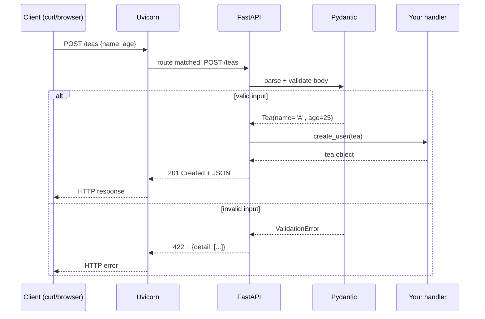

<div align="center">

# ☕ A001 — FastAPI Crash Course

### *Learn CRUD once. Never write boilerplate validation again.*

<br/>


</div>

---

## 🧠 The One-Sentence Summary

> **A Pydantic class is a *contract*; FastAPI enforces it for free.**

If that one sentence makes sense, the rest of this README is decoration. If it doesn't, by the end of this README it will.

---

## 📑 Table of Contents

- [🧠 The One-Sentence Summary](#-the-one-sentence-summary)
- [📖 The Story You'll Tell in 30 Seconds](#-the-story-youll-tell-in-30-seconds)
- [🎯 What You Will Learn (12 Skills)](#-what-you-will-learn-12-skills)
- [📂 Project Structure](#-project-structure)
- [⚙️ Installation & Setup (Zero-Fail)](#-installation--setup-zero-fail)
- [🧠 Pydantic Models — The Mental Model](#-pydantic-models--the-mental-model)
- [🧠 CRUD Endpoints — The Mental Model](#-crud-endpoints--the-mental-model)
- [🛣️ API Endpoints (Detailed)](#-api-endpoints-detailed)
- [🔍 Walk-through of `main.py` — Line by Line](#-walk-through-of-mainpy--line-by-line)
- [🧪 Try It With curl (Every Command Explained)](#-try-it-with-curl-every-command-explained)
- [🧠 Why This Works — The 5 Magic Ingredients](#-why-this-works--the-5-magic-ingredients)
- [⚠️ Limitations (Intentional) — and How to Fix Them](#-limitations-intentional--and-how-to-fix-them)
- [🧠 Mnemonic Cheat Sheet](#-mnemonic-cheat-sheet)
- [🧪 Recall Test (Tomorrow Morning)](#-recall-test-tomorrow-morning)
- [🚀 Where to Go Next](#-where-to-go-next)

---

## 📖 The Story You'll Tell in 30 Seconds

Imagine you own a tiny tea shop ☕. You want customers to:

1. 👀 **See** the menu (`GET /teas`)
2. ➕ **Add** a new tea (`POST /teas`)
3. ✏️ **Edit** the price of an existing tea (`PUT /teas/{tea_id}`)
4. 🗑️ **Remove** a tea (`DELETE /teas/{tea_id}`)

That's *exactly* what this module builds. The teas are stored in a Python list (the menu is on a chalkboard — restart wipes it).

That's the whole story. Now let's get into the details.

---

## 🎯 What You Will Learn (12 Skills)

| # | 🎯 Skill | 🧠 You'll remember it because... |
|:-:|:---------|:--------------------------------|
| 1 | 🏗️ Create a `FastAPI()` instance | The "skeleton" metaphor |
| 2 | 📦 Install FastAPI + Uvicorn | "FPU" — *FastAPI, Pip, Uvicorn* |
| 3 | 📜 Define a Pydantic `BaseModel` | The "contract" metaphor |
| 4 | 🛡️ Get free validation | "Bad input never reaches your function" |
| 5 | 🛣️ Register `GET`, `POST`, `PUT`, `DELETE` | Color-coded HTTP verbs |
| 6 | 🆔 Use path parameters | "Part of the URL itself" |
| 7 | 💾 Store data in a Python list | "Chalkboard menu" metaphor |
| 8 | 🔍 Iterate with `enumerate` | "Two cursors at once" |
| 9 | 📤 Return Python objects | FastAPI auto-converts to JSON |
| 10 | ❓ Return `{"error": ...}` | "Errors are just JSON too" |
| 11 | 🎨 Visit `/docs` | Your API becomes a clickable website |
| 12 | 🧪 Test with `curl` | "Each verb has a different shape" |

---

## 📂 Project Structure

```
📁 A001_CrashCourse/
├── 🐍 main.py            ← 42 lines, the entire app
├── 📦 requirements.txt   ← pinned versions for reproducibility
└── 📖 README.md          ← you are here
```

| File | 📖 Purpose | 🔢 Lines |
|:-----|:----------|:--------:|
| `main.py` | Defines the FastAPI app, the `Tea` Pydantic model, and the CRUD routes. | 42 |
| `requirements.txt` | Exact dependency versions — guarantees your env matches the lesson. | 13 |

---

## ⚙️ Installation & Setup (Zero-Fail)

> 🧠 **Mnemonic:** "**VAPI**" — **V**env, **A**ctivate, **P**ip install, **I**mport.

### Step 1 — Virtual environment
```powershell
python -m venv .venv
.\.venv\Scripts\Activate.ps1
```

### Step 2 — Install pinned deps
```powershell
pip install -r requirements.txt
```

> Why pinned? `pip install fastapi` could give you version 0.50 today and 0.141 tomorrow. The `requirements.txt` here pins every package so the lesson works exactly as written.

<details>
<summary>📋 Click to expand <code>requirements.txt</code></summary>

```
annotated-doc==0.0.5
annotated-types==0.8.0
anyio==4.14.2
click==8.5.0
fastapi==0.141.1
h11==0.16.0
idna==3.19
pydantic==2.13.5
pydantic_core==2.46.5
starlette==1.6.0
typing-inspection==0.4.4
typing_extensions==4.16.0
uvicorn==0.52.4
```

</details>

### Step 3 — Run it
```powershell
uvicorn main:app --reload
```

### Step 4 — Open your browser
- <http://127.0.0.1:8000> — JSON response
- <http://127.0.0.1:8000/docs> — 🎨 Swagger UI
- <http://127.0.0.1:8000/redoc> — 📘 ReDoc

### 🎯 If you remember ONE thing
> **"VAPI" — Venv, Activate, Pip-install, Import** — and you'll never lose 20 minutes to a broken Python setup again.

---

## 🧠 Pydantic Models — The Mental Model

### What is a Pydantic model?

```python
from pydantic import BaseModel

class Tea(BaseModel):
    id: int
    name: str
    origin: str
```

A Pydantic model is a **runtime contract**. It says:

> "Any object claiming to be a `Tea` MUST have an `int` id, a `str` name, and a `str` origin. If even one field is wrong, I refuse to construct it."

### The Restaurant-Reservation Analogy 🍽️

Imagine you call a restaurant:

```
You: "Table for 4 at 7pm"
Host: "Sorry, we close at 6pm."   ← validation REJECTED
```

You never got to *bother the chef*. The host (Pydantic) blocked you. That's exactly what Pydantic does in your API.

### The Three Free Gifts You Get

| 🎁 Gift | 📖 Meaning | 🔢 Lines saved |
|:--------|:-----------|:--------------:|
| ✅ **Validation** | Wrong input → `422 Unprocessable Entity` | ~30 |
| 🪄 **Type coercion** | `"42"` (string) → `42` (int) automatically | ~10 |
| 📚 **JSON Schema** | Auto-published to `/docs` | ~50 |

### 🎯 If you remember ONE thing
> **Pydantic turns Python classes into runtime contracts.** Bad data never reaches your function.

---

## 🧠 CRUD Endpoints — The Mental Model

CRUD = **C**reate, **R**ead, **U**pdate, **D**elete. HTTP has four verbs that map perfectly:

| CRUD | HTTP Verb | Endpoint | Body? |
|:----:|:---------:|:---------|:-----:|
| **C**reate | 🟡 `POST` | `/teas` | ✅ Yes |
| **R**ead | 🟢 `GET` | `/teas` (list) or `/teas/{id}` (one) | ❌ No |
| **U**pdate | 🟠 `PUT` | `/teas/{tea_id}` | ✅ Yes |
| **D**elete | 🔴 `DELETE` | `/teas/{tea_id}` | ❌ No |

> 🧠 **Mnemonic:** "**CRUD ↔ CPUR**" — **C**reate, **P**OST / **R**ead, **GET** / **U**pdate, **PUT** / **D**elete, **DELETE**.

### The "Chalkboard" Storage

```python
teas: List[Tea] = []
```

This list is the *chalkboard menu*. It's:

- ✅ Fast (no DB overhead)
- ✅ Perfect for learning
- ❌ Lost on server restart
- ❌ Single-process only

In production you'd use SQLAlchemy, MongoDB, etc. — covered in a later module.

---

## 🛣️ API Endpoints (Detailed)

Base URL: **`http://127.0.0.1:8000`**

### 🟢 1. `GET /` — Welcome

```bash
curl http://127.0.0.1:8000/
```

```json
{ "message": "Welcome to chai code" }
```

**Why does it work?**
- `@app.get("/")` registers a handler for `GET /`.
- Returning a dict → FastAPI serializes to JSON.
- Status code defaults to `200 OK`.

---

### 🟢 2. `GET /teas` — List all teas

```bash
curl http://127.0.0.1:8000/teas
```

```json
[]
```

**Why does it work?**
- `@app.get("/teas")` registers the handler.
- Returning `teas` (a list) → FastAPI serializes each `Tea` to JSON.

---

### 🟡 3. `POST /teas` — Create a tea

**Request:**

```bash
curl -X POST http://127.0.0.1:8000/teas \
  -H "Content-Type: application/json" \
  -d '{"id":1,"name":"Masala Chai","origin":"India"}'
```

**Response:**

```json
{
  "id": 1,
  "name": "Masala Chai",
  "origin": "India"
}
```

**What's happening under the hood?**

```
┌─────────────────────────────────────────────────┐
│  1. Uvicorn receives POST /teas                  │
│  2. FastAPI parses JSON body                     │
│  3. Pydantic validates: id=int, name=str, ...    │
│  4. ✅ Valid → constructs Tea(1, "Masala", ...)  │
│  5. ❌ Invalid → returns 422 + error JSON        │
│  6. Function appends Tea to list                 │
│  7. Returns Tea → JSON response                  │
└─────────────────────────────────────────────────┘
```

**Try invalid input to see the magic:**

```bash
curl -X POST http://127.0.0.1:8000/teas \
  -H "Content-Type: application/json" \
  -d '{"id":"not_an_int","name":"Tea","origin":"India"}'
```

```json
{
  "detail": [
    {
      "type": "int_parsing",
      "loc": ["body", "id"],
      "msg": "Input should be a valid integer..."
    }
  ]
}
```

Your function **never ran**. Validation killed the request first.

---

### 🟠 4. `PUT /teas/{tea_id}` — Update a tea

```bash
curl -X PUT http://127.0.0.1:8000/teas/1 \
  -H "Content-Type: application/json" \
  -d '{"id":1,"name":"Kashmiri Kahwa","origin":"Kashmir"}'
```

Response on success: updated tea object.
Response on failure: `{ "error": "Tea not found" }` (status `200` — note the quirk in ⚠️ Limitations below).

**Algorithm in plain English:**

```
1. Start at index 0 of the teas list.
2. For each tea, ask: "Is it.id == tea_id?"
3. If yes → replace this slot with the new tea, return it.
4. If we reach the end without a match → return error.
```

---

### 🔴 5. `DELETE /teas/{tea_id}` — Delete a tea

```bash
curl -X DELETE http://127.0.0.1:8000/teas/1
```

Response: the deleted tea object, or `{ "error": "Tea not found" }`.

**The secret weapon: `enumerate`**

```python
for idx, tea in enumerate(teas):
    if tea.id == tea_id:
        deleted = teas.pop(idx)
        return deleted
```

`enumerate` is Python's way of saying *"give me the index AND the value at the same time"*. Without it you'd write clunky `range(len(...))` loops.

---

## 🔍 Walk-through of `main.py` — Line by Line

| Line | Code | 🧠 Why it's there |
|:----:|:-----|:------------------|
| 1 | `from fastapi import FastAPI` | Imports the framework's main class |
| 2 | `from pydantic import BaseModel` | Imports the contract-maker |
| 3 | `from typing import List` | Lets us type-hint a list |
| 5 | `app = FastAPI()` | Creates the ASGI app — the **server's target** |
| 7–10 | `class Tea(BaseModel)` | Defines the schema |
| 13 | `teas: List[Tea] = []` | The "chalkboard menu" |
| 15–17 | `@app.get("/")` → welcome | Home page |
| 19–21 | `@app.get("/teas")` → list | List endpoint |
| 23–26 | `@app.post("/teas")` | Create endpoint |
| 28–34 | `@app.put("/teas/{tea_id}")` | Update endpoint |
| 36–41 | `@app.delete("/teas/{tea_id}")` | Delete endpoint |

> 💡 Notice: **all five routes sit on the same `app`**. There's no "main route file" — FastAPI is just a Python module like any other.

---

## 🧪 Try It With curl (Every Command Explained)

```bash
# 1. Create a tea (POST)
curl -X POST http://127.0.0.1:8000/teas \
  -H "Content-Type: application/json" \
  -d '{"id":1,"name":"Masala Chai","origin":"India"}'

# 2. List all teas (GET)
curl http://127.0.0.1:8000/teas

# 3. Update tea #1 (PUT)
curl -X PUT http://127.0.0.1:8000/teas/1 \
  -H "Content-Type: application/json" \
  -d '{"id":1,"name":"Kashmiri Kahwa","origin":"Kashmir"}'

# 4. Delete tea #1 (DELETE)
curl -X DELETE http://127.0.0.1:8000/teas/1
```

> 🧠 **Mnemonic for HTTP verbs in curl:** "-X is your verb selector". Default is `GET`; specify `-X POST`, `-X PUT`, `-X DELETE` for the others.

---

## 🧠 Why This Works — The 5 Magic Ingredients

1. 🎯 **Type hints** tell FastAPI what to expect.
2. 📜 **BaseModel** turns classes into contracts.
3. 🔁 **Decorators** attach functions to URL+verb pairs.
4. 🎨 **Auto-docs** turn your type hints into a website.
5. 🚀 **Uvicorn** is the engine that talks HTTP for you.

---

## ⚠️ Limitations (Intentional) — and How to Fix Them

| # | ⚠️ Limitation | 🎯 Production fix |
|:-:|:--------------|:------------------|
| 1 | 💾 **No DB** — restart wipes data | Use SQLAlchemy + SQLite/Postgres |
| 2 | 📊 **`POST` returns `200`, not `201`** | Add `status_code=201` to the decorator |
| 3 | ⏱️ **Sync handlers** | Change `def` → `async def` for I/O work |
| 4 | 🆔 **Duplicate IDs allowed** | Add a check before append |
| 5 | 🔓 **No auth** | Use OAuth2 + JWT (later module) |

### Code: making POST return `201`

```python
from fastapi import status

@app.post("/teas", status_code=status.HTTP_201_CREATED)
def add_tea(tea: Tea):
    teas.append(tea)
    return tea
```

---

## 🧠 Mnemonic Cheat Sheet

| Concept | Mnemonic | Story |
|:--------|:---------|:------|
| HTTP verbs | **"Get Post Put Delete"** | "**G**rab **P**roducts, **P**ut them **D**own" |
| CRUD | **CPUR** | Create-POST, Read-GET, Update-PUT, Remove-DELETE |
| Pydantic | **"Contract"** | Like a lease: defines the rules upfront |
| Storage | **"Chalkboard"** | Visible, fast, vanishes when the shop closes |
| Auto-docs | **"/docs = Swagger UI"** | Memorize `/docs` — it's your playground |

---

## 🧠 Bonus — Request Flow Diagram



> 🧠 **Notice:** Your handler **only runs on the success branch**. Pydantic catches the errors upstream.

---

## 🧪 Recall Test (Tomorrow Morning)

Close this README. On a blank page, answer:

1. What does Pydantic's `BaseModel` give you for free?
2. What's the URL of the Swagger UI?
3. What's the difference between `POST` and `PUT`?
4. What status code does FastAPI return on invalid input?
5. How do you make `POST` return `201 Created` instead of `200`?

> If you got 5/5 — you've internalized CRUD with FastAPI. If 3/5 — re-read the Pydantic section.

---

## 🚀 Where to Go Next

| Next | Topic |
|:----|:------|
| ⬅️ [Back to root README](../README.md) | Repo overview |
| ⬅️ [A005](../A005_Query_Parameters_Optional_Default_Value/) | Query parameters |
| ➡️ [A002](../A002_FastAPI_Tutorial/) | Hello world setup |
| ➡️ [A003](../A003_Built_First_FastAPI/) | Multi-routing |
| ➡️ [A004](../A004_Path_Parameter_Dynamic_Route_Validation/) | Path validation |

---

<div align="center">

### 🌟 *Read it once. CRUD it forever.* 🌟

Made with ❤️, ☕, and well-typed Python.

---

## 🎯 Interview Q&A

> Real questions an interviewer might ask about this module. Practice out loud.

### Q1: What is FastAPI and why would you choose it over Flask or Django?

**Answer:** FastAPI is a modern, high-performance web framework for building APIs with Python 3.10+ based on standard type hints.

| Aspect | FastAPI | Flask | Django |
|:-------|:--------|:------|:-------|
| **Speed** | Very fast (ASGI) | Slower (WSGI) | Slower (full-stack) |
| **Validation** | Built-in via Pydantic | Manual | Forms/serializers |
| **Docs** | Auto Swagger/ReDoc | Manual | DRF has some |
| **Async** | Native | Via extensions | ASGI mode |
| **Type safety** | Type-hint-driven | Optional | Optional |

> **One-liner:** *"FastAPI gives you Flask's simplicity with Django-level structure and Node-level speed — using only type hints."*

### Q2: What is a Pydantic model and what does `BaseModel` do?

**Answer:** A Pydantic model is a Python class that inherits from `BaseModel` with type-annotated fields. It acts as a **runtime contract** that validates input, coerces types (`"42"` → `42`), generates JSON Schema, and serializes to JSON.

> **One-liner:** *"`BaseModel` turns a Python class into a runtime data contract."*

### Q3: What's the difference between HTTP `POST` and `PUT`?

**Answer:**

| Verb | CRUD | Idempotent? | Use |
|:-----|:-----|:------------|:----|
| `POST` | Create | ❌ No | "Add a new tea" |
| `PUT` | Replace | ✅ Yes | "Replace tea #1" |

> **One-liner:** *"POST creates, PUT replaces. PUT is idempotent; POST is not."*

### Q4: What does `uvicorn main:app --reload` do?

**Answer:** Starts the Uvicorn ASGI server, loading the `app` object from `main.py`. The `--reload` flag watches for file changes and auto-restarts. **Dev only — never in production.**

> **One-liner:** *"Run the dev server with hot-reload — saves you from manual restarts."*

### Q5: What status code does FastAPI return for invalid input, and where does validation happen?

**Answer:** **`422 Unprocessable Entity`**. Validation happens **before** your function runs:

```
Request → Pydantic parses → type check → ✅ call function
                                  ↓
                              ❌ → 422 + {detail:[{type, loc, msg, input}]}
```

> **One-liner:** *"Bad input gets a 422, your function never runs."*

### Q6: How would you make this app's storage survive server restarts?

**Answer:** Replace `teas: List[Tea] = []` with a real database:

| Storage | Best for |
|:--------|:---------|
| SQLite | Tutorials, small apps |
| PostgreSQL | Production |
| Redis | Caching, sessions |
| MongoDB | Document-shaped data |

Use **SQLAlchemy** (sync) or **SQLModel** (async, Pydantic-based).

> **One-liner:** *"Trade the in-memory list for SQLite/Postgres via SQLAlchemy."*

### Q7: What are the four HTTP "CRUD" verbs and which is idempotent?

**Answer:** Create (POST), Read (GET), Update (PUT), Delete (DELETE). **GET, PUT, and DELETE are idempotent.** **POST is not** — each call creates a new resource.

> **One-liner:** *"Of the four CRUD verbs, only POST is non-idempotent."*

### Q8: Explain the role of `status_code=201` on a POST endpoint.

**Answer:** Convention says `POST` that creates a resource returns **`201 Created`** instead of `200 OK`. Use `status_code=status.HTTP_201_CREATED` to signal a new resource exists.

> **One-liner:** *"`201 Created` says 'something new exists now'."*

</div>