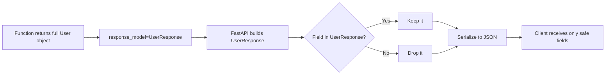

<div align="center">

# 🛡️ A010 — Response Models: Data Validation & Hide Sensitive Data

### *Send everything to your function. Send only what's safe to the client.*

<br/>


</div>

---

## 🧠 The One-Sentence Summary

> **`response_model=...` is a bouncer at the response door — it checks IDs and strips anything not on the guest list before the response leaves your server.**

If you remember *"response_model = guest list at the door"*, the rest of this README is decoration.

---

## 📑 Table of Contents

- [🧠 The One-Sentence Summary](#-the-one-sentence-summary)
- [📖 The Story: The Club with Two Lists](#-the-story-the-club-with-two-lists)
- [🎯 What You Will Learn (10 Skills)](#-what-you-will-learn-10-skills)
- [📂 Project Structure](#-project-structure)
- [⚙️ Installation & Setup](#-installation--setup)
- [🧬 Anatomy of `main.py` — Line by Line](#-anatomy-of-mainpy--line-by-line)
- [🛣️ API Endpoints](#-api-endpoints)
- [🧠 The Mental Model: Two Models, One Response](#-the-mental-model-two-models-one-response)
- [🔍 How `response_model` Works Internally](#-how-response_model-works-internally)
- [🧪 Try It With curl](#-try-it-with-curl)
- [🔐 The Security Pattern (Why This Matters)](#-the-security-pattern-why-this-matters)
- [🔧 Variations You Should Know](#-variations-you-should-know)
- [🧠 Common Mistakes When You Skip `response_model`](#-common-mistakes-when-you-skip-response_model)
- [⚠️ Common Pitfalls & Fixes](#-common-pitfalls--fixes)
- [🧠 Mnemonic Cheat Sheet](#-mnemonic-cheat-sheet)
- [🧪 Recall Test](#-recall-test)
- [🚀 Where to Go Next](#-where-to-go-next)

---

## 📖 The Story: The Club with Two Lists

You run a VIP club 🎩. The backstage has **everything** about every member — name, age, password, credit card, address. But the public area only shows what guests are allowed to see.

| List | What's on it | Who sees it |
|:-----|:-------------|:------------|
| 🗄️ **Backstage** (`User`) | name, age, password | Your code (server) |
| 🎫 **Guest list** (`UserResponse`) | name, age | The client (browser/app) |

FastAPI's `response_model=...` is the **bouncer at the door** between backstage and guest area. Even if your function accidentally returns the password, the bouncer **rips it off the response** before the client sees it.

> 🧠 **Mnemonic:** "**Bouncer at the door**" — `response_model` decides who leaves the club with what.

---

## 🎯 What You Will Learn (10 Skills)

| # | 🎯 Skill | 🧠 You'll remember it because... |
|:-:|:---------|:--------------------------------|
| 1 | 🛡️ **What `response_model` does** | "Bouncer at the door" |
| 2 | 🧬 **Define two Pydantic models** | "Internal vs External" |
| 3 | 🔍 **Field filtering** | "Whitelist only safe fields" |
| 4 | 📚 **Auto-docs show the safe model** | "Swagger UI sees only `UserResponse`" |
| 5 | 🔐 **Hide passwords & secrets** | "Never leak in JSON" |
| 6 | 🎯 **Per-route response model** | "Each endpoint has its own bouncer" |
| 7 | 🚫 **`response_model_exclude_none`** | "Hide empty fields" |
| 8 | 🪜 **`response_model_exclude` / `include`** | "Pick exactly which fields" |
| 9 | 🆚 **`response_model` vs manual filtering** | "Don't write `if 'password' in data: del data['password']`" |
| 10 | 🧠 **Validation of the response** | "FastAPI also validates the output" |

---

## 📂 Project Structure

```
📁 A010_Response_Models_Data_Validation_Hide_Sensitive_Data/
├── 🐍 main.py     ← 22 lines, 2 models, 1 endpoint
└── 📖 README.md   ← you are here
```

---

## ⚙️ Installation & Setup

```powershell
cd D:\AllProgram\LEARN\Python\FastAPI\A010_Response_Models_Data_Validation_Hide_Sensitive_Data
python -m venv .venv
.\.venv\Scripts\Activate.ps1
pip install "fastapi[standard]"
uvicorn main:app --reload
```

Visit <http://127.0.0.1:8000/docs> — note that Swagger UI shows the response schema as **`UserResponse`** (name, age) — *no password field*.

---

## 🧬 Anatomy of `main.py` — Line by Line

```python
from fastapi import FastAPI
from pydantic import BaseModel

app = FastAPI()

# Full user model — what your code works with
class User(BaseModel):
    name: str
    age: int
    password: str                # ← sensitive!

# Response model — what the client is allowed to see
class UserResponse(BaseModel):
    name: str
    age: int
    # ← no password field on purpose

@app.get("/user", response_model=UserResponse)
def get_user():
    return {
        "name": "Adnan",
        "age": 21,
        "password": "123456"      # ← returned but FILTERED OUT
    }
```

| Lines | Code | 🧠 Why it's there |
|:-----:|:-----|:------------------|
| 1–2 | Imports | FastAPI + Pydantic |
| 4 | `app = FastAPI()` | App instance |
| 6–9 | `class User` | **Internal** model — has everything |
| 11–14 | `class UserResponse` | **External** model — safe to expose |
| 16 | `@app.get("/user", response_model=UserResponse)` | The bouncer — only `UserResponse` fields pass |
| 17–22 | `get_user` | Returns a dict that *looks* like a full User, but `password` is stripped |

### The Three Things That Just Happened

```
1. Your function returned:  {"name":"Adnan","age":21,"password":"123456"}
2. FastAPI checked it against UserResponse
3. Client actually received:  {"name":"Adnan","age":21}        ← password GONE
```

> 🧠 **Mnemonic:** "**Bouncer rips it off**" — the function's return is the party; the bouncer checks the guest list.

### 🎯 If you remember ONE thing
> **`response_model` is a whitelist.** Fields not in the model are silently dropped from the response.

---

## 🛣️ API Endpoints

| Method | Endpoint | Response Model | Actual JSON |
|:------:|:---------|:---------------|:------------|
| 🟢 GET | `/user` | `UserResponse` | `{ name, age }` (no password!) |

### What the Client Sees

```bash
curl http://127.0.0.1:8000/user
```

```json
{
  "name": "Adnan",
  "age": 21
}
```

### What Your Function Returned (Internal)

```python
{
  "name": "Adnan",
  "age": 21,
  "password": "123456"
}
```

The **client never sees the password** even though your function returned it.

---

## 🧠 The Mental Model: Two Models, One Response

```
┌──────────────────────────────────────────────┐
│  Your code (backstage)                        │
│                                              │
│  class User:                                 │
│    name, age, password                       │
│         │                                    │
│         │  returns                           │
│         ▼                                    │
│  {name, age, password}                       │
│         │                                    │
│         │  response_model=UserResponse       │
│         ▼                                    │
│  ┌──────────────────────────────┐           │
│  │ Bouncer (response_model)     │           │
│  │ "Whitelist check: only       │           │
│  │  UserResponse fields pass."  │           │
│  └──────────────────────────────┘           │
│         │                                    │
│         ▼                                    │
│  {name, age}  ← password stripped            │
└──────────────────────────────────────────────┘
                │
                │  HTTP JSON
                ▼
┌──────────────────────────────────────────────┐
│  Client (public area)                         │
│                                              │
│  Sees: { "name": "Adnan", "age": 21 }        │
└──────────────────────────────────────────────┘
```

---

## 🔍 How `response_model` Works Internally

FastAPI performs these steps in order:

| Step | What happens | Why |
|:----:|:-------------|:----|
| 1 | Function returns its value (dict or Pydantic model) | Your logic runs first |
| 2 | FastAPI tries to **construct** the `response_model` from the return | Filters out extra fields |
| 3 | If construction fails, FastAPI returns `500` | Catches model mismatches early |
| 4 | The constructed `response_model` is **serialized to JSON** | The client gets the safe version |
| 5 | Swagger UI **documents the response_model** | `/docs` shows only safe fields |

> 🧠 **Mnemonic:** "**R-C-S-D**" — **R**eturn, **C**onstruct, **S**erialize, **D**ocument.

### What if a Required Field Is Missing?

```python
class UserResponse(BaseModel):
    name: str
    email: str   # ← required in response

@app.get("/user", response_model=UserResponse)
def get_user():
    return {"name": "Adnan"}   # ← no email
```

FastAPI returns **`500 Internal Server Error`** with a `ResponseValidationError`. This is **defensive**: it catches programmer mistakes early.

> 🧠 **Mnemonic:** "**500 = your fault**" — if the response can't match the model, you wrote a bug.

---

## 🧪 Try It With curl

### ✅ Default call

```bash
curl http://127.0.0.1:8000/user
```

```json
{"name": "Adnan", "age": 21}
```

### ✅ Verbose — see headers

```bash
curl -v http://127.0.0.1:8000/user
```

Look for `Content-Type: application/json` in the response.

### ✅ Browser

Open <http://127.0.0.1:8000/user>. You'll see only `{name, age}`. No password.

### ✅ Swagger UI

Open <http://127.0.0.1:8000/docs>. Click **GET /user** → **Schema** tab. Notice the schema has only `name` and `age` — `password` is not in the response model.

> 🧠 **Mnemonic:** "**Swagger shows the guest list**" — `/docs` never reveals the backstage.

---

## 🔐 The Security Pattern (Why This Matters)

### ❌ The Old Way (DON'T do this)

```python
@app.get("/user")
def get_user():
    user = db.get_user("adnan")   # has password
    return user                  # ← leaks password!
```

The client sees:

```json
{"name": "Adnan", "age": 21, "password": "123456"}
```

🚨 **That's how breaches happen.**

### ✅ The FastAPI Way (DO this)

```python
class User(BaseModel):
    name: str
    age: int
    password: str

class UserResponse(BaseModel):
    name: str
    age: int

@app.get("/user", response_model=UserResponse)
def get_user():
    user = db.get_user("adnan")   # has password
    return user                  # ← bouncer strips it
```

The client sees:

```json
{"name": "Adnan", "age": 21}
```

✅ **No leak.** And the bouncer is **automatic** — no manual filtering.

> 🧠 **Mnemonic:** "**Bouncer > Bodyguard**" — `response_model` works whether you remember to filter or not.

### Real-World Sensitive Fields to Hide

| Sensitive | Why hide it |
|:----------|:------------|
| `password` | Plaintext credentials |
| `hashed_password` | Even hashes shouldn't leak (offline cracking) |
| `email` | Often PII |
| `phone` | Often PII |
| `ssn`, `tax_id` | Identity theft risk |
| `credit_card` | PCI compliance |
| `api_key`, `token` | Auth bypass risk |
| `internal_notes` | Not for clients |
| `created_at`, `updated_at` | Often harmless but cluttered |

---

## 🔧 Variations You Should Know

### 1️⃣ Exclude `None` values

```python
from typing import Optional

class UserResponse(BaseModel):
    name: str
    age: int
    email: Optional[str] = None

@app.get("/user", response_model=UserResponse, response_model_exclude_none=True)
def get_user():
    return {"name": "Adnan", "age": 21, "email": None}
```

Client sees:

```json
{"name": "Adnan", "age": 21}      ← email is hidden because it's null
```

### 2️⃣ Include only specific fields

```python
@app.get("/user", response_model=User, response_model_include={"name", "age"})
def get_user():
    return {"name": "Adnan", "age": 21, "password": "123456"}
```

Only `name` and `age` are included — even from a model that has more fields.

### 3️⃣ Exclude specific fields

```python
@app.get("/user", response_model=User, response_model_exclude={"password"})
def get_user():
    return {"name": "Adnan", "age": 21, "password": "123456"}
```

Everything in `User` *except* `password` is returned.

### 4️⃣ Return a Pydantic model directly

```python
@app.get("/user", response_model=UserResponse)
def get_user() -> UserResponse:    # ← typed return
    return UserResponse(name="Adnan", age=21)
```

### 5️⃣ Different models for different endpoints

```python
class UserPublic(BaseModel):
    name: str
    age: int

class UserAdmin(BaseModel):
    name: str
    age: int
    password: str

@app.get("/user", response_model=UserPublic)
def get_user():
    return {"name": "Adnan", "age": 21, "password": "123456"}

@app.get("/admin/user", response_model=UserAdmin)
def admin_get_user():
    return {"name": "Adnan", "age": 21, "password": "123456"}
```

| Endpoint | Sees |
|:---------|:-----|
| `/user` | `{name, age}` |
| `/admin/user` | `{name, age, password}` (admin only) |

> 🧠 **Mnemonic:** "**Per-endpoint bouncer**" — each route hires its own.

### 6️⃣ Status code + response model together

```python
from fastapi import status

@app.get("/user", response_model=UserResponse, status_code=status.HTTP_200_OK)
def get_user():
    return {"name": "Adnan", "age": 21, "password": "123456"}
```

---

## 🧠 Common Mistakes When You Skip `response_model`

| Scenario | What happens | Risk |
|:---------|:-------------|:-----|
| Return full DB row | All fields sent to client | 🚨 Password leak |
| Add new field to internal model | Automatically sent to client | 🚨 Surprising leak |
| Refactor and miss a field | Old data shape leaks | 🚨 Backward-compat break |
| Different dict structure than doc | `/docs` lies | 🐛 Misleading docs |

> 🧠 **Mnemonic:** "**No bouncer = door wide open**" — without `response_model`, anything goes.

---

## ⚠️ Common Pitfalls & Fixes

| 😖 Pitfall | 🔍 Cause | ✅ Fix |
|:-----------|:---------|:------|
| Client sees `password` | Forgot `response_model` | Add `response_model=UserResponse` |
| `500 Internal Server Error` | Response missing a required field | Check your function's return value |
| `password` still in `/docs` | Swagger shows the function's return, not the model | Add `response_model` |
| Want to include extra field | Pydantic v2 default drops unknown fields | Use `model_config = ConfigDict(extra="allow")` |
| `Optional` field always sent | Default is `include_none=False` not set | Add `response_model_exclude_none=True` |

---

## 🧠 Mnemonic Cheat Sheet

| Concept | Mnemonic | Story |
|:--------|:---------|:------|
| What is `response_model` | **Bouncer at the door** | Whitelist check |
| Two models | **Internal vs External** | Backstage vs guest area |
| Filter steps | **R-C-S-D** | Return, Construct, Serialize, Document |
| 500 error | **500 = your fault** | Response didn't match model |
| `exclude_none` | **No nulls allowed** | Clean responses |
| Per-endpoint | **Per-endpoint bouncer** | Each route hires its own |

---

## 🧠 Bonus — Response Filtering Flow



### `JSONResponse` and `ORJSONResponse` for Speed

When you need **manual control** or **faster JSON serialization**, return a `Response` object directly:

```python
from fastapi.responses import JSONResponse, ORJSONResponse

@app.get("/items")
def items():
    return JSONResponse(
        status_code=200,
        content={"items": [...]}
    )
```

| Response class | Speed | When to use |
|:---------------|:------|:------------|
| `JSONResponse` (default) | Standard | Most cases |
| `ORJSONResponse` | 2-3× faster | Large payloads, high-throughput APIs |
| `PlainTextResponse` | — | Non-JSON data |
| `HTMLResponse` | — | HTML pages |
| `StreamingResponse` | — | Files, server-sent events |
| `FileResponse` | — | Static files |

Install `orjson` first:

```powershell
pip install orjson
```

> 🧠 **Mnemonic:** "**ORJSON = Optimized Rust JSON.** Drop-in replacement for fast APIs."

---

## 🧪 Recall Test

1. What does `response_model=UserResponse` do?
2. Why use two Pydantic models (`User` and `UserResponse`)?
3. What HTTP status does FastAPI return if the response doesn't match the model?
4. How do you hide `None` values in the response?
5. How do you keep only `name` and `age` from a `User` model that has 5 fields?
6. What does the `/docs` page show — your function's return or the `response_model`?
7. Why is this pattern important for security?

> 7/7 → you understand the most important security pattern in FastAPI.

---

## 🚀 Where to Go Next

| Direction | Module |
|:----------|:-------|
| ⬅️ Previous | [A009](../A009_Path_Query_Body_Together/) |
| ⬅️ Back | [Root README](../README.md) |
| ➡️ Next | A011 (planned) — Status Codes & Error Handling |
| ➡️ Future | A012 (planned) — Dependencies & Authentication |

---

<div align="center">

### 🛡️ *Your function can return anything. The bouncer decides who leaves with what.* 🛡️

Made with ❤️ and a guest list called `UserResponse`.

---

## 🎯 Interview Q&A

### Q1: What does `response_model` do, and why is it important?

**Answer:** `response_model=PydanticClass` tells FastAPI to:

1. ✅ Validate the function's return value against the model
2. ✅ **Filter out fields not in the model** (the security win)
3. ✅ Document the response schema in `/docs`

It's a **whitelist** — fields absent from the model are stripped.

> **One-liner:** *"`response_model` is a bouncer at the response door."*

### Q2: How would you hide `password` from the API response?

**Answer:** Define a separate "safe" model and use it as `response_model`:

```python
class User(BaseModel):
    name: str
    age: int
    password: str     # internal only

class UserResponse(BaseModel):
    name: str
    age: int          # exposed

@app.get("/user", response_model=UserResponse)
def get_user():
    return {"name": "A", "age": 21, "password": "secret"}  # password stripped
```

> **One-liner:** *"Two models: internal (full) vs external (filtered)."*

### Q3: What happens if the function's return doesn't match the response_model?

**Answer:** FastAPI raises a `ResponseValidationError` and returns **`500 Internal Server Error`**. This is **defensive** — it catches programmer mistakes early.

```python
class UserResponse(BaseModel):
    name: str
    email: str   # required

@app.get("/user", response_model=UserResponse)
def get_user():
    return {"name": "A"}    # no email → 500
```

> **One-liner:** *"500 = response didn't match the model (your fault)."*

### Q4: How do you hide fields with `None` values from the response?

**Answer:** Use `response_model_exclude_none=True`:

```python
class UserResponse(BaseModel):
    name: str
    email: str | None = None

@app.get("/user", response_model=UserResponse, response_model_exclude_none=True)
def get_user():
    return {"name": "A", "email": None}
# Response: {"name": "A"}  ← email hidden
```

> **One-liner:** *"`response_model_exclude_none=True` strips nulls."*

### Q5: What's the difference between `response_model_include` and `response_model_exclude`?

**Answer:**

| Argument | Effect |
|:---------|:-------|
| `response_model_include={"name", "age"}` | Only these fields pass |
| `response_model_exclude={"password"}` | All fields except this one |

```python
@app.get("/user", response_model=User, response_model_exclude={"password"})
def get_user(): ...
```

> **One-liner:** *"Include = whitelist. Exclude = blacklist."*

### Q6: Why is `response_model` better than manual filtering?

**Answer:**

| Manual `del data["password"]` | `response_model` |
|:-------------------------------|:-----------------|
| Easy to forget | Automatic |
| Not documented | Documented in `/docs` |
| Doesn't catch missing fields | Validates the response |
| Per-endpoint code | DRY |

> **One-liner:** *"Automatic beats manual — always."*

### Q7: How do you return different shapes for different roles (admin vs public)?

**Answer:** Define two response models and use them in different endpoints:

```python
class UserPublic(BaseModel):
    name: str
    age: int

class UserAdmin(BaseModel):
    name: str
    age: int
    password: str

@app.get("/user", response_model=UserPublic)
def public_user(): ...

@app.get("/admin/user", response_model=UserAdmin)
def admin_user(): ...
```

> **One-liner:** *"Per-endpoint model = per-audience shape."*

### Q8: Does `response_model` work with async functions and streaming responses?

**Answer:** Mostly yes — `response_model` validates the return value before serialization. For streaming (`StreamingResponse`), you can't use `response_model` because FastAPI doesn't know the final shape. Use `response_class=StreamingResponse` instead.

> **One-liner:** *"`response_model` works for normal returns, not for streams."*

</div>