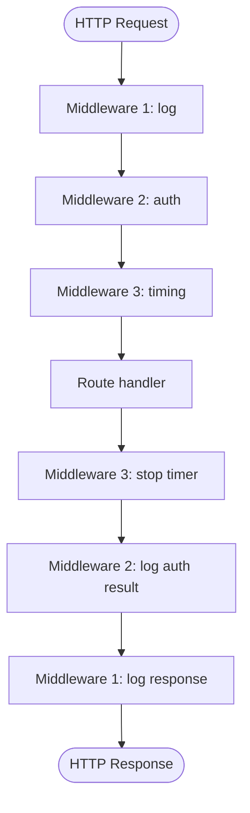

<div align="center">

# 🪝 A014 — Middleware Explained: Logging, Request & Response Flow

### *Run code on EVERY request — before and after the route.*

<br/>


</div>

---

## 🧠 The One-Sentence Summary

> **Middleware is a function that wraps every request — runs *before* your route, calls `call_next(request)`, then runs *after* — like a security checkpoint at a building entrance.**

If you remember *"middleware = wrap the call, do work before and after"*, the rest of this README is decoration.

---

## 📑 Table of Contents

- [🧠 The One-Sentence Summary](#-the-one-sentence-summary)
- [📖 The Story: The Airport Security Checkpoint](#-the-story-the-airport-security-checkpoint)
- [🎯 What You Will Learn (12 Skills)](#-what-you-will-learn-12-skills)
- [📂 Project Structure](#-project-structure)
- [⚙️ Installation & Setup](#-installation--setup)
- [🧬 Anatomy of `main.py` — Line by Line](#-anatomy-of-mainpy--line-by-line)
- [🛣️ API Endpoints](#-api-endpoints)
- [🧠 The Mental Model: The Onion of a Request](#-the-mental-model-the-onion-of-a-request)
- [🔬 Deep Dive: How `call_next` Works](#-deep-dive-how-call_next-works)
- [🧠 The Three Phases of Middleware](#-the-three-phases-of-middleware)
- [🧪 Try It With curl](#-try-it-with-curl)
- [🔧 Variations You Should Know](#-variations-you-should-know)
- [🆚 Middleware vs Dependencies vs Exception Handlers](#-middleware-vs-dependencies-vs-exception-handlers)
- [⚠️ Common Pitfalls & Fixes](#-common-pitfalls--fixes)
- [🧠 Mnemonic Cheat Sheet](#-mnemonic-cheat-sheet)
- [🧪 Recall Test](#-recall-test)
- [🎯 Interview Q&A](#-interview-qa)
- [🚀 Where to Go Next](#-where-to-go-next)

---

## 📖 The Story: The Airport Security Checkpoint

Imagine an airport ✈️. Every passenger (request) goes through the same checkpoints:

1. 🛂 **Check-in** (middleware 1) — verify ticket
2. 🧳 **Baggage** (middleware 2) — scan luggage
3. 🛃 **Customs** (middleware 3) — check passport
4. ✈️ **Boarding** (your route) — the actual destination
5. ↩️ Then the same checkpoints **in reverse** on the way out

That's middleware. Every request passes through a chain of functions. Each one can:

- **Inspect** the request (read headers, URL, body)
- **Modify** the request (add headers, transform body)
- **Short-circuit** (return early, reject the request)
- **Inspect** the response (timing, status, size)
- **Modify** the response (add headers, transform)

> 🧠 **Mnemonic:** "**Middleware = airport security**" — every request passes through, in order, on the way in *and* out.

---

## 🎯 What You Will Learn (12 Skills)

| # | 🎯 Skill | 🧠 You'll remember it because... |
|:-:|:---------|:--------------------------------|
| 1 | 🪝 **What middleware is** | "Airport security" |
| 2 | ⏱️ **Measure request time** | "Time the call to `call_next`" |
| 3 | 📜 **Log every request** | "Print path + time" |
| 4 | 🔍 **Read request details** | "URL, method, headers" |
| 5 | 🛑 **Short-circuit a request** | "Return without calling `call_next`" |
| 6 | ✏️ **Modify the response** | "Add custom header to response" |
| 7 | 🪜 **Multiple middlewares** | "Order matters, like an onion" |
| 8 | 🔐 **Auth as middleware** | "Check token before route" |
| 9 | 🌐 **CORS via middleware** | "Add `Access-Control-Allow-Origin`" |
| 10 | 🆔 **Request ID tracking** | "Generate UUID, pass it through" |
| 11 | 🆚 **Middleware vs `Depends`** | "Middleware = every request; Depends = per route" |
| 12 | 🏗️ **`add_middleware` (low-level)** | "Same as decorator, but programmatic" |

---

## 📂 Project Structure

```
📁 A014_Middleware_Explained_Logging_Request_Response_Flow/
├── 🐍 main.py     ← 28 lines: active timing middleware + commented progress
└── 📖 README.md   ← you are here
```

---

## ⚙️ Installation & Setup

```powershell
cd D:\AllProgram\LEARN\Python\FastAPI\A014_Middleware_Explained_Logging_Request_Response_Flow
python -m venv .venv
.\.venv\Scripts\Activate.ps1
pip install "fastapi[standard]"
uvicorn main:app --reload
```

Now hit any endpoint — you'll see a log line in the console for every request.

---

## 🧬 Anatomy of `main.py` — Line by Line

```python
from fastapi import FastAPI, Request
import time

app = FastAPI()

@app.middleware("http")
async def log_middleware(request: Request, call_next):
    start_time = time.time()

    response = await call_next(request)        # ← call the route

    process_time = time.time() - start_time    # ← measure after

    print(f"Path:{request.url.path} | Time:{process_time}")

    return response
```

| Lines | Code | 🧠 Why it's there |
|:-----:|:-----|:------------------|
| 1–2 | Imports | FastAPI + `Request` + `time` |
| 4 | `app = FastAPI()` | App instance |
| 6 | `@app.middleware("http")` | Registers the function as HTTP middleware |
| 7 | `async def log_middleware(request, call_next)` | Two required args: the request and the next handler |
| 8 | `start_time = time.time()` | **Before:** record the start |
| 10 | `response = await call_next(request)` | **The call:** run the route |
| 12 | `process_time = time.time() - start_time` | **After:** calculate elapsed |
| 14 | `print(...)` | Log to console |
| 16 | `return response` | **Always** return the response |

### The Four Mandatory Lines

```python
@app.middleware("http")              # 1. Register
async def m(request, call_next):     # 2. async + two args
    # ... before ...                 # 3. optional
    response = await call_next(request)    # 4. THE call
    # ... after ...                  # 5. optional
    return response                  # 6. always return
```

> 🧠 **Mnemonic:** "**B-C-A-R**" — **B**efore, **C**all, **A**fter, **R**eturn.

### 🎯 If you remember ONE thing
> **Middleware is a function with `await call_next(request)` in the middle. Code before runs on the way in; code after runs on the way out.**

---

## 🛣️ API Endpoints

The current `main.py` has **no routes** — the middleware logs all requests, including 404s. Add a test route:

```python
@app.get("/")
def home():
    return {"message": "Hello"}

@app.get("/slow")
def slow():
    import time as t
    t.sleep(0.5)    # simulate work
    return {"slow": True}
```

---

## 🧠 The Mental Model: The Onion of a Request



The request enters at the **outer layer** (middleware 1) and dives inward. The response exits at the **outer layer** too — but it travels **outward** through the same layers in reverse.

> 🧠 **Mnemonic:** "**Onion = in, in, in, route, out, out, out.**"

### Where Middleware Sits in the Stack

```
┌──────────────────────────────────────────────┐
│  Starlette (ASGI framework)                  │
│    └─ ServerErrorMiddleware                  │
│        └─ Your middleware 1                  │ ← you
│            └─ Your middleware 2              │ ← you
│                └─ FastAPI routing            │
│                    └─ Your route handler     │ ← you
└──────────────────────────────────────────────┘
```

---

## 🔬 Deep Dive: How `call_next` Works

```python
response = await call_next(request)
```

`call_next` is an **async callable** that:

1. Passes the request to the **next layer** (another middleware or the route)
2. Waits for the response
3. Returns the response to your code

Your code then runs **after** `call_next` returns. So the timeline is:

```
[1] before work
[2] await call_next(request) ───┐
                                 │ time passes, route runs
[3] after work                  │ │
[4] return response ←───────────┘ │
```

> 🧠 **Mnemonic:** "**call_next = 'go to the next layer'**."

### What If You Don't Call `call_next`?

```python
@app.middleware("http")
async def block_all(request, call_next):
    # No await call_next(request) here!
    return JSONResponse(403, {"error": "blocked"})
```

The request **never reaches the route**. You just short-circuited the entire app. Useful for:

- Maintenance mode (`return 503`)
- IP allow/deny lists
- Kill switches

> 🧠 **Mnemonic:** "**Skip call_next = bypass everything.**"

---

## 🧠 The Three Phases of Middleware

| Phase | When | Typical work |
|:------|:-----|:-------------|
| 🟢 **Before** | Before `await call_next(request)` | Auth check, timing start, request ID |
| 🟡 **During** | Inside `call_next` | The actual route runs |
| 🔵 **After** | After `await call_next(request)` | Log response, add headers, measure duration |

### Adding Custom Headers to the Response

```python
@app.middleware("http")
async def add_headers(request: Request, call_next):
    response = await call_next(request)
    response.headers["X-Process-Time"] = "0.045s"
    response.headers["X-Custom"] = "value"
    return response
```

### Setting Response Status Code

```python
@app.middleware("http")
async def force_status(request: Request, call_next):
    response = await call_next(request)
    response.status_code = 200    # override anything
    return response
```

### Reading the Request Body (advanced)

```python
@app.middleware("http")
async def log_body(request: Request, call_next):
    body = await request.body()    # ← read once
    print(f"Body: {body}")
    response = await call_next(request)
    return response
```

> ⚠️ **Warning:** Reading the body consumes the stream. The route won't be able to re-read it. Solution: use `await request.body()` carefully, or use `request.stream()` for advanced cases.

---

## 🧪 Try It With curl

Start the server, then in another terminal:

```bash
# Hit any path — middleware logs it
curl http://127.0.0.1:8000/

# Output in uvicorn console:
# Path:/ | Time:0.0009999275207519531

# Hit a non-existent path — still logged!
curl http://127.0.0.1:8000/nonexistent

# Output:
# Path:/nonexistent | Time:0.0009999275207519531
```

### Add a Timing Header

Modify the middleware to set a header:

```python
@app.middleware("http")
async def timing_middleware(request: Request, call_next):
    start = time.time()
    response = await call_next(request)
    elapsed = time.time() - start
    response.headers["X-Elapsed-Time"] = f"{elapsed:.4f}s"
    return response
```

```bash
curl -i http://127.0.0.1:8000/

# HTTP/1.1 200 OK
# x-elapsed-time: 0.0010s
# content-type: application/json
# ...
```

---

## 🔧 Variations You Should Know

### 1️⃣ Request ID Middleware

```python
import uuid

@app.middleware("http")
async def request_id_middleware(request: Request, call_next):
    rid = str(uuid.uuid4())
    request.state.request_id = rid    # ← stash on request
    response = await call_next(request)
    response.headers["X-Request-ID"] = rid
    print(f"[{rid}] {request.method} {request.url.path}")
    return response
```

Now every request gets a unique ID you can trace in logs.

### 2️⃣ CORS Middleware (the manual way)

```python
from fastapi.responses import JSONResponse

@app.middleware("http")
async def cors_middleware(request: Request, call_next):
    if request.method == "OPTIONS":
        return JSONResponse(
            status_code=200,
            headers={
                "Access-Control-Allow-Origin": "*",
                "Access-Control-Allow-Methods": "*",
                "Access-Control-Allow-Headers": "*",
            }
        )

    response = await call_next(request)
    response.headers["Access-Control-Allow-Origin"] = "*"
    return response
```

> 💡 **Better:** use `from fastapi.middleware.cors import CORSMiddleware` — built-in.

### 3️⃣ Auth Gate (block unauthenticated)

```python
@app.middleware("http")
async def auth_middleware(request: Request, call_next):
    if request.url.path.startswith("/public"):
        return await call_next(request)    # public routes pass through

    token = request.headers.get("authorization")
    if token != "Bearer secret":
        return JSONResponse(401, {"error": "unauthorized"})

    return await call_next(request)
```

### 4️⃣ Maintenance Mode

```python
MAINTENANCE_MODE = False

@app.middleware("http")
async def maintenance_middleware(request: Request, call_next):
    if MAINTENANCE_MODE and not request.url.path.startswith("/admin"):
        return JSONResponse(
            status_code=503,
            content={"message": "Down for maintenance"}
        )
    return await call_next(request)
```

### 5️⃣ `add_middleware` (low-level / programmatic)

Same result, different syntax:

```python
from starlette.middleware.base import BaseHTTPMiddleware

class TimingMiddleware(BaseHTTPMiddleware):
    async def dispatch(self, request, call_next):
        start = time.time()
        response = await call_next(request)
        response.headers["X-Time"] = str(time.time() - start)
        return response

app.add_middleware(TimingMiddleware)
```

Useful when you want a **class-based** middleware (e.g., for configuration).

### 6️⃣ Multiple Middlewares (Order Matters)

```python
@app.middleware("http")    # ← registered second
async def second(request, call_next):
    print("2: before")
    r = await call_next(request)
    print("2: after")
    return r

@app.middleware("http")    # ← registered first, runs first on the way in
async def first(request, call_next):
    print("1: before")
    r = await call_next(request)
    print("1: after")
    return r
```

**Output for one request:**
```
1: before
2: before
[route runs]
2: after
1: after
```

> 🧠 **Mnemonic:** "**Last registered = outermost.**"

---

## 🆚 Middleware vs Dependencies vs Exception Handlers

| Feature | Middleware | `Depends` | Exception handler |
|:--------|:-----------|:----------|:------------------|
| Runs on | **Every** request | Specific routes | Only on errors |
| Has access to | Raw `Request` / `Response` | Anything in dep graph | Request + exception |
| Can short-circuit | ✅ Yes (skip `call_next`) | ✅ Yes (raise in dep) | N/A |
| Per-route | ❌ No (global) | ✅ Yes | ✅ Yes |
| Common use | Logging, CORS, auth, timing | DB sessions, current user, validation | 404, 500, custom errors |

### Decision Tree

```
"I need to do X for every request."
│
├── Logging, timing, headers, CORS         → Middleware
├── DB session, current user (per route)   → Depends
├── Specific error responses (404, 401)    → HTTPException / Exception handler
└── Validation of input shape              → Pydantic (automatic)
```

> 🧠 **Mnemonic:** "**Middleware = blanket. Depends = per route. Exceptions = on error.**"

---

## ⚠️ Common Pitfalls & Fixes

| 😖 Pitfall | 🔍 Cause | ✅ Fix |
|:-----------|:---------|:------|
| `TypeError: object dict can't be used in await` | Forgot `async def` | Make the middleware `async` |
| Route never runs | Forgot to `await call_next(request)` | Always `await` it |
| Body is empty in route | Read body in middleware, didn't rewind | Use `request.json()` carefully, or read in route only |
| `call_next` is `None` | Wrong parameter name | Must be named `call_next` exactly |
| Middleware runs twice | Registered it twice | Use `@app.middleware` only once per function |
| Exception swallowed | Raised in `before`, no `call_next` | Catch with handler or let it propagate |

### Forgetting `await`

```python
# ❌ Returns a coroutine, not a response
response = call_next(request)

# ✅ Actually runs the route
response = await call_next(request)
```

### Reading the Body Twice

```python
# ❌ Body consumed by middleware
@app.middleware("http")
async def m(request, call_next):
    body = await request.body()    # stream consumed!
    return await call_next(request)  # route can't read body now

# ✅ Use request.state to pass data
@app.middleware("http")
async def m(request, call_next):
    request.state.request_id = str(uuid.uuid4())
    return await call_next(request)
```

---

## 🧠 Mnemonic Cheat Sheet

| Concept | Mnemonic | Story |
|:--------|:---------|:------|
| What is middleware | **Airport security** | Every request passes through |
| 4 mandatory lines | **B-C-A-R** | Before, Call, After, Return |
| What `call_next` does | **"Go to the next layer"** | Passes request down |
| Skip call_next | **Bypass everything** | Short-circuit |
| Order | **Last registered = outermost** | Decorator order |
| Middleware vs Depends | **Blanket vs per route** | Different scopes |

---

## 🧪 Recall Test

1. What two parameters does a middleware function take?
2. What does `call_next` do?
3. What happens if you forget to `await` `call_next`?
4. What's the order: code before `call_next` or after runs first?
5. How do you set a custom header on the response?
6. How do you block all requests (e.g., maintenance)?
7. How do you add a class-based middleware programmatically?

> 7/7 → middleware is yours.

---

## 🎯 Interview Q&A

### Q1: What is HTTP middleware in FastAPI?

**Answer:** A function that runs on **every** HTTP request before and after the route handler. It's registered with `@app.middleware("http")` and uses `await call_next(request)` to pass the request to the next layer (another middleware or the route).

```python
@app.middleware("http")
async def m(request, call_next):
    # before
    response = await call_next(request)
    # after
    return response
```

> **One-liner:** *"Middleware wraps every request — runs before and after the route."*

### Q2: What's the difference between middleware and dependencies?

**Answer:**

| Middleware | `Depends` |
|:-----------|:----------|
| Runs on **every** request | Runs only on specific routes |
| Global, app-level | Per-route or per-router |
| Receives raw `Request` and `Response` | Receives the dependency's return value |
| Cannot be conditional per route | Can be conditional |

> **One-liner:** *"Middleware = global blanket. Depends = per-route precise."*

### Q3: How do you measure request time using middleware?

**Answer:** Capture `time.time()` before and after `call_next`:

```python
@app.middleware("http")
async def timing(request, call_next):
    start = time.time()
    response = await call_next(request)
    elapsed = time.time() - start
    response.headers["X-Elapsed-Time"] = f"{elapsed:.4f}s"
    return response
```

> **One-liner:** *"Time the call, set the header, return."*

### Q4: What happens if you don't `await` `call_next(request)`?

**Answer:** `call_next` returns a **coroutine object** instead of the response. Returning that coroutine will fail at serialization. The route **never runs**.

```python
# ❌
response = call_next(request)    # coroutine, not response

# ✅
response = await call_next(request)
```

> **One-liner:** *"Without `await`, the route never runs and you return a coroutine."*

### Q5: How do you block all requests (e.g., for maintenance)?

**Answer:** Skip `call_next` and return a 503 directly:

```python
@app.middleware("http")
async def maintenance(request, call_next):
    return JSONResponse(
        status_code=503,
        content={"message": "Down for maintenance"}
    )
```

> **One-liner:** *"Skip `call_next`, return your own response."*

### Q6: What's the order of execution when multiple middlewares are registered?

**Answer:** **Last registered = outermost.** It runs first on the way in and last on the way out:

```python
@app.middleware("http")
async def second(...): ...    # registered second → outermost

@app.middleware("http")
async def first(...): ...     # registered first  → innermost
```

For one request: `second before → first before → route → first after → second after`.

> **One-liner:** *"Last-decorated = outermost (onion)."*

### Q7: How do you add a request ID to every log line?

**Answer:** Generate a UUID in the middleware, stash it on `request.state`, return it in a response header:

```python
import uuid

@app.middleware("http")
async def rid(request, call_next):
    rid = str(uuid.uuid4())
    request.state.rid = rid
    response = await call_next(request)
    response.headers["X-Request-ID"] = rid
    return response
```

> **One-liner:** *"Generate UUID, stash on `request.state`, return as header."*

### Q8: How does FastAPI's CORS middleware work?

**Answer:** It's a built-in middleware that adds `Access-Control-*` headers:

```python
from fastapi.middleware.cors import CORSMiddleware

app.add_middleware(
    CORSMiddleware,
    allow_origins=["*"],            # or specific origins
    allow_credentials=True,
    allow_methods=["*"],
    allow_headers=["*"],
)
```

Without it, browsers block cross-origin requests. The middleware adds the right headers so the browser allows them.

> **One-liner:** *"CORSMiddleware adds the headers browsers need."*

---

## 🚀 Where to Go Next

| Direction | Module |
|:----------|:-------|
| ⬅️ Previous | [A013](../A013_Dependency_Injection_Depends()_Auth_Example/) |
| ⬅️ Back | [Root README](../README.md) |
| ➡️ Next | A015 (planned) — CORS, GZip, Trusted Host Middleware |
| ➡️ Future | A016 (planned) — Background Tasks, Lifespan Events |

---

<div align="center">

### 🪝 *Wrap every request. Time them. Log them. Modify them.* 🪝

Made with ❤️, an airport security checkpoint, and a function with `await call_next`.

</div>