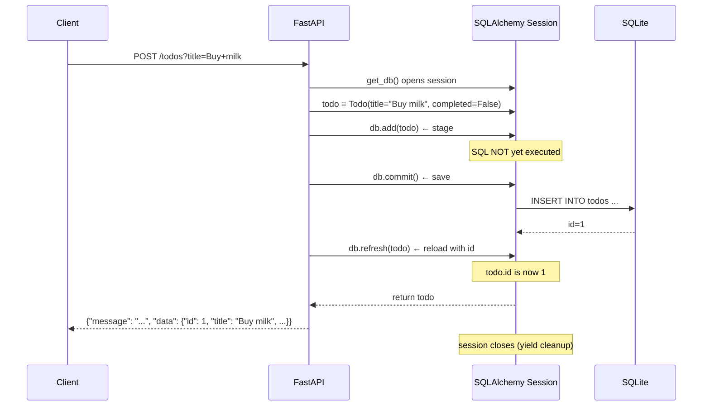

<div align="center">

# ➕ A017 — CREATE Operation with Database

### *Persist your first row. Add → Commit → Refresh.*

<br/>


</div>

---

## 🧠 The One-Sentence Summary

> **Create = `db.add(obj)` to stage the row, `db.commit()` to save it, `db.refresh(obj)` to load what the database generated (auto-incremented id, default timestamps) — three calls, in that order.**

If you remember *"add → commit → refresh"*, the rest of this README is decoration.

---

## 📑 Table of Contents

- [🧠 The One-Sentence Summary](#-the-one-sentence-summary)
- [📖 The Story: The Mailroom](#-the-story-the-mailroom)
- [🎯 What You Will Learn (10 Skills)](#-what-you-will-learn-10-skills)
- [📂 Project Structure](#-project-structure)
- [⚙️ Installation & Setup](#-installation--setup)
- [🧬 Anatomy of `main.py` — Line by Line](#-anatomy-of-mainpy--line-by-line)
- [🛣️ API Endpoints](#-api-endpoints)
- [🧠 The Mental Model: The Three Phases of CREATE](#-the-mental-model-the-three-phases-of-create)
- [🆕 Every New Keyword & Function Explained](#-every-new-keyword--function-explained)
- [🧪 Try It With curl](#-try-it-with-curl)
- [🔧 Variations: Pydantic-Validated Create](#-variations-pydantic-validated-create)
- [🆚 `title` as Form vs Body vs Query](#-title-as-form-vs-body-vs-query)
- [⚠️ Common Pitfalls & Fixes](#-common-pitfalls--fixes)
- [🧠 Mnemonic Cheat Sheet](#-mnemonic-cheat-sheet)
- [🧪 Recall Test](#-recall-test)
- [🎯 Interview Q&A](#-interview-qa)
- [🚀 Where to Go Next](#-where-to-go-next)

---

## 📖 The Story: The Mailroom

Imagine a mailroom 📬. A letter arrives:

1. 📨 **Receive** — Put the letter on the desk (`db.add`)
2. ✅ **Verify** — Open, read, validate the contents (`db.flush` — optional)
3. 📮 **File** — Put it in the cabinet permanently (`db.commit`)
4. 🏷️ **Stamp & return** — Apply the registered ID and return the letter to the sender (`db.refresh`)

That's the lifecycle of a CREATE operation in SQLAlchemy.

> 🧠 **Mnemonic:** "**A-C-R**" — **A**dd, **C**ommit, **R**efresh. Three steps, in that order.

---

## 🎯 What You Will Learn (10 Skills)

| # | 🎯 Skill | 🧠 You'll remember it because... |
|:-:|:---------|:--------------------------------|
| 1 | ➕ **`db.add(obj)`** | "Stage the row" |
| 2 | 💾 **`db.commit()`** | "Save to disk" |
| 3 | 🏷️ **`db.refresh(obj)`** | "Load DB-generated values" |
| 4 | 🆔 **Auto-incremented `id`** | "DB assigns the primary key" |
| 5 | 📤 **Return the new row** | "Echo the inserted object" |
| 6 | 🟡 **POST convention** | "201 Created for new resources" |
| 7 | 🎯 **`Depends(get_db)`** | "Per-request session" |
| 8 | 🚪 **Lifecycle of a session** | "Open → use → close" |
| 9 | 🔁 **`db.flush` vs `db.commit`** | "When SQL actually runs" |
| 10 | 🧹 **`db.rollback`** | "Undo on errors" |

---

## 📂 Project Structure

```
📁 A017_CREATE_Operation_with_Database/
├── 🐍 main.py     ← 45 lines: SQLAlchemy setup + POST /todos
├── 🗄️ test.db     ← created on first run (SQLite database)
└── 📖 README.md   ← you are here
```

---

## ⚙️ Installation & Setup

```powershell
cd D:\AllProgram\LEARN\Python\FastAPI\A017_CREATE_Operation_with_Database
python -m venv .venv
.\.venv\Scripts\Activate.ps1
pip install "fastapi[standard]" sqlalchemy
uvicorn main:app --reload
```

> 🧠 **Same install as A016.** This module extends A016 with a CREATE endpoint.

---

## 🧬 Anatomy of `main.py` — Line by Line

```python
from sqlalchemy import create_engine, Column, Integer, String
from sqlalchemy.orm import sessionmaker, declarative_base, Session
from fastapi import FastAPI, Depends

app = FastAPI()

DATABASE_URL = "sqlite:///./test.db"

engine = create_engine(
    DATABASE_URL,
    connect_args={"check_same_thread": False}
)

session_local = sessionmaker(bind=engine)

Base = declarative_base()

class Todo(Base):
    __tablename__ = "todos"
    id = Column(Integer, primary_key=True, index=True)
    title = Column(String)
    completed = Column(String)

Base.metadata.create_all(bind=engine)

def get_db():
    db = session_local()
    try:
        yield db
    finally:
        db.close()

# Create API
@app.post("/todos")
def create_todo(title: str, db: Session = Depends(get_db)):
    todo = Todo(title=title, completed=False)
    db.add(todo)
    db.commit()
    db.refresh(todo)
    return {
        "message": "Todo created",
        "data": todo
    }
```

| Lines | Code | 🧠 Why it's there |
|:-----:|:-----|:------------------|
| 1–3 | Imports | SQLAlchemy + FastAPI + `Depends` + `Session` |
| 5 | `app = FastAPI()` | App instance |
| 7 | `DATABASE_URL` | **Where** the DB lives |
| 10–13 | `engine = create_engine(...)` | **Connection factory** |
| 15 | `session_local = sessionmaker(...)` | **Session factory** |
| 17 | `Base = declarative_base()` | **Model parent** |
| 19–24 | `class Todo(Base)` | **Model** (a table) |
| 26 | `Base.metadata.create_all(...)` | **Create the table** |
| 28–33 | `def get_db()` | **Per-request session** |
| 36–45 | `@app.post("/todos")` | **The CREATE endpoint** |

### The Three Lines That Matter (lines 38–41)

```python
todo = Todo(title=title, completed=False)   # 1. Build the object
db.add(todo)                                # 2. Stage the insert
db.commit()                                 # 3. Save to the DB
db.refresh(todo)                            # 4. Load the generated id
```

> 🧠 **Mnemonic:** "**B-A-C-R**" — **B**uild, **A**dd, **C**ommit, **R**efresh. The four steps.

### 🎯 If you remember ONE thing
> **`db.add()` stages. `db.commit()` saves. `db.refresh()` reloads. Always in that order.**

---

## 🛣️ API Endpoints

| Method | Endpoint | Body | Returns |
|:------:|:---------|:-----|:--------|
| 🟡 POST | `/todos` | `?title=...` (query param) | `{ message, data: Todo }` |

> ⚠️ **Note:** The current endpoint accepts `title` as a **query parameter** (`?title=...`), not a JSON body. This is unusual for POST. See *Variations* below for the proper Pydantic-body approach.

---

## 🧠 The Mental Model: The Three Phases of CREATE



> 🧠 **Notice:** `db.add` does **not** run SQL. `db.commit` does. `db.refresh` re-queries the row.

---

## 🆕 Every New Keyword & Function Explained

### 1. `db.add(obj)` — stage the operation

**What:** Adds a new object to the session. **Does NOT execute SQL yet.**

```python
todo = Todo(title="Buy milk")
db.add(todo)    # ← staged, not saved
```

**Returns:** `None`. The session now tracks this object.

**For updates and deletes**, you don't call `db.add` — the object is already tracked. For a new object, `db.add` is mandatory.

> 🧠 **Mnemonic:** "**`add` = put in the cart. Don't checkout yet.**"

### 2. `db.commit()` — save to the database

**What:** Executes all pending SQL (INSERT, UPDATE, DELETE) and persists the changes to the DB.

```python
db.commit()    # ← INSERT runs, row is now in the DB
```

**Returns:** `None`. After commit, the session's pending operations are flushed.

**Auto-rollback on error:** SQLAlchemy 2.x auto-rolls back if `commit()` fails.

> 🧠 **Mnemonic:** "**`commit` = checkout. Pay and leave the store.**"

### 3. `db.refresh(obj)` — reload from the database

**What:** Re-queries the row in the DB and updates the in-memory object with the latest values.

```python
db.refresh(todo)    # ← todo.id is now 1 (DB-assigned)
```

**Why needed:** Auto-incremented `id`, default timestamps, and server-generated values aren't in the Python object until you reload.

**Returns:** `None`. Side effect: object attributes are updated.

> 🧠 **Mnemonic:** "**`refresh` = 'sync from the source of truth'**."

### 4. `db.flush()` — execute SQL without committing

**What:** Sends pending SQL to the DB **but doesn't commit** the transaction.

```python
db.add(todo)
db.flush()    # ← INSERT runs, but you can still rollback
print(todo.id)  # ← id is now populated (from the flush)
```

**When to use:** When you need the auto-incremented `id` **before** committing (e.g., to build a related object).

> 🧠 **Mnemonic:** "**`flush` = dry-run. SQL runs, but no permanent save.**"

### 5. `db.rollback()` — undo pending changes

**What:** Discards all pending changes since the last `commit()`.

```python
try:
    db.add(todo)
    db.commit()
except IntegrityError:
    db.rollback()    # ← undo the staged add
```

> 🧠 **Mnemonic:** "**`rollback` = ctrl-Z the transaction.**"

### 6. The full `add → commit → refresh` pattern

```python
todo = Todo(title="Buy milk", completed=False)
db.add(todo)        # 1. STAGE
db.commit()         # 2. SAVE
db.refresh(todo)    # 3. RELOAD (id is now set)
return todo
```

| Step | What it does | SQL fired? |
|:----:|:-------------|:-----------|
| `db.add(todo)` | Mark for INSERT | ❌ No |
| `db.commit()` | Save everything | ✅ `INSERT INTO todos ...` |
| `db.refresh(todo)` | Reload from DB | ✅ `SELECT * FROM todos WHERE id = 1` |

> 🧠 **Mnemonic:** "**Stage, Save, Sync.**"

---

## 🧪 Try It With curl

### 1. Create a todo (via query string)

```bash
curl -X POST "http://127.0.0.1:8000/todos?title=Buy+milk"
```

```json
{
  "message": "Todo created",
  "data": {
    "id": 1,
    "title": "Buy milk",
    "completed": false
  }
}
```

### 2. Create another todo

```bash
curl -X POST "http://127.0.0.1:8000/todos?title=Read+book"
```

### 3. Verify it persisted

Stop the server (Ctrl+C) and restart it. The data is still there — that's the DB doing its job.

### 4. Inspect from Python

```powershell
python -c "from main import SessionLocal, Todo; db = SessionLocal(); print(db.query(Todo).all()); db.close()"
```

Output:
```
[(1, 'Buy milk', 'false'), (2, 'Read book', 'false')]
```

---

## 🔧 Variations: Pydantic-Validated Create

The current `main.py` accepts `title` as a **query parameter** — fragile and not idiomatic. The proper way is to use a **Pydantic body model**:

```python
from pydantic import BaseModel

class TodoCreate(BaseModel):
    title: str
    completed: str = "false"

@app.post("/todos", status_code=201)
def create_todo(todo: TodoCreate, db: Session = Depends(get_db)):
    obj = Todo(**todo.model_dump())
    db.add(obj)
    db.commit()
    db.refresh(obj)
    return obj
```

Now the client sends JSON:

```bash
curl -X POST http://127.0.0.1:8000/todos \
  -H "Content-Type: application/json" \
  -d '{"title": "Buy milk", "completed": "false"}'
```

### With `response_model`

```python
from pydantic import ConfigDict

class TodoOut(BaseModel):
    model_config = ConfigDict(from_attributes=True)
    id: int
    title: str
    completed: str

@app.post("/todos", status_code=201, response_model=TodoOut)
def create_todo(todo: TodoCreate, db: Session = Depends(get_db)):
    obj = Todo(**todo.model_dump())
    db.add(obj)
    db.commit()
    db.refresh(obj)
    return obj
```

### Returning a richer shape

```python
@app.post("/todos", status_code=201)
def create_todo(todo: TodoCreate, db: Session = Depends(get_db)):
    obj = Todo(**todo.model_dump())
    db.add(obj)
    db.commit()
    db.refresh(obj)
    return {
        "message": "Todo created successfully",
        "id": obj.id,
        "data": obj
    }
```

---

## 🆚 `title` as Form vs Body vs Query

The current endpoint declares `title: str` without a Pydantic model. FastAPI defaults to **query parameter**:

```python
@app.post("/todos")
def create_todo(title: str, ...):  # ← title comes from ?title=...
```

| Style | Signature | Client sends |
|:------|:----------|:-------------|
| **Query param** (current) | `def create_todo(title: str)` | `?title=...` |
| **JSON body** (recommended) | `def create_todo(todo: TodoCreate)` | `{"title": "..."}` in body |
| **Form data** (HTML forms) | `def create_todo(title: str = Form(...))` | `application/x-www-form-urlencoded` |
| **Path param** | `def create_todo(title: str, todo_id: int)` | `/todos/{todo_id}/title` |

> 🧠 **Mnemonic:** "**Query = `?`. Body = JSON. Form = form-encoded. Path = `{...}`.**"

---

## ⚠️ Common Pitfalls & Fixes

| 😖 Pitfall | 🔍 Cause | ✅ Fix |
|:-----------|:---------|:------|
| `todo.id` is `None` after commit | Forgot `db.refresh(todo)` | Add `db.refresh(todo)` after `db.commit()` |
| `DetachedInstanceError` when returning | `db.close()` ran before serialization | Use `yield` dep so close happens after the response |
| `IntegrityError: UNIQUE constraint failed` | Duplicate primary key | Use auto-increment (don't set `id` manually) |
| `InvalidRequestError: ... is not persistent` | Tried to `refresh` an unsaved object | `refresh` only works after `add` + `commit`/`flush` |
| `db.add()` ran but no row in DB | Forgot `commit()` | Always call `commit` after `add` for writes |
| Pydantic can't serialize the response | Missing `from_attributes=True` | Add to Pydantic v2 model config |

### The "I Forgot refresh" Trap

```python
todo = Todo(title="x")
db.add(todo)
db.commit()
print(todo.id)    # None — id was generated by the DB, not by Python!
```

**Fix:**
```python
db.refresh(todo)
print(todo.id)    # 1 — now loaded from the DB
```

### The "I Forgot commit" Trap

```python
todo = Todo(title="x")
db.add(todo)
# No commit!
db.close()    # ← all staged changes discarded
```

The data is **gone**. Always `commit` before `close`.

---

## 🧠 Mnemonic Cheat Sheet

| Concept | Mnemonic | Story |
|:--------|:---------|:------|
| 3 phases | **A-C-R** | Add, Commit, Refresh |
| 4 lines | **B-A-C-R** | Build, Add, Commit, Refresh |
| `add` | **Stage** | Put in the cart |
| `commit` | **Save** | Checkout, leave the store |
| `refresh` | **Sync** | Reload from source of truth |
| `flush` | **Dry-run** | SQL runs, no permanent save |
| `rollback` | **Ctrl-Z** | Undo the transaction |

---

## 🧪 Recall Test

1. What's the order of `add` → `commit` → `refresh`?
2. Does `db.add(todo)` execute SQL immediately?
3. Why do you need `db.refresh(todo)` after `db.commit()`?
4. What does `db.flush()` do, and how is it different from `db.commit()`?
5. What's returned in the response — a dict or the object?
6. What happens to staged changes if you forget `db.commit()`?
7. Why does the current endpoint use `?title=...` instead of a JSON body?
8. How do you make a Pydantic model that reads from a SQLAlchemy object?

> 8/8 → CREATE is yours.

---

## 🎯 Interview Q&A

### Q1: Explain the `add → commit → refresh` lifecycle in SQLAlchemy.

**Answer:**

| Step | Method | What happens |
|:-----|:-------|:-------------|
| 1 | `db.add(obj)` | Object staged in the session. **No SQL yet.** |
| 2 | `db.commit()` | All pending SQL fires. Row persisted. |
| 3 | `db.refresh(obj)` | Re-queries the row. DB-generated values (id, timestamps) are loaded. |

> **One-liner:** *"Add stages, commit saves, refresh reloads."*

### Q2: Why call `db.refresh()` after `db.commit()`?

**Answer:** The `id` (and any default/timestamp values) is generated **by the database** during the INSERT, not by Python. The in-memory object still has `id=None` until you `refresh()`. Without it, the response would show `id: null`.

> **One-liner:** *"`refresh` loads the values the DB generated."*

### Q3: What's the difference between `db.flush()` and `db.commit()`?

**Answer:**

| `db.flush()` | `db.commit()` |
|:-------------|:---------------|
| Sends SQL to the DB | Sends SQL **and commits** the transaction |
| Changes can still be rolled back | Changes are permanent |
| Useful for getting the `id` mid-transaction | Used at the end of a unit of work |

> **One-liner:** *"flush = dry run. commit = permanent save."*

### Q4: What happens to a staged object if you close the session without committing?

**Answer:** **The changes are lost.** SQLAlchemy only persists what you've committed. The `yield`-based `get_db()` runs `db.close()` in `finally`, but `close()` does **not** auto-commit.

> **One-liner:** *"No commit = no save. Always commit before close."*

### Q5: Why does FastAPI's `yield` dependency matter for CREATE?

**Answer:** It ensures the session stays open **long enough to**:

1. Run the route (including `add` + `commit` + `refresh`)
2. Serialize the response (FastAPI reads the object's attributes)
3. **Then** close the session

If the session closed earlier, you'd hit `DetachedInstanceError` when FastAPI tries to read `todo.id` for the JSON response.

> **One-liner:** *"The session must outlive the response serialization."*

### Q6: Should the POST endpoint return 200 or 201?

**Answer:** **`201 Created`** is the convention. The new resource was successfully created. Add `status_code=201` (or `status.HTTP_201_CREATED`) to the decorator.

> **One-liner:** *"POST that creates = 201 Created."*

### Q7: How do you handle a duplicate primary key in CREATE?

**Answer:** Catch `IntegrityError`:

```python
from sqlalchemy.exc import IntegrityError

@app.post("/todos", status_code=201)
def create_todo(todo: TodoCreate, db: Session = Depends(get_db)):
    obj = Todo(id=todo.id, **todo.model_dump())
    try:
        db.add(obj)
        db.commit()
    except IntegrityError:
        db.rollback()
        raise HTTPException(409, "Todo with this id already exists")
    db.refresh(obj)
    return obj
```

> **One-liner:** *"Catch `IntegrityError`, rollback, return 409 Conflict."*

### Q8: How would you auto-set `created_at` on every new row?

**Answer:** Use `default=datetime.utcnow` in the model:

```python
from datetime import datetime
from sqlalchemy import Column, DateTime

class Todo(Base):
    __tablename__ = "todos"
    id = Column(Integer, primary_key=True)
    title = Column(String)
    created_at = Column(DateTime, default=datetime.utcnow)
```

`default=...` runs **at INSERT time** (Python-side). For DB-side defaults, use `server_default=func.now()`.

> **One-liner:** *"`default=` runs in Python. `server_default=` runs in the DB."*

---

## 🚀 Where to Go Next

| Direction | Module |
|:----------|:-------|
| ⬅️ Previous | [A016](../A016_SQLAlchemy_Setup_Models_Database_Integration/) |
| ⬅️ Back | [Root README](../README.md) |
| ➡️ Next | A018 (planned) — READ Operation (GET list + GET by id) |
| ➡️ Future | A019 (planned) — UPDATE + DELETE with SQLAlchemy |

---

<div align="center">

### ➕ *Stage, save, sync. Three calls, in that order. Forever.* ➕

Made with ❤️, `db.add()`, and a `db.refresh()`.

</div>