<div align="center">

# 📖 A018 — READ Operation with Database

### *List all. Find one. 404 if missing.*

<br/>


</div>

---

## 🧠 The One-Sentence Summary

> **Read = `db.query(Model).all()` for a list, `db.query(Model).filter(...).first()` for one — and raise `HTTPException(404)` when nothing matches.**

If you remember *"query → filter → all/first"*, the rest of this README is decoration.

---

## 📑 Table of Contents

- [🧠 The One-Sentence Summary](#-the-one-sentence-summary)
- [📖 The Story: The Library Catalog](#-the-story-the-library-catalog)
- [🎯 What You Will Learn (12 Skills)](#-what-you-will-learn-12-skills)
- [📂 Project Structure](#-project-structure)
- [⚙️ Installation & Setup](#-installation--setup)
- [🧬 Anatomy of `main.py` — Line by Line (Heavily Commented)](#-anatomy-of-mainpy--line-by-line-heavily-commented)
- [🛣️ API Endpoints](#-api-endpoints)
- [🧠 The Mental Model: SQLAlchemy Query Builder](#-the-mental-model-sqlalchemy-query-builder)
- [🆕 Every New Keyword & Function Explained](#-every-new-keyword--function-explained)
- [🆚 `.all()` vs `.first()` vs `.one()` vs `.scalar()`](#-all-vs-first-vs-one-vs-scalar)
- [🧪 Try It With curl](#-try-it-with-curl)
- [🔧 Variations: Filter, Order, Pagination](#-variations-filter-order-pagination)
- [⚠️ Common Pitfalls & Fixes](#-common-pitfalls--fixes)
- [🧠 Mnemonic Cheat Sheet](#-mnemonic-cheat-sheet)
- [🧪 Recall Test](#-recall-test)
- [🎯 Interview Q&A](#-interview-qa)
- [🚀 Where to Go Next](#-where-to-go-next)

---

## 📖 The Story: The Library Catalog

Imagine a library 📚. A patron asks:

- 🟢 *"Show me all the books in this section"* → `db.query(Todo).all()`
- 🔍 *"Find me the book with id #42"* → `db.query(Todo).filter(Todo.id == 42).first()`
- ❌ *"Sorry, no such book"* → `raise HTTPException(404)`

The librarian (SQLAlchemy) walks the shelves, finds the matches, and hands them back. If nothing matches, the librarian tells you honestly: 404.

> 🧠 **Mnemonic:** "**Query = the librarian. `.all()` = all books. `.first()` = the first match. 404 = not on the shelf.**"

---

## 🎯 What You Will Learn (12 Skills)

| # | 🎯 Skill | 🧠 You'll remember it because... |
|:-:|:---------|:--------------------------------|
| 1 | 🔍 **`db.query(Model)`** | "Build a query" |
| 2 | 📋 **`.all()`** | "Return every row" |
| 3 | 🎯 **`.filter(...)`** | "WHERE clause" |
| 4 | 🥇 **`.first()`** | "First match or None" |
| 5 | 🚨 **404 for missing rows** | "Raise HTTPException, not return dict" |
| 6 | 🆚 **`==` vs `=`** | "Python uses `==` for comparison" |
| 7 | 🔢 **`len(todos)`** | "Count the rows" |
| 8 | 📤 **Return rich shape** | "{message, Total, data}" |
| 9 | 🔀 **Query chaining** | "filter + order_by + limit" |
| 10 | 🆚 **`filter()` vs `filter_by()`** | "Two styles, same result" |
| 11 | 🧠 **Lazy vs Eager loading** | "When does the SQL actually run?" |
| 12 | 🎯 **404 vs 200 + error** | "Use the right status code" |

---

## 📂 Project Structure

```
📁 A018_READ_Operation_with_Database/
├── 🐍 main.py     ← 63 lines: SQLAlchemy setup + CREATE + READ all + READ one
├── 🗄️ test.db     ← created on first run (SQLite database)
└── 📖 README.md   ← you are here
```

---

## ⚙️ Installation & Setup

```powershell
cd D:\AllProgram\LEARN\Python\FastAPI\A018_READ_Operation_with_Database
python -m venv .venv
.\.venv\Scripts\Activate.ps1
pip install "fastapi[standard]" sqlalchemy
uvicorn main:app --reload
```

> 🧠 **Same setup as A016/A017.** This module extends them with two READ endpoints.

---

## 🧬 Anatomy of `main.py` — Line by Line (Heavily Commented)

The full file is now annotated. Here's the **READ** portion (the new part of this module):

```python
# READ ALL — GET /todos
@app.get("/todos")
def get_todos(db: Session = Depends(get_db)):
    # db.query(Todo)   → SELECT * FROM todos
    # .all()            → list of every row as Todo objects
    todos = db.query(Todo).all()

    return {
        "message": "",
        "Total": len(todos),    # how many came back
        "data": todos
    }

# READ ONE — GET /todos/{todo_id}
@app.get("/todos/{todo_id}")
def get_todo(todo_id: int, db: Session = Depends(get_db)):
    # .filter(Todo.id == todo_id)  → WHERE id = ?
    # .first()                      → first match, or None
    todo = db.query(Todo).filter(Todo.id == todo_id).first()

    # If no match, raise 404 (proper HTTP error)
    if not todo:
        raise HTTPException(status_code=404, detail="Todo not found")

    return todo
```

| Lines (new) | Code | 🧠 Why it's there |
|:-----------:|:-----|:------------------|
| 47 | `# Read all data` | Comment showing the section |
| 48 | `@app.get("/todos")` | Register the list endpoint |
| 49 | `def get_todos(db: Session = Depends(get_db))` | Inject the per-request session |
| 50 | `db.query(Todo).all()` | **The query** — returns a list |
| 51–54 | Return shape | `{ message, Total, data }` |
| 57 | `@app.get("/todos/{todo_id}")` | Register the one-by-id endpoint |
| 58 | `def get_todo(todo_id: int, ...)` | Path param with `int` validation |
| 59 | `db.query(Todo).filter(...).first()` | **The query** — returns one or None |
| 61 | `if not todo:` | Check for no match |
| 62 | `raise HTTPException(...)` | Return 404 |
| 63 | `return todo` | Return the match |

### The Two Query Patterns

```python
# Pattern 1: List everything
todos = db.query(Todo).all()

# Pattern 2: Find one by id
todo = db.query(Todo).filter(Todo.id == todo_id).first()
```

> 🧠 **Mnemonic:** "**Q-F-A**" — **Q**uery, **F**ilter, **A**ll (or First).

### 🎯 If you remember ONE thing
> **For a list: `.all()`. For one: `.filter(...).first()`. For missing: raise `HTTPException(404)`.**

---

## 🛣️ API Endpoints

| Method | Endpoint | Path | Returns |
|:------:|:---------|:-----|:--------|
| 🟡 POST | `/todos` | (query: `?title=...`) | Creates a new todo (from A017) |
| 🟢 GET | `/todos` | — | `{ message, Total, data: [Todo] }` |
| 🟢 GET | `/todos/{todo_id}` | `todo_id: int` | `Todo` or `404` |

---

## 🧠 The Mental Model: SQLAlchemy Query Builder

```mermaid
flowchart LR
    A[db.query&#40;Todo&#41;] -->|SELECT * FROM todos| B[Query object]
    B -->|.filter&#40;Todo.id == 1&#41;| C[WHERE id=1]
    B -->|.order_by&#40;Todo.id&#41;| D[ORDER BY id]
    B -->|.limit&#40;10&#41;| E[LIMIT 10]
    C --> F[.all&#40;&#41;]
    C --> G[.first&#40;&#41;]
    C --> H[.count&#40;&#41;]
    D --> F
    E --> F
    F --> I[List of Todo objects]
    G --> J[Todo or None]
    H --> K[int]
```



> 🧠 **Notice:** The query is **lazy**. SQL doesn't run until you call `.all()`, `.first()`, or `.count()`.

---

## 🆕 Every New Keyword & Function Explained

### 1. `db.query(Model)` — build a query

**What:** Returns a **Query object** that you can chain filters and limits onto.

```python
query = db.query(Todo)             # SELECT * FROM todos
query = db.query(Todo, User)       # SELECT * FROM todos, users  (join)
```

> 🧠 **Mnemonic:** "**`query` = 'start building a SELECT'**."

### 2. `.filter(*clauses)` — WHERE clause

**What:** Adds a WHERE clause. Use Python comparison operators (`==`, `!=`, `>`, `<`, `in_`, `like`, etc.).

```python
db.query(Todo).filter(Todo.id == 1)                    # WHERE id = 1
db.query(Todo).filter(Todo.completed == "true")         # WHERE completed = 'true'
db.query(Todo).filter(Todo.id > 5)                      # WHERE id > 5
db.query(Todo).filter(Todo.title.like("%buy%"))         # WHERE title LIKE '%buy%'
db.query(Todo).filter(Todo.id.in_([1, 2, 3]))           # WHERE id IN (1, 2, 3)
db.query(Todo).filter(Todo.id == 1, Todo.completed == "true")  # AND
```

> 🧠 **Mnemonic:** "**`filter` = WHERE. Use Python `==` for equals.**"

### 3. `.filter_by(**kwargs)` — keyword-style WHERE

**What:** Same as `.filter()` but uses keyword arguments. **String columns only.**

```python
db.query(Todo).filter_by(completed="true")             # WHERE completed = 'true'
db.query(Todo).filter_by(id=1, title="Buy milk")       # AND both
```

> ⚠️ Cannot use `>` or `<` — only `=`. For comparisons, use `.filter()`.

### 4. `.all()` — fetch every row

**What:** Runs the query and returns **all rows as a list of model instances**.

```python
todos = db.query(Todo).all()    # list[Todo]
# → [Todo(id=1, title='Buy milk'), Todo(id=2, title='Read book')]
```

**Returns:** `list[Todo]`. Empty list if no matches.

> 🧠 **Mnemonic:** "**`all` = every match, as a list.**"

### 5. `.first()` — fetch the first match

**What:** Runs the query and returns the **first row**, or `None` if no match.

```python
todo = db.query(Todo).filter(Todo.id == 1).first()    # Todo or None
```

**Returns:** `Todo | None`. Always check for `None`.

> 🧠 **Mnemonic:** "**`first` = one match or `None`.**"

### 6. `.one()` — exactly one match, else error

**What:** Returns the row only if **exactly one** matches. Otherwise raises.

```python
db.query(Todo).filter(Todo.id == 1).one()     # ✅ if exactly 1
db.query(Todo).one()                          # ❌ if more than 1 (raises MultipleResultsFound)
db.query(Todo).filter(Todo.id == 999).one()   # ❌ if 0 (raises NoResultFound)
```

> 🧠 **Mnemonic:** "**`one` = strict. 0 or 2+ is an error.**"

### 7. `.scalar()` — first column of first row

**What:** Returns a single value (not a tuple).

```python
count = db.query(Todo).filter(Todo.completed == "true").count()
# count is an int directly
```

> 🧠 **Mnemonic:** "**`scalar` = unwrap to a single value.**"

### 8. `.count()` — number of rows

**What:** Returns the count.

```python
n = db.query(Todo).count()    # SELECT COUNT(*) FROM todos
n = db.query(Todo).filter(Todo.completed == "true").count()
```

> 🧠 **Mnemonic:** "**`count` = SELECT COUNT(*).**"

### 9. `.order_by(column)` — ORDER BY

**What:** Sort the results.

```python
db.query(Todo).order_by(Todo.id)               # ASC by default
db.query(Todo).order_by(Todo.id.desc())        # DESC
```

### 10. `.limit(n)` and `.offset(n)` — pagination

```python
db.query(Todo).limit(10)                       # LIMIT 10
db.query(Todo).offset(20).limit(10)            # OFFSET 20 LIMIT 10  (page 3 of 10)
```

---

## 🆚 `.all()` vs `.first()` vs `.one()` vs `.scalar()`

| Method | Returns | Empty case | Multiple match case |
|:-------|:--------|:-----------|:-------------------|
| `.all()` | `list[Model]` | `[]` | (all) |
| `.first()` | `Model \| None` | `None` | first only |
| `.one()` | `Model` | raises `NoResultFound` | raises `MultipleResultsFound` |
| `.scalar()` | single value | `None` | first scalar only |
| `.count()` | `int` | `0` | (all counted) |

### When to Use Which

| Scenario | Use |
|:---------|:----|
| Show all todos in a list | `.all()` |
| Find one by id (might not exist) | `.filter(...).first()` |
| Find a unique-by-constraint row | `.filter(...).one()` |
| Just count the rows | `.count()` |
| Get a single value (e.g., max id) | `.scalar()` |

> 🧠 **Mnemonic:** "**`.all()` for lists, `.first()` for one (might be None), `.one()` for unique, `.scalar()` for a value.**"

---

## 🧪 Try It With curl

### 1. Create some todos

```bash
curl -X POST "http://127.0.0.1:8000/todos?title=Buy+milk"
curl -X POST "http://127.0.0.1:8000/todos?title=Read+book"
curl -X POST "http://127.0.0.1:8000/todos?title=Write+code"
```

### 2. List all todos

```bash
curl http://127.0.0.1:8000/todos
```

```json
{
  "message": "",
  "Total": 3,
  "data": [
    {"id": 1, "title": "Buy milk", "completed": "false"},
    {"id": 2, "title": "Read book", "completed": "false"},
    {"id": 3, "title": "Write code", "completed": "false"}
  ]
}
```

### 3. Get one by id

```bash
curl http://127.0.0.1:8000/todos/2
```

```json
{"id": 2, "title": "Read book", "completed": "false"}
```

### 4. Get a missing id (404)

```bash
curl -i http://127.0.0.1:8000/todos/999
```

```http
HTTP/1.1 404 Not Found
content-type: application/json

{"detail": "Todo not found"}
```

---

## 🔧 Variations: Filter, Order, Pagination

### Filter by completed

```python
@app.get("/todos/completed")
def get_completed(db: Session = Depends(get_db)):
    return db.query(Todo).filter(Todo.completed == "true").all()
```

### Order + limit

```python
@app.get("/todos/recent")
def get_recent(db: Session = Depends(get_db)):
    return db.query(Todo).order_by(Todo.id.desc()).limit(5).all()
```

### Pagination

```python
@app.get("/todos")
def get_todos(skip: int = 0, limit: int = 10, db: Session = Depends(get_db)):
    return db.query(Todo).offset(skip).limit(limit).all()
```

```bash
curl "http://127.0.0.1:8000/todos?skip=0&limit=2"    # first 2
curl "http://127.0.0.1:8000/todos?skip=2&limit=2"    # next 2
```

### Search by title

```python
@app.get("/todos/search")
def search(q: str, db: Session = Depends(get_db)):
    return db.query(Todo).filter(Todo.title.like(f"%{q}%")).all()
```

```bash
curl "http://127.0.0.1:8000/todos/search?q=buy"
# Returns todos whose title contains "buy"
```

### SQLAlchemy 2.x Style

```python
from sqlalchemy import select

@app.get("/todos")
def get_todos(db: Session = Depends(get_db)):
    return db.execute(select(Todo)).scalars().all()
```

---

## ⚠️ Common Pitfalls & Fixes

| 😖 Pitfall | 🔍 Cause | ✅ Fix |
|:-----------|:---------|:------|
| `SyntaxError: invalid syntax` (filter) | Used `=` instead of `==` | Use `==` in Python |
| 200 with `{error: ...}` | Returned dict instead of raising | `raise HTTPException(404, ...)` |
| `AttributeError: 'NoneType' has no attribute 'id'` | Didn't check `.first()` returned `None` | Always `if not x: raise ...` |
| `DetachedInstanceError` after close | Used object after `db.close()` | Return from route while session is open |
| `MultipleResultsFound` | Used `.one()` with multiple matches | Switch to `.first()` |
| Slow `len(todos)` | Calling `len()` on `.all()` | Use `.count()` instead |

### `=` vs `==` — The Classic Mistake

```python
# ❌ Assignment (always truthy)
db.query(Todo).filter(Todo.completed = "true")    # SyntaxError

# ✅ Comparison
db.query(Todo).filter(Todo.completed == "true")   # WHERE completed = 'true'
```

### Why `len(todos)` Is OK But Not Optimal

```python
# Works, but loads every row into memory
todos = db.query(Todo).all()
n = len(todos)

# Better — let the DB do the counting
n = db.query(Todo).count()
```

---

## 🧠 Mnemonic Cheat Sheet

| Concept | Mnemonic | Story |
|:--------|:---------|:------|
| Two patterns | **Q-F-A** | Query, Filter, All (or First) |
| `.all()` | **List** | Every match as a list |
| `.first()` | **One or None** | First match, or None if missing |
| `.one()` | **Strict** | Exactly one, else error |
| `==` vs `=` | **Python uses `==`** | Assignment vs comparison |
| 404 | **Honest librarian** | "Not on the shelf" |
| 200 + error | **Lying librarian** | "Yes, I have it" + empty shelf |

---

## 🧪 Recall Test

1. What's the difference between `.all()` and `.first()`?
2. What does `.filter(Todo.id == 1)` do?
3. How do you return a 404 when a row is missing?
4. Why use `==` (double equals) in `.filter()`?
5. What's the difference between `.filter()` and `.filter_by()`?
6. What does `.count()` return?
7. How do you order results descending?
8. Why use `.count()` instead of `len(db.query(Todo).all())`?

> 8/8 → READ is yours.

---

## 🎯 Interview Q&A

### Q1: What's the difference between `.all()` and `.first()` in SQLAlchemy?

**Answer:**

| `.all()` | `.first()` |
|:---------|:-----------|
| Returns `list[Model]` | Returns `Model \| None` |
| Empty → `[]` | Empty → `None` |
| Use for list endpoints | Use for "find by id" endpoints |

> **One-liner:** *".all() = list, .first() = one or None."*

### Q2: How do you return a proper 404 when a row is missing?

**Answer:** Always raise `HTTPException` — never return a dict with `error`:

```python
todo = db.query(Todo).filter(Todo.id == todo_id).first()
if not todo:
    raise HTTPException(status_code=404, detail="Todo not found")
return todo
```

> **One-liner:** *"Raise 404, don't lie with 200 + error."*

### Q3: How do you write `WHERE id = 1` in SQLAlchemy?

**Answer:** Use `==` (Python comparison, not `=`):

```python
db.query(Todo).filter(Todo.id == 1)
```

Other operators: `>`, `<`, `>=`, `<=`, `!=`, `in_`, `like`, `between`.

> **One-liner:** *"`.filter(Todo.id == 1)` = `WHERE id = 1`."*

### Q4: What's the difference between `.filter()` and `.filter_by()`?

**Answer:**

| `.filter(Todo.id == 1)` | `.filter_by(id=1)` |
|:------------------------|:------------------|
| SQLAlchemy expression | Keyword arguments |
| Supports `>`, `<`, `like`, `in_` | Only `=` |
| Verbose | Concise |

> **One-liner:** *"`filter` = operators. `filter_by` = kwargs."*

### Q5: When does SQLAlchemy actually run the query?

**Answer:** The query is **lazy**. SQL runs when you call:

- `.all()` — full list
- `.first()` — one row
- `.one()` — strict one
- `.count()` — count
- `.scalar()` — single value

`db.query(Todo)` alone does NOT run SQL.

> **One-liner:** *"Query is lazy. SQL runs at the terminal method."*

### Q6: How do you order results by id descending?

**Answer:** Use `.order_by(...desc())`:

```python
db.query(Todo).order_by(Todo.id.desc()).all()
```

> **One-liner:** *".order_by(column.desc()) = ORDER BY column DESC."*

### Q7: How do you implement pagination?

**Answer:** Use `.offset()` and `.limit()`:

```python
@app.get("/todos")
def list_todos(skip: int = 0, limit: int = 10, db: Session = Depends(get_db)):
    return db.query(Todo).offset(skip).limit(limit).all()
```

```bash
GET /todos?skip=0&limit=10     # page 1
GET /todos?skip=10&limit=10    # page 2
```

> **One-liner:** *".offset(skip).limit(limit) = LIMIT/OFFSET."*

### Q8: Why use `.count()` instead of `len(todos)` after `.all()`?

**Answer:** `.count()` runs `SELECT COUNT(*)` in the DB — fast, no row transfer. `len(db.query(Todo).all())` loads every row first, then counts in Python — wasteful for large tables.

```python
# ❌ Loads every row
n = len(db.query(Todo).all())

# ✅ Counts in DB
n = db.query(Todo).count()
```

> **One-liner:** *".count() = DB-side count. `len(.all())` = load then count."*

---

## 🚀 Where to Go Next

| Direction | Module |
|:----------|:-------|
| ⬅️ Previous | [A017](../A017_CREATE_Operation_with_Database/) |
| ⬅️ Back | [Root README](../README.md) |
| ➡️ Next | A019 (planned) — UPDATE + DELETE Operations |
| ➡️ Future | A020 (planned) — Full SQLAlchemy CRUD with Pydantic |

---

<div align="center">

### 📖 *List. Find. 404 if missing. That's READ.* 📖

Made with ❤️, `db.query()`, and `.first()`.

</div>