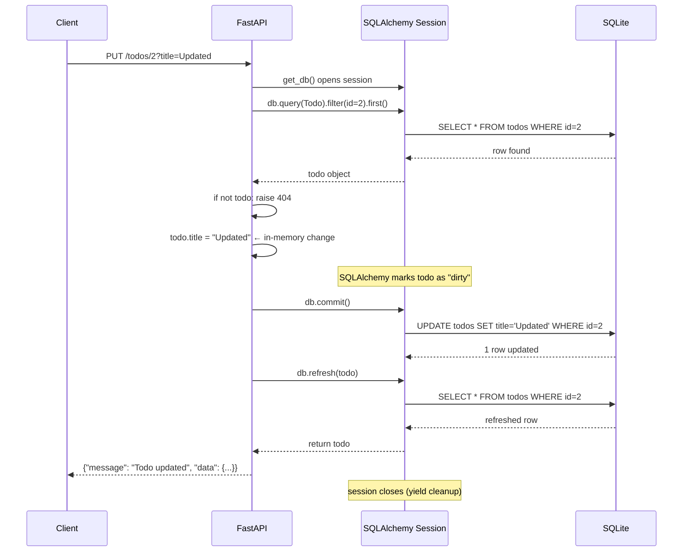

<div align="center">

# ✏️ A019 — UPDATE Operation with Database

### *Find the row. Mutate it. Commit. Refresh.*

<br/>


</div>

---

## 🧠 The One-Sentence Summary

> **Update = query for the row, mutate its attributes, then `db.commit()`. SQLAlchemy tracks the changes and fires an `UPDATE` statement automatically — no raw SQL needed.**

If you remember *"find → mutate → commit → refresh"*, the rest of this README is decoration.

---

## 📑 Table of Contents

- [🧠 The One-Sentence Summary](#-the-one-sentence-summary)
- [📖 The Story: The Whiteboard Eraser](#-the-story-the-whiteboard-eraser)
- [🎯 What You Will Learn (10 Skills)](#-what-you-will-learn-10-skills)
- [📂 Project Structure](#-project-structure)
- [⚙️ Installation & Setup](#-installation--setup)
- [🧬 Anatomy of `main.py` — Line by Line (Heavily Commented)](#-anatomy-of-mainpy--line-by-line-heavily-commented)
- [🛣️ API Endpoints](#-api-endpoints)
- [🧠 The Mental Model: How UPDATE Works in SQLAlchemy](#-the-mental-model-how-update-works-in-sqlalchemy)
- [🆕 Every New Keyword & Function Explained](#-every-new-keyword--function-explained)
- [🆚 `PUT` vs `PATCH` — Which to Use](#-put-vs-patch--which-to-use)
- [🧪 Try It With curl](#-try-it-with-curl)
- [🔧 Variations: PATCH-style Partial Updates](#-variations-patch-style-partial-updates)
- [⚠️ Common Pitfalls & Fixes](#-common-pitfalls--fixes)
- [🧠 Mnemonic Cheat Sheet](#-mnemonic-cheat-sheet)
- [🧪 Recall Test](#-recall-test)
- [🎯 Interview Q&A](#-interview-qa)
- [🚀 Where to Go Next](#-where-to-go-next)

---

## 📖 The Story: The Whiteboard Eraser

Imagine a whiteboard with todos on it 🖍️. UPDATE is **erasing one item and writing a new one in its place**:

1. 🔍 **Find** the row by id
2. ❌ **Check** it exists (404 if not)
3. ✏️ **Erase & write** — change the attributes on the Python object
4. 💾 **Save** — `db.commit()` fires the UPDATE
5. 🪞 **Reflect** — `db.refresh()` reloads the row

> 🧠 **Mnemonic:** "**F-C-M-C-R**" — **F**ind, **C**heck, **M**utate, **C**ommit, **R**efresh.

---

## 🎯 What You Will Learn (10 Skills)

| # | 🎯 Skill | 🧠 You'll remember it because... |
|:-:|:---------|:--------------------------------|
| 1 | ✏️ **Update via attribute mutation** | "Just set the attribute" |
| 2 | 💾 **`db.commit()`** | "Saves pending changes" |
| 3 | 🔄 **SQLAlchemy's auto-`UPDATE`** | "It tracks what you changed" |
| 4 | 🆚 **PUT vs PATCH** | "PUT replaces, PATCH edits" |
| 5 | ❌ **404 on missing row** | "Always check, then raise" |
| 6 | 🔁 **Update + refresh** | "Why refresh after update" |
| 7 | 🧬 **Bulk updates with `update()`** | "One SQL for many rows" |
| 8 | 🆔 **Update by id (PUT path)** | "Path + body = update" |
| 9 | 🧹 **Optimistic locking** | "Version field to detect conflicts" |
| 10 | 🔒 **Concurrency gotchas** | "Two updates at once = last wins" |

---

## 📂 Project Structure

```
📁 A019_UPDATE_Operation_with_Database/
├── 🐍 main.py     ← 130 lines: SQLAlchemy setup + CREATE + READ + UPDATE
├── 🗄️ test.db     ← created on first run (SQLite database)
└── 📖 README.md   ← you are here
```

---

## ⚙️ Installation & Setup

```powershell
cd D:\AllProgram\LEARN\Python\FastAPI\A019_UPDATE_Operation_with_Database
python -m venv .venv
.\.venv\Scripts\Activate.ps1
pip install "fastapi[standard]" sqlalchemy
uvicorn main:app --reload
```

> 🧠 **Same setup as A017/A018.** This module adds a `PUT` endpoint.

---

## 🧬 Anatomy of `main.py` — Line by Line (Heavily Commented)

The full file is now annotated. Here's the **UPDATE** portion (the new part):

```python
# =========================================================
# UPDATE — PUT /todos/{todo_id}
# =========================================================
# Flow:
#   1. Look up the row by id
#   2. If not found, raise 404
#   3. Mutate the in-memory object's attributes
#   4. `db.commit()` flushes the changes as an UPDATE statement
#   5. `db.refresh()` reloads the row
@app.put("/todos/{todo_id}")
def update_todo(todo_id: int, title: str, db: Session = Depends(get_db)):
    # SELECT * FROM todos WHERE id = {todo_id} LIMIT 1
    todo = db.query(Todo).filter(Todo.id == todo_id).first()

    # If no row matched, raise 404
    if not todo:
        raise HTTPException(status_code=404, detail="Todo not found")

    # Mutate the in-memory object — SQLAlchemy tracks the change
    todo.title = title

    # Commit to send the UPDATE to the DB
    db.commit()

    # Refresh to reload the row
    db.refresh(todo)

    return {
        "message": "Todo updated",
        "data": todo
    }
```

| Lines (new) | Code | 🧠 Why it's there |
|:-----------:|:-----|:------------------|
| 109 | `# Update` | Comment |
| 110 | `@app.put("/todos/{todo_id}")` | Register the update endpoint |
| 111 | `def update_todo(todo_id, title, db)` | Path param + body + session |
| 112 | `db.query(Todo).filter(...).first()` | **Find** the row |
| 114 | `if not todo:` | Check existence |
| 115 | `raise HTTPException(404, ...)` | 404 if missing |
| 117 | `todo.title = title` | **Mutate** the attribute |
| 119 | `db.commit()` | **Save** (fires `UPDATE`) |
| 120 | `db.refresh(todo)` | **Reload** the row |
| 122–125 | Return shape | `{ message, data: todo }` |

### The Magic Line

```python
todo.title = title
```

**This is all you write.** No `UPDATE todos SET title = ? WHERE id = ?` SQL. SQLAlchemy:

1. Detects the attribute change (called a **"dirty" object**)
2. On `commit()`, generates the `UPDATE` statement
3. Sends it to the DB
4. Clears the dirty flag

> 🧠 **Mnemonic:** "**Mutate the Python, SQLAlchemy writes the SQL.**"

### 🎯 If you remember ONE thing
> **Update = find → mutate → commit → refresh. No raw SQL.**

---

## 🛣️ API Endpoints

| Method | Endpoint | Path | Body | Returns |
|:------:|:---------|:-----|:-----|:--------|
| 🟡 POST | `/todos` | — | `?title=...` | Create (from A017) |
| 🟢 GET | `/todos` | — | — | List (from A018) |
| 🟢 GET | `/todos/{todo_id}` | `todo_id: int` | — | One (from A018) |
| 🟠 PUT | `/todos/{todo_id}` | `todo_id: int` | `?title=...` | Updated todo or 404 |

---

## 🧠 The Mental Model: How UPDATE Works in SQLAlchemy



> 🧠 **Notice:** No raw SQL is written by the user. SQLAlchemy generates it from the Python attribute change.

---

## 🆕 Every New Keyword & Function Explained

### 1. Attribute mutation — `obj.field = value`

**What:** Just assign a new value to the model's attribute. SQLAlchemy tracks it.

```python
todo = db.query(Todo).filter(Todo.id == 1).first()
todo.title = "New title"     # ← tracked, not yet saved
todo.completed = "true"      # ← also tracked
```

**What you DON'T do:**

```python
# ❌ Don't run raw UPDATE
db.execute("UPDATE todos SET title = 'x' WHERE id = 1")

# ❌ Don't re-query
todo = db.query(Todo).filter(Todo.id == 1).first()    # would re-fetch
todo.title = "x"                                       # ← unnecessary
```

> 🧠 **Mnemonic:** "**Mutate the object. SQLAlchemy does the SQL.**"

### 2. `db.commit()` — save the changes

**What:** Fires the `UPDATE` statement and persists the change.

```python
todo.title = "New"
db.commit()    # ← UPDATE todos SET title='New' WHERE id=1
```

> 🧠 **Mnemonic:** "**`commit` = save. UPDATE fires now.**"

### 3. `db.refresh(obj)` — reload from the DB

**What:** Re-queries the row and updates the in-memory object.

```python
todo.title = "New"
db.commit()
db.refresh(todo)    # ← in case the DB changed the value (trigger, default)
```

**Why needed for UPDATE:**

- A `BEFORE UPDATE` trigger might modify the value
- A `server_default` might fill in a column
- You want the **actual stored value**, not what you wrote

> 🧠 **Mnemonic:** "**`refresh` = sync from DB.**"

### 4. `db.dirty` — what's pending

**What:** Returns the set of objects that have been modified but not committed.

```python
todo.title = "New"
print(db.dirty)    # IdentitySet([<Todo object>])
db.commit()
print(db.dirty)    # IdentitySet([])
```

Useful for debugging: "Did I forget to commit?"

> 🧠 **Mnemonic:** "**`db.dirty` = the pending updates.**"

### 5. `db.new` — what's staged to insert

**What:** Returns the set of objects staged for `INSERT`.

```python
todo = Todo(title="x")
db.add(todo)
print(db.new)    # IdentitySet([<Todo object>])
```

> 🧠 **Mnemonic:** "**`db.new` = the pending inserts.**"

### 6. Bulk update with `Query.update()`

**What:** Run a single `UPDATE` statement that affects **many rows** at once.

```python
# Mark all uncompleted todos as completed
db.query(Todo).filter(Todo.completed == "false").update(
    {"completed": "true"},
    synchronize_session=False    # ← important for performance
)
db.commit()
```

This fires **one** SQL statement:

```sql
UPDATE todos SET completed = 'true' WHERE completed = 'false'
```

> 🧠 **Mnemonic:** "**Bulk update = one SQL, many rows.**"

### 7. `synchronize_session` — sync strategy

**What:** Tells SQLAlchemy how to update its in-memory objects after a bulk update.

| Value | Behavior |
|:------|:---------|
| `False` | Don't sync (fastest; in-memory objects become stale) |
| `"fetch"` | Re-query all affected rows (slow but safe) |
| `"evaluate"` | Apply the update to in-memory objects (default for single-row) |

```python
db.query(Todo).filter(Todo.completed == "false").update(
    {"completed": "true"},
    synchronize_session=False
)
```

> 🧠 **Mnemonic:** "**`synchronize_session=False` for speed. `fetch` for safety.**"

---

## 🆚 `PUT` vs `PATCH` — Which to Use

| `PUT` | `PATCH` |
|:------|:--------|
| Replaces the **whole** resource | Updates **some** fields |
| Body must contain all fields | Body contains only changed fields |
| Idempotent | Idempotent in semantics |
| Use when client knows the full state | Use for partial updates |

### PUT — Replace

```python
@app.put("/todos/{todo_id}")
def update_todo(todo_id: int, title: str, db: Session = Depends(get_db)):
    todo = db.query(Todo).filter(Todo.id == todo_id).first()
    if not todo:
        raise HTTPException(404, "Todo not found")
    todo.title = title
    db.commit()
    return todo
```

### PATCH — Partial Update

```python
from typing import Optional
from pydantic import BaseModel

class TodoUpdate(BaseModel):
    title: Optional[str] = None
    completed: Optional[str] = None

@app.patch("/todos/{todo_id}")
def patch_todo(todo_id: int, changes: TodoUpdate, db: Session = Depends(get_db)):
    todo = db.query(Todo).filter(Todo.id == todo_id).first()
    if not todo:
        raise HTTPException(404, "Todo not found")
    if changes.title is not None:
        todo.title = changes.title
    if changes.completed is not None:
        todo.completed = changes.completed
    db.commit()
    return todo
```

> 🧠 **Mnemonic:** "**PUT = full replace. PATCH = partial edit.**"

---

## 🧪 Try It With curl

### 1. Create a todo

```bash
curl -X POST "http://127.0.0.1:8000/todos?title=Buy+milk"
```

### 2. Update it

```bash
curl -X PUT "http://127.0.0.1:8000/todos/1?title=Buy+organic+milk"
```

```json
{
  "message": "Todo updated",
  "data": {"id": 1, "title": "Buy organic milk", "completed": "false"}
}
```

### 3. Verify

```bash
curl http://127.0.0.1:8000/todos/1
# {"id": 1, "title": "Buy organic milk", "completed": "false"}
```

### 4. Update a missing id (404)

```bash
curl -i -X PUT "http://127.0.0.1:8000/todos/999?title=Ghost"
```

```http
HTTP/1.1 404 Not Found
content-type: application/json

{"detail": "Todo not found"}
```

---

## 🔧 Variations: PATCH-style Partial Updates

### PATCH only the `completed` field

```bash
curl -X PATCH http://127.0.0.1:8000/todos/1 \
  -H "Content-Type: application/json" \
  -d '{"completed": "true"}'
```

```python
@app.patch("/todos/{todo_id}")
def patch_todo(todo_id: int, changes: TodoUpdate, db: Session = Depends(get_db)):
    todo = db.query(Todo).filter(Todo.id == todo_id).first()
    if not todo:
        raise HTTPException(404, "Todo not found")

    # `model_dump(exclude_unset=True)` gives only the fields the client sent
    update_data = changes.model_dump(exclude_unset=True)
    for field, value in update_data.items():
        setattr(todo, field, value)

    db.commit()
    db.refresh(todo)
    return todo
```

> 🧠 **Mnemonic:** "**`exclude_unset=True` = 'only the fields the client sent'**."

### Bulk update (mark all as done)

```python
@app.post("/todos/mark-all-done", status_code=200)
def mark_all_done(db: Session = Depends(get_db)):
    n = db.query(Todo).filter(Todo.completed == "false").update(
        {"completed": "true"},
        synchronize_session=False
    )
    db.commit()
    return {"message": f"{n} todos marked done"}
```

### Update with timestamps

```python
from datetime import datetime

class Todo(Base):
    __tablename__ = "todos"
    id = Column(Integer, primary_key=True)
    title = Column(String)
    updated_at = Column(String)    # ← new column

@app.put("/todos/{todo_id}")
def update_todo(todo_id: int, title: str, db: Session = Depends(get_db)):
    todo = db.query(Todo).filter(Todo.id == todo_id).first()
    if not todo:
        raise HTTPException(404, "Todo not found")
    todo.title = title
    todo.updated_at = datetime.utcnow().isoformat()    # ← record the update
    db.commit()
    return todo
```

---

## ⚠️ Common Pitfalls & Fixes

| 😖 Pitfall | 🔍 Cause | ✅ Fix |
|:-----------|:---------|:------|
| 200 with `{error: ...}` on missing id | Returned dict instead of raising | `raise HTTPException(404, ...)` |
| `DetachedInstanceError` | Object accessed after `db.close()` | Use `yield` dep so close happens after response |
| Changes not saved | Forgot `db.commit()` | Always commit after mutating |
| Two clients update same row | No optimistic locking | Add a `version` column, check before commit |
| UPDATE doesn't run | Wrote `todo.title` but used a different variable | Make sure the object you mutate is the one in the session |
| `UnmappedInstanceError` | Tried to update an object not in the session | `db.add(todo)` first if you created it manually |

### The "Forgot to Fetch" Trap

```python
# ❌ This creates a *new* Todo, not updates the existing one
@app.put("/todos/{todo_id}")
def bad(todo_id: int, title: str, db: Session = Depends(get_db)):
    todo = Todo(id=todo_id, title=title)    # ← detached object
    db.add(todo)                            # ← INSERT, not UPDATE
    db.commit()

# ✅ Always fetch first
@app.put("/todos/{todo_id}")
def good(todo_id: int, title: str, db: Session = Depends(get_db)):
    todo = db.query(Todo).filter(Todo.id == todo_id).first()
    if not todo:
        raise HTTPException(404, "Todo not found")
    todo.title = title    # ← UPDATE
    db.commit()
```

### Optimistic Locking with a `version` Column

```python
class Todo(Base):
    __tablename__ = "todos"
    id = Column(Integer, primary_key=True)
    title = Column(String)
    version = Column(Integer, default=0)    # ← version counter

@app.put("/todos/{todo_id}")
def update_with_lock(todo_id: int, title: str, expected_version: int, db: Session = Depends(get_db)):
    rows = db.query(Todo).filter(
        Todo.id == todo_id,
        Todo.version == expected_version    # ← only if version matches
    ).update({"title": title, "version": Todo.version + 1})

    if rows == 0:
        raise HTTPException(409, "Version conflict — someone else updated first")

    db.commit()
    return db.query(Todo).filter(Todo.id == todo_id).first()
```

> 🧠 **Mnemonic:** "**Optimistic locking = 'I think the version is X. If not, fail'**."

---

## 🧠 Mnemonic Cheat Sheet

| Concept | Mnemonic | Story |
|:--------|:---------|:------|
| 4 steps | **F-C-M-C-R** | Find, Check, Mutate, Commit, Refresh |
| Mutate-and-commit | **Python = SQL** | Mutate the object, SQLAlchemy writes UPDATE |
| `PUT` vs `PATCH` | **Full vs partial** | PUT replaces, PATCH edits |
| 404 | **Honest librarian** | "Not on the shelf" |
| `db.dirty` | **Pending updates** | Use to debug "did I forget to commit?" |
| Bulk update | **One SQL, many rows** | `query.update({...})` |
| Optimistic lock | **Version match** | "I think it's X. If not, fail." |

---

## 🧪 Recall Test

1. What's the order: query, mutate, commit, refresh?
2. How do you update a row in SQLAlchemy?
3. What's the difference between `PUT` and `PATCH`?
4. Why raise 404 instead of returning a dict?
5. What does `db.dirty` show?
6. How do you bulk-update many rows at once?
7. What is `synchronize_session=False` and why use it?
8. What is optimistic locking?

> 8/8 → UPDATE is yours.

---

## 🎯 Interview Q&A

### Q1: How do you update a row in SQLAlchemy?

**Answer:** Query for it, mutate its attributes, then `commit()`:

```python
todo = db.query(Todo).filter(Todo.id == todo_id).first()
if not todo:
    raise HTTPException(404, "Not found")
todo.title = new_title
db.commit()
db.refresh(todo)
```

No raw SQL — SQLAlchemy detects the change and fires the UPDATE on commit.

> **One-liner:** *"Find, mutate, commit. SQLAlchemy does the SQL."*

### Q2: Why do you call `db.refresh()` after `db.commit()`?

**Answer:** To reload the row from the DB. Triggers or server-side defaults might have modified the value. Without `refresh`, the in-memory object still has the **stale** pre-commit value.

> **One-liner:** *"`refresh` = sync from DB after commit."*

### Q3: What's the difference between `PUT` and `PATCH`?

**Answer:**

| `PUT` | `PATCH` |
|:------|:--------|
| Replaces the whole resource | Updates only the fields you send |
| Idempotent | Idempotent in semantics |
| Body has all fields | Body has only changed fields |

> **One-liner:** *"PUT = full replace. PATCH = partial edit."*

### Q4: How do you do a bulk update?

**Answer:** Use `Query.update()`:

```python
db.query(Todo).filter(Todo.completed == "false").update(
    {"completed": "true"},
    synchronize_session=False
)
db.commit()
```

This fires **one** SQL statement for all matching rows.

> **One-liner:** *"Bulk update = one SQL, many rows."*

### Q5: What is optimistic locking?

**Answer:** A concurrency control technique. Each row has a `version` column. On update, you check that the version still matches what you read. If not, someone else updated first — fail with 409 Conflict.

```python
db.query(Todo).filter(
    Todo.id == id,
    Todo.version == expected_version
).update({"title": new, "version": Todo.version + 1})
```

> **One-liner:** *"Optimistic lock = 'I think the version is X'."*

### Q6: What happens if you mutate an object that's not in the session?

**Answer:** SQLAlchemy doesn't track it. The change is **silently lost** when the session closes. Solution: query for the object first, then mutate.

```python
# ❌ Lost
todo = Todo(id=1, title="x")    # detached
todo.title = "y"                # not tracked
db.commit()                     # nothing saved

# ✅ Tracked
todo = db.query(Todo).filter(Todo.id == 1).first()
todo.title = "y"                # tracked
db.commit()                     # UPDATE runs
```

> **One-liner:** *"Mutate objects that are in the session, not detached ones."*

### Q7: How would you record when a row was last updated?

**Answer:** Add a `updated_at` column and set it in your update handler:

```python
class Todo(Base):
    __tablename__ = "todos"
    id = Column(Integer, primary_key=True)
    title = Column(String)
    updated_at = Column(String)

@app.put("/todos/{todo_id}")
def update_todo(todo_id: int, title: str, db: Session = Depends(get_db)):
    todo = db.query(Todo).filter(Todo.id == todo_id).first()
    todo.title = title
    todo.updated_at = datetime.utcnow().isoformat()
    db.commit()
    return todo
```

> **One-liner:** *"`updated_at` = 'when did this last change?'**.*

### Q8: What is `synchronize_session=False` and when should you use it?

**Answer:** It tells SQLAlchemy **not to sync in-memory objects** after a bulk `update()`. Use it for **performance** when:

- You don't need the updated values in Python
- You're done with the session soon
- You're updating thousands of rows

Trade-off: in-memory objects become stale; calling `todo.title` after the update returns the **old** value.

> **One-liner:** *"`synchronize_session=False` = speed over freshness."*

---

## 🚀 Where to Go Next

| Direction | Module |
|:----------|:-------|
| ⬅️ Previous | [A018](../A018_READ_Operation_with_Database/) |
| ⬅️ Back | [Root README](../README.md) |
| ➡️ Next | A020 (planned) — DELETE Operation |
| ➡️ Future | A021 (planned) — Full SQLAlchemy CRUD with Pydantic |

---

<div align="center">

### ✏️ *Mutate the Python, let SQLAlchemy write the SQL.* ✏️

Made with ❤️, `todo.title = "..."`, and `db.commit()`.

</div>