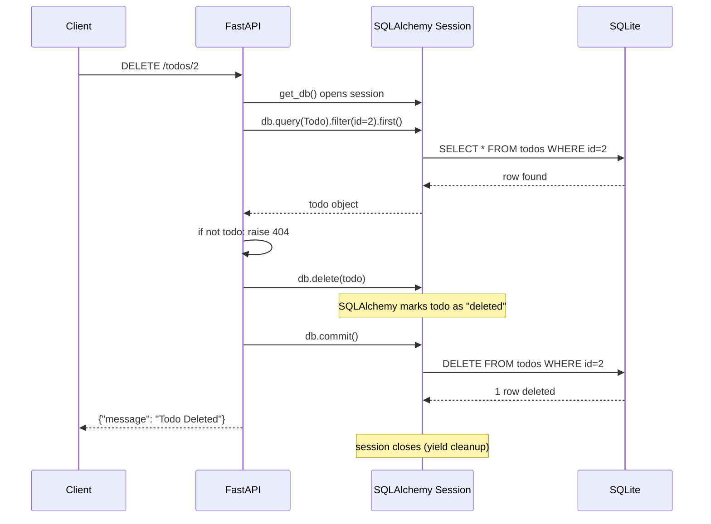

<div align="center">

# 🗑️ A020 — DELETE Operation with Database

### *Find the row. Delete it. Commit. Gone.*

<br/>


</div>

---

## 🧠 The One-Sentence Summary

> **Delete = query for the row, `db.delete(obj)`, `db.commit()`. The row is gone. No `if deleted: return null` — just `204 No Content`.**

If you remember *"find → delete → commit"*, the rest of this README is decoration.

---

## 📑 Table of Contents

- [🧠 The One-Sentence Summary](#-the-one-sentence-summary)
- [📖 The Story: The Sweeper](#-the-story-the-sweeper)
- [🎯 What You Will Learn (10 Skills)](#-what-you-will-learn-10-skills)
- [📂 Project Structure](#-project-structure)
- [⚙️ Installation & Setup](#-installation--setup)
- [🧬 Anatomy of `main.py` — Line by Line (Heavily Commented)](#-anatomy-of-mainpy--line-by-line-heavily-commented)
- [🛣️ API Endpoints](#-api-endpoints)
- [🧠 The Mental Model: How DELETE Works in SQLAlchemy](#-the-mental-model-how-delete-works-in-sqlalchemy)
- [🆕 Every New Keyword & Function Explained](#-every-new-keyword--function-explained)
- [🆚 Hard Delete vs Soft Delete](#-hard-delete-vs-soft-delete)
- [🆚 `204 No Content` vs `200 OK` vs `404 Not Found`](#-204-no-content-vs-200-ok-vs-404-not-found)
- [🧪 Try It With curl](#-try-it-with-curl)
- [🔧 Variations](#-variations)
- [⚠️ Common Pitfalls & Fixes](#-common-pitfalls--fixes)
- [🧠 Mnemonic Cheat Sheet](#-mnemonic-cheat-sheet)
- [🧪 Recall Test](#-recall-test)
- [🎯 Interview Q&A](#-interview-qa)
- [🚀 Where to Go Next](#-where-to-go-next)

---

## 📖 The Story: The Sweeper

Imagine a whiteboard with todos on it 🖍️. DELETE is **the sweeper 🧹**:

1. 🔍 **Find** the row by id
2. ❌ **Check** it exists (404 if not)
3. 🧹 **Sweep** — `db.delete(todo)` stages the DELETE
4. 💾 **Empty the dustpan** — `db.commit()` actually removes the row
5. ✅ **Done** — return `204 No Content` (the request succeeded, no body)

> 🧠 **Mnemonic:** "**F-C-D-C**" — **F**ind, **C**heck, **D**elete, **C**ommit.

---

## 🎯 What You Will Learn (10 Skills)

| # | 🎯 Skill | 🧠 You'll remember it because... |
|:-:|:---------|:--------------------------------|
| 1 | 🧹 **`db.delete(obj)`** | "Stages the DELETE" |
| 2 | 💾 **`db.commit()`** | "Actually fires the SQL" |
| 3 | 🆔 **404 on missing row** | "Always check before delete" |
| 4 | ✅ **204 No Content** | "Success, no body" |
| 5 | 🔁 **Cascade delete** | "Delete parent → delete children" |
| 6 | 🗃️ **Soft delete** | "Set `deleted_at`, don't remove" |
| 7 | 🧹 **Bulk delete** | "One SQL, many rows" |
| 8 | 🔒 **Foreign keys** | "What happens to related rows?" |
| 9 | ⚡ **`PRAGMA foreign_keys=ON`** | "SQLite needs this to cascade" |
| 10 | 🪞 **`db.dirty` vs `db.deleted`** | "What state is the session in?" |

---

## 📂 Project Structure

```
📁 A020_DELETE_Operation_with_Database/
├── 🐍 main.py     ← 153 lines: SQLAlchemy setup + CREATE + READ + UPDATE + DELETE
├── 🗄️ test.db     ← created on first run (SQLite database)
└── 📖 README.md   ← you are here
```

---

## ⚙️ Installation & Setup

```powershell
cd D:\AllProgram\LEARN\Python\FastAPI\A020_DELETE_Operation_with_Database
python -m venv .venv
.\.venv\Scripts\Activate.ps1
pip install "fastapi[standard]" sqlalchemy
uvicorn main:app --reload
```

> 🧠 **Same setup as A017/A018/A019.** This module adds a `DELETE` endpoint.

---

## 🧬 Anatomy of `main.py` — Line by Line (Heavily Commented)

The DELETE portion (the new part):

```python
# =========================================================
# DELETE — DELETE /todos/{todo_id}
# =========================================================
# Flow:
#   1. Look up the row by id
#   2. If not found, raise 404
#   3. `db.delete(todo)` stages the DELETE
#   4. `db.commit()` fires the DELETE
#   5. Return 204 No Content
@app.delete("/todos/{todo_id}")
def delete_todo(todo_id: int, db: Session = Depends(get_db)):
    # SELECT * FROM todos WHERE id = {todo_id} LIMIT 1
    todo = db.query(Todo).filter(Todo.id == todo_id).first()

    # If no row matched, raise 404
    if not todo:
        raise HTTPException(status_code=404, detail="Todo not found")

    # Stage the DELETE (the object is marked as deleted in the session)
    db.delete(todo)

    # Commit to send the DELETE to the DB
    db.commit()

    # 204 No Content is the standard response for a successful DELETE
    return {
        "message": "Todo Deleted"
    }
```

| Lines (new) | Code | 🧠 Why it's there |
|:-----------:|:-----|:------------------|
| 140 | `# DELETE` | Comment |
| 141 | `@app.delete("/todos/{todo_id}")` | Register the delete endpoint |
| 142 | `def delete_todo(todo_id, db)` | Path param + session |
| 143 | `db.query(Todo).filter(...).first()` | **Find** the row |
| 145–146 | `if not todo: raise 404` | Check existence |
| 148 | `db.delete(todo)` | **Stage** the DELETE |
| 149 | `db.commit()` | **Fire** the SQL |
| 151–152 | Return shape | `{ message }` |

### The Two Magic Lines

```python
db.delete(todo)    # stage
db.commit()        # fire
```

That's it. No raw SQL. SQLAlchemy:

1. Marks the object as "deleted" (added to `db.deleted`)
2. On `commit()`, generates the `DELETE` statement
3. Sends it to the DB
4. The row is **gone** from the table

> 🧠 **Mnemonic:** "**`delete` stages. `commit` fires.**"

### 🎯 If you remember ONE thing
> **Delete = find → delete → commit. The row is gone. Return 204.**

---

## 🛣️ API Endpoints

| Method | Endpoint | Path | Body | Returns |
|:------:|:---------|:-----|:-----|:--------|
| 🟡 POST | `/todos` | — | `?title=...` | Create (from A017) |
| 🟢 GET | `/todos` | — | — | List (from A018) |
| 🟢 GET | `/todos/{todo_id}` | `todo_id: int` | — | One (from A018) |
| 🟠 PUT | `/todos/{todo_id}` | `todo_id: int` | `?title=...` | Update (from A019) |
| 🔴 DELETE | `/todos/{todo_id}` | `todo_id: int` | — | 204 or 404 |

---

## 🧠 The Mental Model: How DELETE Works in SQLAlchemy



> 🧠 **Notice:** DELETE removes the row from the table. It's **not reversible** with a simple rollback if `commit()` has already fired.

---

## 🆕 Every New Keyword & Function Explained

### 1. `db.delete(obj)` — stage the DELETE

**What:** Tells the session to mark the object for deletion. The SQL doesn't fire yet.

```python
todo = db.query(Todo).filter(Todo.id == 1).first()
db.delete(todo)    # ← staged, not yet deleted
db.commit()        # ← DELETE fires now
```

**What you DON'T do:**

```python
# ❌ Don't run raw DELETE
db.execute("DELETE FROM todos WHERE id = 1")

# ❌ Don't forget to commit
db.delete(todo)    # ← staged, but session closes → lost
```

> 🧠 **Mnemonic:** "**`delete` = put it in the trash. `commit` = take it out.**"

### 2. `db.deleted` — what's pending

**What:** Returns the set of objects staged for `DELETE`.

```python
todo = db.query(Todo).filter(Todo.id == 1).first()
db.delete(todo)
print(db.deleted)    # IdentitySet([<Todo object>])
db.commit()
print(db.deleted)    # IdentitySet([])
```

Useful for debugging: "Did I forget to commit the delete?"

> 🧠 **Mnemonic:** "**`db.deleted` = the pending deletes.**"

### 3. `HTTPException(404, ...)` — proper error response

**What:** FastAPI's way to return an HTTP error with a JSON body.

```python
if not todo:
    raise HTTPException(status_code=404, detail="Todo not found")
```

Returns:

```http
HTTP/1.1 404 Not Found
content-type: application/json

{"detail": "Todo not found"}
```

> 🧠 **Mnemonic:** "**404 = 'not on the shelf'**."

### 4. `204 No Content` — successful DELETE response

**What:** The HTTP status code for "I deleted it successfully; there's no body to return."

```python
from fastapi import status

@app.delete("/todos/{todo_id}", status_code=status.HTTP_204_NO_CONTENT)
def delete_todo(todo_id: int, db: Session = Depends(get_db)):
    todo = db.query(Todo).filter(Todo.id == todo_id).first()
    if not todo:
        raise HTTPException(404, "Todo not found")
    db.delete(todo)
    db.commit()
    return    # ← no body
```

> 🧠 **Mnemonic:** "**204 = 'done, nothing to show'**."

### 5. `db.query(Todo).filter(...).delete()` — bulk delete

**What:** Run a single `DELETE` statement that affects **many rows** at once.

```python
# Delete all completed todos
n = db.query(Todo).filter(Todo.completed == "true").delete(
    synchronize_session=False
)
db.commit()
return {"message": f"{n} todos deleted"}
```

This fires **one** SQL statement:

```sql
DELETE FROM todos WHERE completed = 'true'
```

> 🧠 **Mnemonic:** "**Bulk delete = one SQL, many rows.**"

### 6. `cascade="all, delete-orphan"` — cascade delete

**What:** When a parent is deleted, automatically delete its children.

```python
from sqlalchemy.orm import relationship

class Author(Base):
    __tablename__ = "authors"
    id = Column(Integer, primary_key=True)
    books = relationship("Book", back_populates="author", cascade="all, delete-orphan")

class Book(Base):
    __tablename__ = "books"
    id = Column(Integer, primary_key=True)
    author_id = Column(Integer, ForeignKey("authors.id"))
    author = relationship("Author", back_populates="books")
```

```python
author = db.query(Author).filter(Author.id == 1).first()
db.delete(author)    # ← all books of this author are also deleted
db.commit()
```

> 🧠 **Mnemonic:** "**Cascade = 'take the children too'**."

### 7. `PRAGMA foreign_keys = ON` — enable FK constraints in SQLite

**What:** SQLite has foreign keys **off by default**. You need this to enforce cascade.

```python
from sqlalchemy import event

@event.listens_for(engine, "connect")
def enable_fk(dbapi_connection, connection_record):
    cursor = dbapi_connection.cursor()
    cursor.execute("PRAGMA foreign_keys=ON")
    cursor.close()
```

> 🧠 **Mnemonic:** "**SQLite = FK off by default. PRAGMA turns it on.**"

---

## 🆚 Hard Delete vs Soft Delete

| Hard Delete | Soft Delete |
|:------------|:-----------|
| Removes the row from the table | Sets a `deleted_at` column |
| Can't be recovered | Can be "undeleted" |
| `db.delete(todo)` | `todo.deleted_at = datetime.utcnow()` |
| Faster (less data) | Slower (more data) |
| Use for: logs, drafts | Use for: user data, compliance |

### Soft Delete Implementation

```python
from datetime import datetime
from sqlalchemy import Column, String, DateTime

class Todo(Base):
    __tablename__ = "todos"
    id = Column(Integer, primary_key=True, index=True)
    title = Column(String)
    completed = Column(String)
    deleted_at = Column(DateTime, nullable=True)    # ← soft delete column

@app.delete("/todos/{todo_id}", status_code=204)
def soft_delete_todo(todo_id: int, db: Session = Depends(get_db)):
    todo = db.query(Todo).filter(
        Todo.id == todo_id,
        Todo.deleted_at.is_(None)    # ← only delete if not already deleted
    ).first()
    if not todo:
        raise HTTPException(404, "Todo not found")
    todo.deleted_at = datetime.utcnow()    # ← mark as deleted
    db.commit()
    return
```

Querying after soft delete:

```python
# Only return non-deleted todos
todos = db.query(Todo).filter(Todo.deleted_at.is_(None)).all()
```

> 🧠 **Mnemonic:** "**Hard delete = gone forever. Soft delete = 'tombstone' on the row.**"

---

## 🆚 `204 No Content` vs `200 OK` vs `404 Not Found`

| Status | Meaning | When to use |
|:-------|:--------|:------------|
| `200 OK` | Success, returning a body | DELETE with confirmation `{message: "..."}` |
| `204 No Content` | Success, no body | DELETE that returns nothing |
| `404 Not Found` | The row didn't exist | The id wasn't in the table |

> 🧠 **Mnemonic:** "**200 = 'done, here's a receipt'. 204 = 'done, nothing to show'. 404 = 'wasn't there'**."

---

## 🧪 Try It With curl

### 1. Create a todo

```bash
curl -X POST "http://127.0.0.1:8000/todos?title=Buy+milk"
```

```json
{
  "message": "Todo created",
  "data": {"id": 1, "title": "Buy milk", "completed": "false"}
}
```

### 2. Delete it

```bash
curl -X DELETE http://127.0.0.1:8000/todos/1
```

```json
{"message": "Todo Deleted"}
```

### 3. Verify it's gone

```bash
curl -i http://127.0.0.1:8000/todos/1
```

```http
HTTP/1.1 404 Not Found
content-type: application/json

{"detail": "Todo not found"}
```

### 4. Delete a missing id (404)

```bash
curl -i -X DELETE http://127.0.0.1:8000/todos/999
```

```http
HTTP/1.1 404 Not Found
content-type: application/json

{"detail": "Todo not found"}
```

---

## 🔧 Variations

### Variation 1: Bulk delete (delete all completed)

```python
@app.delete("/todos/completed")
def delete_completed(db: Session = Depends(get_db)):
    n = db.query(Todo).filter(Todo.completed == "true").delete(
        synchronize_session=False
    )
    db.commit()
    return {"message": f"{n} completed todos deleted"}
```

```bash
curl -X DELETE http://127.0.0.1:8000/todos/completed
# {"message": "5 completed todos deleted"}
```

### Variation 2: Soft delete with `deleted_at`

```python
from datetime import datetime

class Todo(Base):
    __tablename__ = "todos"
    id = Column(Integer, primary_key=True, index=True)
    title = Column(String)
    completed = Column(String)
    deleted_at = Column(String, nullable=True)    # ← new column

@app.delete("/todos/{todo_id}", status_code=204)
def soft_delete(todo_id: int, db: Session = Depends(get_db)):
    todo = db.query(Todo).filter(
        Todo.id == todo_id,
        Todo.deleted_at.is_(None)
    ).first()
    if not todo:
        raise HTTPException(404, "Todo not found")
    todo.deleted_at = datetime.utcnow().isoformat()
    db.commit()
    return
```

### Variation 3: DELETE with cascade (parent + children)

```python
from sqlalchemy.orm import relationship
from sqlalchemy import ForeignKey

class Author(Base):
    __tablename__ = "authors"
    id = Column(Integer, primary_key=True)
    books = relationship("Book", back_populates="author", cascade="all, delete-orphan")

class Book(Base):
    __tablename__ = "books"
    id = Column(Integer, primary_key=True)
    author_id = Column(Integer, ForeignKey("authors.id"))
    author = relationship("Author", back_populates="books")

@app.delete("/authors/{author_id}", status_code=204)
def delete_author(author_id: int, db: Session = Depends(get_db)):
    author = db.query(Author).filter(Author.id == author_id).first()
    if not author:
        raise HTTPException(404, "Author not found")
    db.delete(author)    # ← all books cascade-deleted
    db.commit()
    return
```

### Variation 4: DELETE all (nuke the table)

```python
@app.delete("/todos/all", status_code=204)
def delete_all(db: Session = Depends(get_db)):
    db.query(Todo).delete()
    db.commit()
    return
```

---

## ⚠️ Common Pitfalls & Fixes

| 😖 Pitfall | 🔍 Cause | ✅ Fix |
|:-----------|:---------|:------|
| 200 with `{error: ...}` on missing id | Returned dict instead of raising | `raise HTTPException(404, ...)` |
| Row not deleted | Forgot `db.commit()` | Always commit after `db.delete()` |
| Foreign key violation | Tried to delete a parent with children | Use `cascade="all, delete-orphan"` or `ON DELETE CASCADE` |
| Cascade not working in SQLite | SQLite has FKs off by default | `PRAGMA foreign_keys=ON` |
| Returns 200 with empty body | Used `204` but returned a body | With `204`, return nothing (or remove `status_code`) |
| `DetachedInstanceError` | Accessed `todo` after session closed | Make sure delete + return happen in the same request |
| Deleted a different row | Two queries, mutated the wrong one | Always use `filter(Todo.id == todo_id).first()` |
| Lost data | Hard delete with no backup | Use soft delete for important data |

### The "Forgot to Commit" Trap

```python
# ❌ Nothing actually deleted
@app.delete("/todos/{todo_id}")
def bad(todo_id: int, db: Session = Depends(get_db)):
    todo = db.query(Todo).filter(Todo.id == todo_id).first()
    db.delete(todo)    # ← staged, but...
    # forgot db.commit()!

# ✅ Always commit
@app.delete("/todos/{todo_id}")
def good(todo_id: int, db: Session = Depends(get_db)):
    todo = db.query(Todo).filter(Todo.id == todo_id).first()
    if not todo:
        raise HTTPException(404, "Todo not found")
    db.delete(todo)
    db.commit()    # ← fire the SQL
```

### The "Cascade in SQLite" Trap

```python
# ❌ Cascade does nothing in SQLite by default
class Author(Base):
    books = relationship("Book", cascade="all, delete-orphan")    # ← ignored!

# ✅ Enable FKs
from sqlalchemy import event

@event.listens_for(engine, "connect")
def enable_fk(dbapi_connection, connection_record):
    cursor = dbapi_connection.cursor()
    cursor.execute("PRAGMA foreign_keys=ON")
    cursor.close()
```

### The "Detached Instance" Trap

```python
# ❌ Can't access todo after session closes
def bad(todo_id: int, db: Session = Depends(get_db)):
    todo = db.query(Todo).filter(Todo.id == todo_id).first()
    db.delete(todo)
    db.commit()
    # ... session closes here ...
    return todo.title    # ← DetachedInstanceError

# ✅ Don't access the object after delete
def good(todo_id: int, db: Session = Depends(get_db)):
    todo = db.query(Todo).filter(Todo.id == todo_id).first()
    if not todo:
        raise HTTPException(404, "Todo not found")
    db.delete(todo)
    db.commit()
    return {"message": "Todo Deleted"}    # ← no todo access needed
```

> 🧠 **Mnemonic:** "**Delete + commit + return simple dict. Don't touch the object after.**"

---

## 🧠 Mnemonic Cheat Sheet

| Concept | Mnemonic | Story |
|:--------|:---------|:------|
| 4 steps | **F-C-D-C** | Find, Check, Delete, Commit |
| `db.delete` | **Trash can** | Put it in; `commit` takes it out |
| 204 | **Done, nothing to show** | Empty receipt |
| 404 | **Not on the shelf** | Honest librarian |
| Hard vs soft | **Gone vs tombstone** | Hard = erased; soft = marked |
| Cascade | **Take the children too** | One DELETE removes a tree |
| Bulk delete | **One SQL, many rows** | `query.delete()` |
| SQLite FK | **PRAGMA on** | SQLite is off by default |
| `db.deleted` | **Pending deletes** | Like `db.dirty` but for DELETE |

---

## 🧪 Recall Test

1. What's the order: query, delete, commit?
2. What's the difference between `db.delete()` and `db.commit()`?
3. What status code should a successful DELETE return?
4. When do you return 404?
5. What's the difference between hard delete and soft delete?
6. How do you delete all completed todos in one SQL?
7. Why might cascade not work in SQLite?
8. What is `db.deleted` and when would you check it?

> 8/8 → DELETE is yours.

---

## 🎯 Interview Q&A

### Q1: How do you delete a row in SQLAlchemy?

**Answer:** Query for it, call `db.delete(obj)`, then `commit()`:

```python
todo = db.query(Todo).filter(Todo.id == todo_id).first()
if not todo:
    raise HTTPException(404, "Not found")
db.delete(todo)
db.commit()
```

The `delete()` stages the change; `commit()` fires the SQL.

> **One-liner:** *"Find, delete, commit. SQLAlchemy does the SQL."*

### Q2: What's the difference between hard delete and soft delete?

**Answer:**

| Hard Delete | Soft Delete |
|:------------|:-----------|
| Removes the row | Sets a `deleted_at` column |
| Can't be recovered | Can be "undeleted" |
| Use for: logs, drafts | Use for: user data, compliance |

> **One-liner:** *"Hard = gone forever. Soft = tombstone on the row."*

### Q3: What HTTP status code should a successful DELETE return?

**Answer:** `204 No Content` is the standard — "I deleted it, no body to return." `200 OK` is also acceptable if you return a confirmation message.

| Status | Body | When |
|:-------|:-----|:-----|
| `204` | None | Standard DELETE |
| `200` | `{message: "..."}` | DELETE with confirmation |
| `404` | `{detail: "..."}` | The id didn't exist |

> **One-liner:** *"204 = done, nothing to show."*

### Q4: How do you do a bulk delete?

**Answer:** Use `Query.delete()`:

```python
n = db.query(Todo).filter(Todo.completed == "true").delete(
    synchronize_session=False
)
db.commit()
```

This fires **one** `DELETE` SQL statement for all matching rows.

> **One-liner:** *"Bulk delete = one SQL, many rows."*

### Q5: What is cascade delete?

**Answer:** When you delete a parent row, SQLAlchemy automatically deletes its children:

```python
class Author(Base):
    books = relationship("Book", back_populates="author", cascade="all, delete-orphan")
```

`db.delete(author)` removes the author and all their books.

> **One-liner:** *"Cascade = 'take the children too'."*

### Q6: Why might cascade not work in SQLite?

**Answer:** SQLite has foreign keys **off by default**. You need to enable them with `PRAGMA`:

```python
from sqlalchemy import event

@event.listens_for(engine, "connect")
def enable_fk(dbapi_connection, connection_record):
    cursor = dbapi_connection.cursor()
    cursor.execute("PRAGMA foreign_keys=ON")
    cursor.close()
```

Postgres and MySQL have FKs on by default.

> **One-liner:** *"SQLite = FK off by default. PRAGMA turns it on."*

### Q7: How would you implement soft delete?

**Answer:** Add a `deleted_at` column and set it instead of removing the row:

```python
class Todo(Base):
    __tablename__ = "todos"
    id = Column(Integer, primary_key=True)
    title = Column(String)
    deleted_at = Column(DateTime, nullable=True)

@app.delete("/todos/{todo_id}", status_code=204)
def soft_delete(todo_id: int, db: Session = Depends(get_db)):
    todo = db.query(Todo).filter(
        Todo.id == todo_id,
        Todo.deleted_at.is_(None)
    ).first()
    if not todo:
        raise HTTPException(404, "Todo not found")
    todo.deleted_at = datetime.utcnow()
    db.commit()
```

> **One-liner:** *"Soft delete = `deleted_at = now()`, not `db.delete()`."*

### Q8: What is `db.deleted` and when would you check it?

**Answer:** It's the set of objects staged for `DELETE` but not yet committed. Useful for debugging: "Did I forget to commit the delete?"

```python
db.delete(todo)
print(db.deleted)    # IdentitySet([<Todo object>])
db.commit()
print(db.deleted)    # IdentitySet([])
```

Similar to `db.dirty` (pending updates) and `db.new` (pending inserts).

> **One-liner:** *"`db.deleted` = 'what's staged for DELETE'."*

---

## 🚀 Where to Go Next

| Direction | Module |
|:----------|:-------|
| ⬅️ Previous | [A019](../A019_UPDATE_Operation_with_Database/) |
| ⬅️ Back | [Root README](../README.md) |
| ➡️ Next | A021 (planned) — Full SQLAlchemy CRUD with Pydantic |
| ➡️ Future | A022 (planned) — Pydantic v2 + ORM integration |

---

<div align="center">

### 🗑️ *Delete the Python, let SQLAlchemy write the SQL.* 🗑️

Made with ❤️, `db.delete(todo)`, and `db.commit()`.

</div>