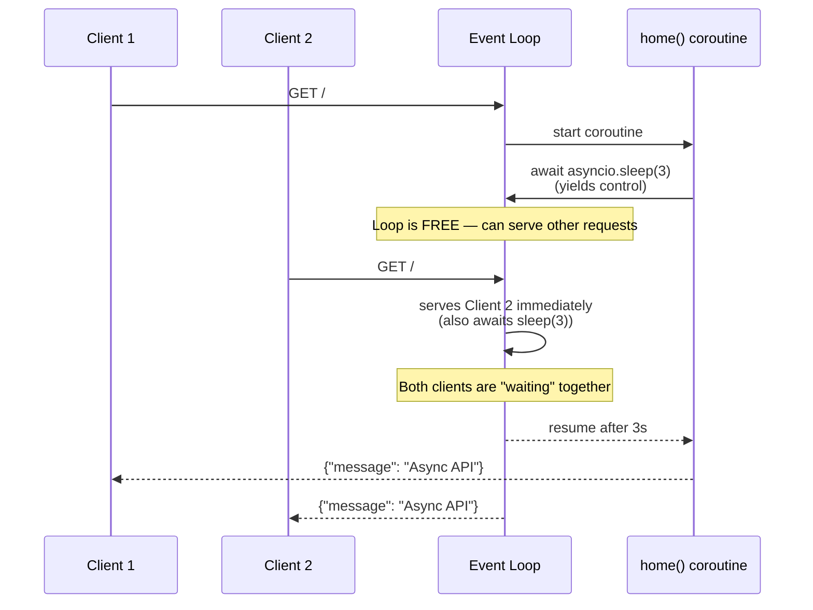

<div align="center">

# ⚡ A021 — Async / Await Explained (Async Programming)

### *Block the worker, or yield to the loop. Your choice.*

<br/>


</div>

---

## 🧠 The One-Sentence Summary

> **`async def` turns your function into a coroutine. `await` yields control back to the event loop while waiting, so the server can handle *other* requests instead of sitting idle.**

If you remember *"`async` = coroutine, `await` = yield to the loop"*, the rest of this README is decoration.

---

## 📑 Table of Contents

- [🧠 The One-Sentence Summary](#-the-one-sentence-summary)
- [📖 The Story: The Coffee Shop](#-the-story-the-coffee-shop)
- [🎯 What You Will Learn (10 Skills)](#-what-you-will-learn-10-skills)
- [📂 Project Structure](#-project-structure)
- [⚙️ Installation & Setup](#-installation--setup)
- [🧬 Anatomy of `main.py` — Line by Line (Heavily Commented)](#-anatomy-of-mainpy--line-by-line-heavily-commented)
- [🛣️ API Endpoints](#-api-endpoints)
- [🧠 The Mental Model: How Async Works](#-the-mental-model-how-async-works)
- [🆕 Every New Keyword Explained](#-every-new-keyword-explained)
- [🆚 Sync vs Async — The Comparison Table](#-sync-vs-async--the-comparison-table)
- [🧪 Try It With curl](#-try-it-with-curl)
- [🔧 Variations](#-variations)
- [⚠️ Common Pitfalls & Fixes](#-common-pitfalls--fixes)
- [🧠 Mnemonic Cheat Sheet](#-mnemonic-cheat-sheet)
- [🧪 Recall Test](#-recall-test)
- [🎯 Interview Q&A](#-interview-qa)
- [🚀 Where to Go Next](#-where-to-go-next)

---

## 📖 The Story: The Coffee Shop ☕

Imagine a coffee shop with **one barista**:

| 🍳 Sync | ⚡ Async |
|:--------|:---------|
| Barista takes order #1, makes it, serves it, takes order #2 | Barista takes order #1, puts it in the machine, takes order #2 while #1 brews |
| 6 orders × 3 min = **18 minutes** | 6 orders, all started quickly, finished around the same time |
| Worker is busy **waiting** for the machine | Worker is busy **taking new orders** |

> 🧠 **Mnemonic:** "**Sync = one thing at a time. Async = juggling while the machine runs.**"

---

## 🎯 What You Will Learn (10 Skills)

| # | 🎯 Skill | 🧠 You'll remember it because... |
|:-:|:---------|:--------------------------------|
| 1 | ⚡ **`async def`** | "Defines a coroutine function" |
| 2 | ⏸️ **`await`** | "Yields control to the event loop" |
| 3 | 🌀 **Event loop** | "The scheduler that runs coroutines" |
| 4 | ⏱️ **`asyncio.sleep()`** | "Non-blocking sleep" |
| 5 | 🚫 **`time.sleep()` blocks** | "Don't use in async code" |
| 6 | 🧵 **Coroutine vs function** | "Coroutines can be awaited" |
| 7 | 🚦 **`asyncio.run()`** | "Boots the event loop" |
| 8 | 🏃 **Concurrency ≠ parallelism** | "One thread, multiple tasks" |
| 9 | 📦 **`asyncio.gather()`** | "Run many coroutines at once" |
| 10 | ⚠️ **When NOT to use async** | "CPU-bound work is still slow" |

---

## 📂 Project Structure

```
📁 A021_Async_Await_Explained_Async_Programming/
├── 🐍 main.py     ← 20 lines: one async route, asyncio.sleep(3)
└── 📖 README.md   ← you are here
```

---

## ⚙️ Installation & Setup

```powershell
cd D:\AllProgram\LEARN\Python\FastAPI\A021_Async_Await_Explained_Async_Programming
python -m venv .venv
.\.venv\Scripts\Activate.ps1
pip install "fastapi[standard]"
uvicorn main:app --reload
```

> 🧠 **No new packages needed.** `asyncio` is part of Python's standard library.

---

## 🧬 Anatomy of `main.py` — Line by Line (Heavily Commented)

```python
# =========================================================
# A021 — Async / Await Explained (Async Programming)
# =========================================================
# Walks the difference between sync and async route handlers:
#   - GET /                       → async def + await asyncio.sleep(3)
#   - The endpoint DOES NOT block the event loop while waiting.
#   - Other requests can be served during the 3s wait.
# =========================================================

# --- Standard library: time for sync timing, asyncio for async sleep ---
import time
import asyncio

# --- FastAPI: the framework ---
from fastapi import FastAPI

# 1. Create the FastAPI app instance (Uvicorn serves THIS object)
app = FastAPI()


# =========================================================
# ASYNC ROUTE — GET /
# =========================================================
# `async def` makes this a *coroutine function*. When called, it returns a
# coroutine object that the event loop schedules and runs to completion.
# `await asyncio.sleep(3)` YIELDS control back to the event loop for 3s,
# letting other requests be served in the meantime.
@app.get("/")
async def home():
    # `asyncio.sleep(3)` is a NON-BLOCKING sleep. It tells the event loop
    # "wake me up in 3 seconds" and immediately returns control.
    # Compare to `time.sleep(3)` which would BLOCK the entire worker.
    await asyncio.sleep(3)

    return {
        "message": "Async API"
    }


# =========================================================
# Reference: what sync would look like
# =========================================================
# Sync functions block the worker thread for the full duration:
# def task():
#     time.sleep(3)    # ← BLOCKS the whole server for 3 seconds
#     return "Task done"
#
# Async functions yield control while waiting:
# async def task():
#     await asyncio.sleep(3)    # ← server handles other requests meanwhile
#     return "Done"
# =========================================================
```

| Line | Code | 🧠 Why it's there |
|:----:|:-----|:------------------|
| 1–2 | `import time, asyncio` | `time` is the sync stopwatch; `asyncio` is the async scheduler |
| 5 | `app = FastAPI()` | The app instance |
| 8 | `@app.get("/")` | Register a `GET /` route |
| 8 | `async def home():` | **Coroutine function** — returns a coroutine object when called |
| 9 | `await asyncio.sleep(3)` | **Yield** control to the loop for 3s, then resume |
| 10–12 | `return {...}` | Normal return — gets serialized to JSON |

### The Two Magic Words

```python
async def home():           # ← "I'm a coroutine"
    await asyncio.sleep(3)  # ← "I yield here; come back in 3s"
```

That's it. The `async`/`await` pair is the entire async story in this module.

### 🎯 If you remember ONE thing
> **`async def` makes a coroutine. `await` yields control while waiting. Other requests run during the wait.**

---

## 🛣️ API Endpoints

| Method | Endpoint | Returns | Notes |
|:------:|:---------|:--------|:------|
| 🟢 GET | `/` | `{message: "Async API"}` | After a 3s non-blocking wait |

---

## 🧠 The Mental Model: How Async Works



> 🧠 **The event loop is a juggler.** When a coroutine awaits, the loop picks up the next task.

---

## 🆕 Every New Keyword Explained

### 1. `async def` — coroutine function

**What:** Declares a function that returns a *coroutine object* (not a value directly).

```python
async def home():
    return "hello"

# Calling it does NOT run it — it returns a coroutine
coro = home()              # ← coroutine object, not "hello"
print(type(coro))          # <class 'coroutine'>

# You have to await it (or run it via asyncio.run) to get the value
result = await coro        # "hello"
```

> 🧠 **Mnemonic:** "**`async def` is a recipe, not a meal. `await` cooks it.**"

### 2. `await` — yield to the event loop

**What:** Pauses the current coroutine until the awaited thing finishes. While paused, the loop runs other tasks.

```python
await asyncio.sleep(3)     # pause for 3s, loop is free
await fetch_url(...)       # pause until HTTP response arrives
await db.execute(...)      # pause until DB query finishes
```

> 🧠 **Mnemonic:** "**`await` = 'wake me up when this is done'**."

### 3. `asyncio.sleep(seconds)` — non-blocking sleep

**What:** Tells the event loop "I'm waiting for `seconds` seconds" and yields control immediately.

```python
await asyncio.sleep(3)     # loop serves other requests during these 3s
```

> 🧠 **Mnemonic:** "**`asyncio.sleep` is polite. `time.sleep` is rude.**"

### 4. `time.sleep(seconds)` — blocking sleep

**What:** Pauses the **current thread** for `seconds` seconds. **DO NOT use inside `async def`.**

```python
time.sleep(3)              # ← BLOCKS the entire worker thread
                           # ← NO other request can be served
```

> 🧠 **Mnemonic:** "**`time.sleep` is a wall. `asyncio.sleep` is a door.**"

### 5. `asyncio.run(coro)` — boot the event loop

**What:** Runs a coroutine to completion. Used in **standalone scripts**, not in FastAPI routes (FastAPI/Uvicorn already runs the loop).

```python
import asyncio

async def main():
    print("hello")
    await asyncio.sleep(1)
    print("world")

asyncio.run(main())        # runs the loop, prints "hello\nworld"
```

> 🧠 **Mnemonic:** "**`asyncio.run` = the 'play' button.**"

### 6. `asyncio.gather(*coros)` — run many coroutines concurrently

**What:** Schedules multiple coroutines on the same loop and waits for all of them.

```python
import asyncio

async def fetch(i):
    await asyncio.sleep(1)
    return f"result {i}"

async def main():
    results = await asyncio.gather(
        fetch(1), fetch(2), fetch(3)    # all run "at the same time"
    )
    print(results)    # ['result 1', 'result 2', 'result 3']
```

All three coroutines start, then the loop interleaves them. Total time: ~1s, not 3s.

> 🧠 **Mnemonic:** "**`gather` = 'start them all, wait for all'**."

### 7. `asyncio.create_task(coro)` — fire-and-track a coroutine

**What:** Schedules a coroutine on the loop and returns a `Task` you can await or cancel later.

```python
task = asyncio.create_task(long_running())
# ... do other stuff ...
result = await task
```

> 🧠 **Mnemonic:** "**`create_task` = 'start now, join later'**."

### 8. Event loop

**What:** The scheduler that runs coroutines. Single-threaded. It picks the next ready coroutine, runs it until it awaits, then picks the next.

```
┌────────────────────────────────────┐
│  Event Loop (single thread)        │
│  ┌──────────┐  ┌──────────┐        │
│  │ coro A   │  │ coro B   │  ...   │
│  └──────────┘  └──────────┘        │
│  Pick one → run → await → repeat   │
└────────────────────────────────────┘
```

> 🧠 **Mnemonic:** "**One thread. Many coroutines. Magic scheduler.**"

### 9. Coroutine object

**What:** What `async def` returns when called. It's a *pausable* computation.

```python
async def greet():
    return "hi"

c = greet()           # coroutine object — NOT "hi" yet
print(type(c))        # <class 'coroutine'>
```

> 🧠 **Mnemonic:** "**A coroutine is a paused promise.**"

---

## 🆚 Sync vs Async — The Comparison Table

| Aspect | `def` (sync) | `async def` (async) |
|:-------|:-------------|:--------------------|
| Blocks the worker? | ✅ Yes, while waiting | ❌ No, yields to loop |
| While waiting, can other requests be served? | ❌ No | ✅ Yes |
| Use `time.sleep()`? | ✅ OK | ❌ **Never** |
| Use `asyncio.sleep()`? | ❌ Can't (`await` is invalid syntax) | ✅ Yes |
| `requests.get()` (sync lib)? | ✅ OK | ⚠️ Wraps in `run_in_executor` or use `httpx.AsyncClient` |
| `httpx.AsyncClient().get()`? | ⚠️ Don't mix | ✅ Idiomatic |
| Good for I/O-bound (HTTP, DB)? | Works but blocks | ✅ **Best choice** |
| Good for CPU-bound (math, parsing)? | ✅ Use a thread/process pool | ❌ Doesn't help (still one thread) |
| Concurrent requests on one worker? | ❌ No | ✅ Yes |

### Visual: What happens during the 3s sleep

```
SYNC:  [request 1 ████████ 3s ████ done]  then [request 2 ████ done]
       Total wall time: 6s, 2 requests

ASYNC: [r1 ████ 3s ████] [r2 ████ 3s ████]    (interleaved)
       Total wall time: 3s, 2 requests
```

> 🧠 **Mnemonic:** "**Sync = one customer at a time. Async = juggle customers.**"

---

## 🧪 Try It With curl

### 1. Open two terminals (or tabs) and start the server

```powershell
uvicorn main:app --reload
```

### 2. In terminal 1, hit `/`

```bash
time curl http://127.0.0.1:8000/
```

You should see:

```
{"message":"Async API"}
real    0m3.01s
```

### 3. While that's running, hit `/` in terminal 2 (within 3s)

```bash
time curl http://127.0.0.1:8000/
```

You should also see:

```
{"message":"Async API"}
real    0m3.01s
```

> 🧠 **Both requests finish in ~3s, not 6s.** That's the magic of async — the loop handled them concurrently.

---

## 🔧 Variations

### Variation 1: Sync version for comparison

```python
import time

@app.get("/sync")
def sync_home():
    time.sleep(3)    # ← BLOCKS the worker for 3s
    return {"message": "Sync API"}
```

If you have multiple clients hitting `/sync` simultaneously, **each one waits 3s and the total is `n × 3s`** because the worker is blocked.

### Variation 2: `asyncio.gather` for parallel coroutines

```python
import asyncio

async def fetch_user(uid: int):
    await asyncio.sleep(1)    # pretend API call
    return {"id": uid, "name": f"User {uid}"}

@app.get("/users")
async def get_users():
    # All three run concurrently — total time ~1s, not 3s
    users = await asyncio.gather(
        fetch_user(1), fetch_user(2), fetch_user(3)
    )
    return {"users": users}
```

### Variation 3: `create_task` for fire-and-forget

```python
import asyncio

async def log_event(message: str):
    await asyncio.sleep(0.5)
    print(f"[LOG] {message}")

@app.post("/orders")
async def create_order():
    # Don't make the user wait for logging
    asyncio.create_task(log_event("order created"))
    return {"message": "order received"}
```

### Variation 4: Async DB calls with SQLAlchemy

```python
from sqlalchemy.ext.asyncio import create_async_engine, AsyncSession

engine = create_async_engine("sqlite+aiosqlite:///./test.db")

async def get_db():
    async with AsyncSession(engine) as session:
        yield session

@app.get("/todos")
async def list_todos(db: AsyncSession = Depends(get_db)):
    result = await db.execute(select(Todo))
    todos = result.scalars().all()
    return todos
```

> 🧠 **Mnemonic:** "**Async DB drivers exist (like `aiosqlite`, `asyncpg`); use them with `async def`.**"

### Variation 5: Mixing sync and async with `run_in_threadpool`

```python
import asyncio
from fastapi.concurrency import run_in_threadpool

def blocking_io():
    time.sleep(2)    # blocking, but we run it in a thread
    return "done"

@app.get("/mixed")
async def mixed():
    result = await run_in_threadpool(blocking_io)
    return {"result": result}
```

FastAPI automatically does this when you call a sync `def` route from an async context.

> 🧠 **Mnemonic:** "**Sync inside async = `run_in_threadpool` (or just use a sync route).**"

---

## ⚠️ Common Pitfalls & Fixes

| 😖 Pitfall | 🔍 Cause | ✅ Fix |
|:-----------|:---------|:------|
| `SyntaxError: 'await' outside async function` | Used `await` in a sync `def` | Make the function `async def` |
| `time.sleep(3)` blocks the server | Used sync sleep in async code | Use `await asyncio.sleep(3)` |
| `RuntimeError: no running event loop` | Called `asyncio.run()` inside an async function | Remove the `asyncio.run()`; you're already in a loop |
| `await sync_func()` fails | Tried to `await` a sync function | Wrap with `run_in_threadpool` or use async lib |
| No speedup from async | CPU-bound work in coroutine | Use `ProcessPoolExecutor` instead |
| `coroutine 'home' was never awaited` | Forgot `await` when calling | Add `await` before the call |
| Multiple coroutines run sequentially | Used `for coro in coros: await coro` | Use `asyncio.gather(*coros)` |

### The `await sync_func()` Trap

```python
# ❌ This will error
import requests

@app.get("/external")
async def external():
    response = await requests.get("https://api.example.com")    # ← TypeError
    return response.json()

# ✅ Use an async HTTP client
import httpx

@app.get("/external")
async def external():
    async with httpx.AsyncClient() as client:
        response = await client.get("https://api.example.com")
        return response.json()
```

### The "Forgot to Await" Trap

```python
# ❌ The coroutine is created but never run
async def fetch():
    return "data"

async def main():
    result = fetch()        # ← coroutine object, NOT "data"
    print(result)           # <coroutine object ...>
    print(type(result))     # <class 'coroutine'>

# ✅ Always await
async def main():
    result = await fetch()  # "data"
```

### The "Sequential `await`" Trap

```python
# ❌ Runs sequentially — total 3s
async def main():
    a = await fetch(1)    # 1s
    b = await fetch(2)    # 1s
    c = await fetch(3)    # 1s
    return [a, b, c]       # total: 3s

# ✅ Runs concurrently — total 1s
async def main():
    a, b, c = await asyncio.gather(
        fetch(1), fetch(2), fetch(3)
    )
    return [a, b, c]       # total: 1s
```

> 🧠 **Mnemonic:** "**`gather` = parallel. Sequential `await`s = serial.**"

### The "Sync Sleep in Async" Trap

```python
# ❌ This BLOCKS the entire event loop for 3s
@app.get("/")
async def home():
    time.sleep(3)    # ← blocks worker thread; no other requests served
    return {"message": "Async API"}

# ✅ Yields control
@app.get("/")
async def home():
    await asyncio.sleep(3)    # ← loop serves other requests
    return {"message": "Async API"}
```

---

## 🧠 Mnemonic Cheat Sheet

| Concept | Mnemonic | Story |
|:--------|:---------|:------|
| `async def` | **Recipe, not meal** | Awaiting cooks it |
| `await` | **Wake me up** | Loop does other things meanwhile |
| `asyncio.sleep` | **Polite nap** | Yields to the loop |
| `time.sleep` | **Rude nap** | Blocks everything |
| Event loop | **Juggler** | One thread, many coroutines |
| `gather` | **Start all, wait all** | Total time = max(time), not sum |
| `create_task` | **Fire now, join later** | Background coroutine |
| Concurrency | **One barista, many orders** | Single thread, interleaved |
| Parallelism | **Many baristas** | Multiple CPUs/threads |
| Sync in async | **run_in_threadpool** | FastAPI does this for you |
| CPU-bound work | **Async doesn't help** | Use `ProcessPoolExecutor` |

---

## 🧪 Recall Test

1. What's the difference between `async def` and `def`?
2. What does `await` do?
3. Why is `time.sleep` bad in async code?
4. What's the difference between `asyncio.gather` and sequential `await`s?
5. What is the event loop?
6. When should you NOT use async?
7. How do you run multiple coroutines concurrently?
8. What happens if you forget to `await` a coroutine?

> 8/8 → async is yours.

---

## 🎯 Interview Q&A

### Q1: What's the difference between `async def` and `def`?

**Answer:** `async def` declares a **coroutine function** that returns a coroutine object. `def` declares a regular function that runs immediately when called.

```python
def f(): return 1           # call → 1
async def g(): return 1     # call → coroutine object (need to await)
```

> **One-liner:** *"`async def` is a recipe; `await` cooks it."*

### Q2: What does `await` do?

**Answer:** It pauses the current coroutine, yielding control back to the event loop, and resumes when the awaited thing finishes. While paused, the loop runs other coroutines.

> **One-liner:** *"`await` = 'pause me, do others, come back'."*

### Q3: Why is `time.sleep` bad in async code?

**Answer:** It blocks the entire worker thread. No other coroutine can run on that thread until the sleep finishes. Use `await asyncio.sleep()` instead — it yields control.

```python
# ❌ blocks
async def home():
    time.sleep(3)    # ← server is frozen for 3s

# ✅ yields
async def home():
    await asyncio.sleep(3)    # ← server handles other requests
```

> **One-liner:** *"`time.sleep` is rude; `asyncio.sleep` is polite."*

### Q4: What's the difference between `asyncio.gather` and sequential `await`s?

**Answer:**

```python
# Sequential: total 3s
a = await fetch(1)    # 1s
b = await fetch(2)    # 1s
c = await fetch(3)    # 1s

# Concurrent: total 1s
a, b, c = await asyncio.gather(fetch(1), fetch(2), fetch(3))
```

`gather` schedules all coroutines on the loop and waits for all of them.

> **One-liner:** *"`gather` = parallel. Sequential `await`s = serial."*

### Q5: When should you NOT use async?

**Answer:** For **CPU-bound work** (math, image processing, parsing). Async helps with **I/O** (HTTP, DB, file reads) because it yields while waiting. For CPU-bound work, use `ProcessPoolExecutor` to use multiple CPU cores.

> **One-liner:** *"Async = I/O. CPU work = processes."*

### Q6: What is concurrency vs parallelism?

**Answer:**

| Concurrency | Parallelism |
|:------------|:------------|
| One thread, multiple tasks (interleaved) | Multiple threads/cores, multiple tasks (truly simultaneous) |
| `asyncio`, async/await | `multiprocessing`, `ProcessPoolExecutor` |
| Good for I/O-bound | Good for CPU-bound |

> **One-liner:** *"Concurrency = juggling. Parallelism = many hands."*

### Q7: How does FastAPI handle sync and async routes?

**Answer:** FastAPI runs sync `def` routes in a **thread pool** (so they don't block the event loop). It runs `async def` routes directly on the event loop. You can mix both.

```python
@app.get("/sync")
def sync_route():        # ← runs in a worker thread
    time.sleep(1)
    return {"ok": True}

@app.get("/async")
async def async_route():    # ← runs on the event loop
    await asyncio.sleep(1)
    return {"ok": True}
```

> **One-liner:** *"Sync = thread pool. Async = event loop. FastAPI handles both."*

### Q8: How do you call a sync function from async code?

**Answer:** Use `run_in_threadpool` (or just declare the route as sync and FastAPI does it for you).

```python
from fastapi.concurrency import run_in_threadpool

def blocking():
    time.sleep(2)
    return "done"

@app.get("/mixed")
async def mixed():
    result = await run_in_threadpool(blocking)
    return {"result": result}
```

> **One-liner:** *"Sync inside async = `run_in_threadpool`."*

---

## 🚀 Where to Go Next

| Direction | Module |
|:----------|:-------|
| ⬅️ Previous | [A020](../A020_DELETE_Operation_with_Database/) |
| ⬅️ Back | [Root README](../README.md) |
| ➡️ Next | A022 (planned) — Background tasks with `BackgroundTasks` |
| ➡️ Future | A023 (planned) — WebSockets |

---

<div align="center">

### ⚡ *Yield to the loop. Handle more requests.* ⚡

Made with ❤️, `async def`, and `await asyncio.sleep()`.

</div>