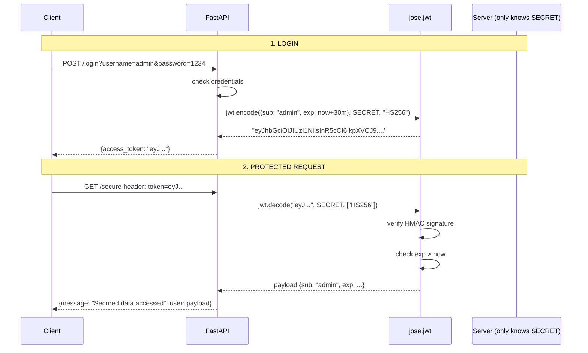

<div align="center">

# 🔐 A022 — JWT Authentication (Token-Based Auth / Login API)

### *Sign a token on login. Verify it on every protected request.*

<br/>


</div>

---

## 🧠 The One-Sentence Summary

> **JWT turns "I am who I say I am" into a signed, time-limited string. Login exchanges credentials for a token; protected routes verify the token's signature + expiry before answering.**

If you remember *"login → token → verify"* (or **L-T-V**), the rest of this README is decoration.

---

## 📑 Table of Contents

- [🧠 The One-Sentence Summary](#-the-one-sentence-summary)
- [📖 The Story: The Wristband at the Concert](#-the-story-the-wristband-at-the-concert)
- [🎯 What You Will Learn (10 Skills)](#-what-you-will-learn-10-skills)
- [📂 Project Structure](#-project-structure)
- [⚙️ Installation & Setup](#-installation--setup)
- [🧬 Anatomy of `main.py` — Line by Line (Heavily Commented)](#-anatomy-of-mainpy--line-by-line-heavily-commented)
- [🛣️ API Endpoints](#-api-endpoints)
- [🧠 The Mental Model: How JWT Works](#-the-mental-model-how-jwt-works)
- [🆕 Every New Keyword Explained](#-every-new-keyword-explained)
- [🆚 JWT vs Session vs Basic Auth](#-jwt-vs-session-vs-basic-auth)
- [🧪 Try It With curl](#-try-it-with-curl)
- [🔧 Variations](#-variations)
- [⚠️ Common Pitfalls & Fixes](#-common-pitfalls--fixes)
- [🧠 Mnemonic Cheat Sheet](#-mnemonic-cheat-sheet)
- [🧪 Recall Test](#-recall-test)
- [🎯 Interview Q&A](#-interview-qa)
- [🚀 Where to Go Next](#-where-to-go-next)

---

## 📖 The Story: The Wristband at the Concert 🎫

Imagine a concert venue with three zones:

| Zone | What you need | How it works |
|:-----|:-------------|:-------------|
| 🎟️ **Box office** (`POST /login`) | Username + password | The bouncer checks your ID, hands you a **wristband** |
| 🎶 **General admission** (`/`) | Nothing | Walk in freely |
| 🌟 **VIP area** (`GET /secure`) | **Wristband** | Another bouncer at the VIP door checks the wristband — is it real? not expired? |

The **wristband** is your **JWT**. It carries your name (`sub`) and an expiry (`exp`). The bouncer (the server) doesn't need to phone the box office — the wristband itself is the proof.

> 🧠 **Mnemonic:** "**L-T-V** — **L**ogin gives a **T**oken. **V**erify it at the door."

---

## 🎯 What You Will Learn (10 Skills)

| # | 🎯 Skill | 🧠 You'll remember it because... |
|:-:|:---------|:--------------------------------|
| 1 | 🎫 **What a JWT is** | "A signed, time-limited string" |
| 2 | 🔏 **`HS256` signing** | "Symmetric HMAC + SHA-256" |
| 3 | ⏰ **`exp` claim** | "Tokens expire" |
| 4 | 🔓 **`jose.jwt.encode()`** | "Sign a token" |
| 5 | 🔍 **`jose.jwt.decode()`** | "Verify a token" |
| 6 | 📋 **`sub` claim** | "Who's the token for?" |
| 7 | 🚪 **`Depends(verify_token)`** | "Gate the route" |
| 8 | ❌ **401 on bad/expired token** | "Token invalid = unauthorized" |
| 9 | 🛡️ **Stateless auth** | "No server-side session" |
| 10 | 🕵️ **Tamper detection** | "The signature catches changes" |

---

## 📂 Project Structure

```
📁 A022_JWT_Authentication_Token_Based_Auth_Login_API/
├── 🐍 main.py             ← 70 lines: login + verify + secure
├── 📦 requirements.txt    ← fastapi[standard] + python-jose[cryptography]
└── 📖 README.md           ← you are here
```

---

## ⚙️ Installation & Setup

```powershell
cd D:\AllProgram\LEARN\Python\FastAPI\A022_JWT_Authentication_Token_Based_Auth_Login_API
python -m venv .venv
.\.venv\Scripts\Activate.ps1
pip install -r requirements.txt
uvicorn main:app --reload
```

> 🧠 **Install the pinned deps with `-r requirements.txt`** because A022 needs `python-jose[cryptography]`.

---

## 🧬 Anatomy of `main.py` — Line by Line (Heavily Commented)

The full file is now annotated. Here's the **JWT-specific** portion:

```python
# =========================================================
# CREATE TOKEN — helper
# =========================================================
# Build the payload, attach an `exp` claim, sign it, return the JWT string.
def create_token(data: dict) -> str:
    # Copy the input so we don't mutate the caller's dict
    to_encode = data.copy()

    # Set expiry: now + 30 minutes (timezone-aware UTC)
    expire = datetime.now(timezone.utc) + timedelta(minutes=30)
    to_encode.update({"exp": expire})

    # Sign the payload with the secret + algorithm → JWT string
    token = jwt.encode(to_encode, SECRET_KEY, algorithm=ALGORITHM)
    return token
```

| Line(s) | Code | 🧠 Why it's there |
|:-------:|:-----|:------------------|
| 1 | `from fastapi import FastAPI, HTTPException, Depends, Header` | Framework + 401 + DI + header param |
| 2 | `from jose import jwt` | The JWT library |
| 4 | `from datetime import ...` | For the `exp` claim |
| 6 | `app = FastAPI()` | App instance |
| 8–10 | `SECRET_KEY`, `ALGORITHM` | Symmetric key + HS256 |
| 13 | `def create_token(data)` | Sign a token |
| 14 | `to_encode = data.copy()` | Don't mutate caller's dict |
| 15 | `expire = ... + timedelta(minutes=30)` | Tokens expire |
| 16–18 | `to_encode.update({"exp": expire})` | Add the `exp` claim |
| 20 | `jwt.encode(...)` | Sign and return the JWT string |
| 24 | `@app.post("/login")` | Issue a token |
| 25 | `def login(username, password)` | Toy credential check |
| 26–30 | `if username != "admin" or ...` | Reject with 401 |
| 31–33 | `token = create_token({"sub": username})` | `sub` = who the token is for |
| 39 | `def verify_token(token: str = Header(None))` | Read the token from a header |
| 41 | `jwt.decode(...)` | Verify signature + `exp` automatically |
| 43–47 | `except: raise 401` | Any failure = unauthorized |
| 50 | `@app.get("/secure")` | Protected route |
| 51 | `user = Depends(verify_token)` | Gate the route |
| 52–55 | Return | Includes the decoded payload as `user` |

### The Three Magic Lines

```python
token = jwt.encode(payload, SECRET, algorithm="HS256")  # create
payload = jwt.decode(token, SECRET, algorithms=["HS256"])  # verify
user = Depends(verify_token)                            # gate
```

> 🧠 **Mnemonic:** "**Encode to create, decode to verify, Depends to gate.**"

### 🎯 If you remember ONE thing
> **Login exchanges credentials for a JWT. Protected routes verify the JWT's signature and expiry. Bad/expired = 401.**

---

## 🛣️ API Endpoints

| Method | Endpoint | Auth | Body | Returns |
|:------:|:---------|:----:|:-----|:--------|
| 🟡 POST | `/login` | none | `?username=...&password=...` | `{access_token: "<jwt>"}` or 401 |
| 🟢 GET | `/secure` | `token: <jwt>` header | — | `{message, user: payload}` or 401 |

> ⚠️ This module passes the JWT in a **custom header** called `token`, **not** the standard `Authorization: Bearer …`. See *Variations* below for the idiomatic version.

---

## 🧠 The Mental Model: How JWT Works



> 🧠 **The server never stores the token.** That's the whole point of "stateless" auth.

---

## 🆕 Every New Keyword Explained

### 1. JWT — JSON Web Token

**What:** A compact, URL-safe string of three **base64url-encoded** JSON parts, separated by `.`:

```
header.payload.signature
│       │       │
│       │       └─ HMAC( header + "." + payload, SECRET )
│       └─ { "sub": "admin", "exp": 1700000000 }
└─ { "alg": "HS256", "typ": "JWT" }
```

> 🧠 **Mnemonic:** "**H.P.S** — **H**eader, **P**ayload, **S**ignature."

### 2. `jose.jwt.encode(payload, secret, algorithm)` — sign a token

**What:** Returns the JWT string for the given payload, signed with `secret` and `algorithm`.

```python
from jose import jwt

token = jwt.encode(
    {"sub": "admin", "exp": 1700000000},
    "mysecret",
    algorithm="HS256"
)
# 'eyJhbGciOiJIUzI1NiIsInR5cCI6IkpXVCJ9.eyJzdWIiOiJhZG1pbiIsImV4cCI6MTcwMDAwMDAwMH0.xxx'
```

> 🧠 **Mnemonic:** "**`encode` = 'I made this' (and I can prove it).**"

### 3. `jose.jwt.decode(token, secret, algorithms)` — verify a token

**What:** Returns the payload if signature and `exp` are valid; raises `JWTError` otherwise.

```python
from jose import jwt

payload = jwt.decode(token, "mysecret", algorithms=["HS256"])
# {"sub": "admin", "exp": 1700000000}
```

`decode` checks:
1. **Signature** matches the secret
2. **`exp` claim** is in the future
3. **Algorithm** is in the allowed list (prevents `alg: "none"` attacks)

> 🧠 **Mnemonic:** "**`decode` = 'let me check this is real and not expired'**."

### 4. `exp` claim — expiry

**What:** A Unix timestamp after which the token is invalid. `decode` raises if `exp <= now`.

```python
from datetime import datetime, timedelta, timezone

expire = datetime.now(timezone.utc) + timedelta(minutes=30)
payload = {"sub": "admin", "exp": expire}
```

> 🧠 **Mnemonic:** "**`exp` = 'use it before this date, or it's trash'**."

### 5. `sub` claim — subject

**What:** The standard claim for **who** the token represents (usually a user id or username).

```python
{"sub": "admin"}    # token belongs to user "admin"
```

> 🧠 **Mnemonic:** "**`sub` = 'the person this wristband is for'**."

### 6. `HS256` — HMAC-SHA256

**What:** A **symmetric** signing algorithm. The same secret signs and verifies. Fast, simple, common for single-service apps.

| Algorithm | Secret type | Use case |
|:----------|:-----------|:---------|
| `HS256` | Symmetric (one shared key) | Single service, internal APIs |
| `RS256` | Asymmetric (public + private key) | Multi-service, public clients |
| `ES256` | Asymmetric (ECDSA) | Mobile/IoT (small signatures) |

> 🧠 **Mnemonic:** "**HS = same key both sides. RS = public/private.**"

### 7. `Header(None)` — read a custom header

**What:** FastAPI extracts the named header and injects it. `None` means the header is **optional** (no 422 if missing).

```python
def verify_token(token: str = Header(None)):
    ...
```

> 🧠 **Mnemonic:** "**`Header(None)` = 'I want the value, but don't 422 if absent'**."

### 8. `Depends(verify_token)` — gate a route

**What:** Runs `verify_token` before the route. If it raises 401, the route never runs. If it returns, the value is injected as `user`.

```python
@app.get("/secure")
def secure_data(user=Depends(verify_token)):
    return {"user": user}
```

> 🧠 **Mnemonic:** "**`Depends` = 'show me your wristband first'**."

### 9. Stateless auth

**What:** The server keeps **no record** of active tokens. The token itself carries all the info needed to verify. Compare to **session-based** auth, where the server stores a session id → user mapping.

> 🧠 **Mnemonic:** "**Stateless = 'all info is in the wristband'.**"

### 10. Tamper detection

**What:** Any change to header or payload invalidates the signature. If you change `{"sub": "admin"}` to `{"sub": "root"}`, the HMAC no longer matches.

> 🧠 **Mnemonic:** "**Change the wristband → signature breaks → bouncer rejects.**"

---

## 🆚 JWT vs Session vs Basic Auth

| Aspect | Basic Auth | Session Cookie | JWT |
|:-------|:-----------|:---------------|:----|
| Where state lives | Nowhere (creds in every request) | Server (session table) | Nowhere (in the token) |
| Stateless server? | ✅ | ❌ | ✅ |
| Easy to revoke? | ❌ (rotating creds only) | ✅ (delete session) | ⚠️ (needs blocklist or short expiry) |
| Easy to scale? | ✅ | ❌ (sticky sessions or shared store) | ✅ (any server can verify) |
| Tamper-proof? | ❌ (creds are base64, not signed) | ✅ (server controls it) | ✅ (HMAC signature) |
| Cross-domain? | ✅ | ⚠️ (CORS, cookies) | ✅ |
| Use case | Internal tools | Web apps (single domain) | APIs, mobile, microservices |

> 🧠 **Mnemonic:** "**JWT = stateless, signed, time-limited. Session = stateful, server-stored, easy to revoke.**"

---

## 🧪 Try It With curl

### 1. Try to access `/secure` without a token (should 401 because token is missing)

```bash
curl -i http://127.0.0.1:8000/secure
```

The header is optional, so FastAPI actually passes `None` and the decode fails:

```http
HTTP/1.1 401 Unauthorized
{"detail":"Invalid or expired token"}
```

### 2. Log in (good creds)

```bash
curl -X POST "http://127.0.0.1:8000/login?username=admin&password=1234"
```

```json
{"access_token":"eyJhbGciOiJIUzI1NiIsInR5cCI6IkpXVCJ9.eyJzdWIiOiJhZG1pbiIsImV4cCI6MTcyNTI0OTI4MH0.xxx"}
```

### 3. Save the token and hit `/secure`

```bash
# PowerShell
$TOKEN = (curl -X POST "http://127.0.0.1:8000/login?username=admin&password=1234" | ConvertFrom-Json).access_token
curl -H "token: $TOKEN" http://127.0.0.1:8000/secure
```

```json
{
  "message": "Secured data accessed",
  "user": {"sub": "admin", "exp": 1725249280}
}
```

### 4. Log in with wrong creds (401)

```bash
curl -i -X POST "http://127.0.0.1:8000/login?username=admin&password=wrong"
```

```http
HTTP/1.1 401 Unauthorized
{"detail":"Invalid username and password"}
```

### 5. Decode a token visually (any JWT debugger)

Paste your token into <https://jwt.io> to see the header and payload (signature still requires the secret).

---

## 🔧 Variations

### Variation 1: Standard `Authorization: Bearer <token>` header

```python
from fastapi.security import OAuth2PasswordBearer

oauth2_scheme = OAuth2PasswordBearer(tokenUrl="/login")

def verify_token(token: str = Depends(oauth2_scheme)):
    try:
        payload = jwt.decode(token, SECRET_KEY, algorithms=[ALGORITHM])
        return payload
    except Exception:
        raise HTTPException(401, "Invalid or expired token")
```

Client sends:

```bash
curl -H "Authorization: Bearer eyJ..." http://127.0.0.1:8000/secure
```

> 🧠 **Mnemonic:** "**Bearer = 'whoever holds this token is allowed in'**."

### Variation 2: Pydantic login body (no query params)

```python
from pydantic import BaseModel

class LoginRequest(BaseModel):
    username: str
    password: str

@app.post("/login")
def login(body: LoginRequest):
    if body.username != "admin" or body.password != "1234":
        raise HTTPException(401, "Invalid credentials")
    return {"access_token": create_token({"sub": body.username})}
```

```bash
curl -X POST http://127.0.0.1:8000/login \
  -H "Content-Type: application/json" \
  -d '{"username":"admin","password":"1234"}'
```

### Variation 3: Real user lookup with hashed passwords

```python
from passlib.hash import bcrypt

fake_users = {
    "admin": bcrypt.hash("1234")
}

@app.post("/login")
def login(username: str, password: str):
    hashed = fake_users.get(username)
    if not hashed or not bcrypt.verify(password, hashed):
        raise HTTPException(401, "Invalid credentials")
    return {"access_token": create_token({"sub": username})}
```

### Variation 4: Refresh token (long-lived)

```python
def create_access_token(sub: str, minutes: int = 30):
    return create_token({"sub": sub, "type": "access"}, minutes=minutes)

def create_refresh_token(sub: str, days: int = 7):
    return create_token({"sub": sub, "type": "refresh"}, days=days)

@app.post("/login")
def login(username: str, password: str):
    if username != "admin" or password != "1234":
        raise HTTPException(401, "Invalid")
    return {
        "access_token": create_access_token(username),
        "refresh_token": create_refresh_token(username),
        "token_type": "bearer"
    }

@app.post("/refresh")
def refresh(refresh_token: str):
    payload = jwt.decode(refresh_token, SECRET_KEY, algorithms=[ALGORITHM])
    if payload.get("type") != "refresh":
        raise HTTPException(401, "Not a refresh token")
    return {"access_token": create_access_token(payload["sub"])}
```

### Variation 5: Add custom claims (roles, scopes)

```python
@app.post("/login")
def login(username: str, password: str):
    if username != "admin" or password != "1234":
        raise HTTPException(401, "Invalid")
    token = create_token({
        "sub": username,
        "role": "admin",          # ← custom claim
        "scopes": ["read", "write"]
    })
    return {"access_token": token}
```

---

## ⚠️ Common Pitfalls & Fixes

| 😖 Pitfall | 🔍 Cause | ✅ Fix |
|:-----------|:---------|:------|
| `JWTError: The specified alg value is not allowed` | `decode` called with no `algorithms` kwarg or wrong algorithm | Always pass `algorithms=[ALGORITHM]` |
| `ExpiredSignatureError` | `exp` in the past | Mint a new token, or extend expiry |
| `InvalidTokenError: Signature verification failed` | Wrong secret, or token was tampered with | Use the same `SECRET_KEY` on every service |
| 500 instead of 401 on bad token | `except` block not catching `JWTError` | Catch `from jose import JWTError; except JWTError:` |
| Token still works after logout | JWT is stateless — server can't revoke | Use short expiry + refresh tokens, or a blocklist |
| Client sends token in cookie; server reads header | Mismatched transport | Send `Authorization: Bearer …` and use `OAuth2PasswordBearer` |
| `exp` is "naive" datetime | `datetime.now()` without tz | Use `datetime.now(timezone.utc)` |
| Leaking the secret on GitHub | Hardcoded `SECRET_KEY` | Load from env: `os.environ["SECRET_KEY"]` |

### The "Algorithms List" Trap

```python
# ❌ This used to be exploitable via `alg: none`
payload = jwt.decode(token, SECRET_KEY)    # ← no algorithms restriction!

# ✅ Always pass the allowed algorithms explicitly
payload = jwt.decode(token, SECRET_KEY, algorithms=[ALGORITHM])
```

### The "Naive Datetime" Trap

```python
# ❌ Some libs reject naive datetimes
expire = datetime.now() + timedelta(minutes=30)    # ← no tz

# ✅ Always timezone-aware
expire = datetime.now(timezone.utc) + timedelta(minutes=30)
```

### The "Bare `except`" Trap

```python
# ❌ Catches everything (KeyboardInterrupt, SystemExit) — too broad
def verify_token(token: str = Header(None)):
    try:
        return jwt.decode(token, SECRET_KEY, algorithms=[ALGORITHM])
    except:
        raise HTTPException(401, "Invalid or expired token")

# ✅ Catch only the specific exception
from jose import JWTError

def verify_token(token: str = Header(None)):
    try:
        return jwt.decode(token, SECRET_KEY, algorithms=[ALGORITHM])
    except JWTError:
        raise HTTPException(401, "Invalid or expired token")
```

> 🧠 **Mnemonic:** "**Catch `JWTError`, not everything.**"

---

## 🧠 Mnemonic Cheat Sheet

| Concept | Mnemonic | Story |
|:--------|:---------|:------|
| 3-step flow | **L-T-V** | Login → Token → Verify |
| JWT structure | **H.P.S** | Header.Payload.Signature |
| `encode` | **Make a wristband** | Sign with secret |
| `decode` | **Check the wristband** | Verify signature + exp |
| `exp` | **Use-by date** | Token dies after this |
| `sub` | **Whose wristband** | The user's id |
| `HS256` | **Same key both sides** | Symmetric, fast |
| `Depends(verify)` | **Show your wristband** | Gate the route |
| 401 | **Bouncer says no** | Bad/expired token |
| Stateless | **Server forgets** | No session table |
| Tamper-proof | **Signature catches lies** | Change payload → reject |

---

## 🧪 Recall Test

1. What are the three parts of a JWT?
2. How do you create a token?
3. How do you verify a token?
4. What claim controls expiry?
5. What claim identifies the user?
6. What status code is returned for a bad/expired token?
7. How do you gate a route so it requires a valid token?
8. What is one difference between JWT and session-based auth?

> 8/8 → JWT is yours.

---

## 🎯 Interview Q&A

### Q1: What is a JWT and what are its three parts?

**Answer:** A JSON Web Token is a compact, signed string with three base64url parts separated by `.`:

```
header.payload.signature
```

- **Header** — algorithm + type (`{"alg": "HS256", "typ": "JWT"}`)
- **Payload** — claims (data) like `sub`, `exp`
- **Signature** — HMAC of `header.payload` with the secret

> **One-liner:** *"H.P.S — Header, Payload, Signature."*

### Q2: How do you create and verify a JWT?

**Answer:**

```python
from jose import jwt

# Create
token = jwt.encode({"sub": "admin", "exp": expire}, SECRET, algorithm="HS256")

# Verify
payload = jwt.decode(token, SECRET, algorithms=["HS256"])
```

`decode` checks the signature and `exp` automatically.

> **One-liner:** *"encode to create, decode to verify."*

### Q3: What is the `exp` claim?

**Answer:** A Unix timestamp after which the token is **invalid**. `jwt.decode` raises `ExpiredSignatureError` if `exp <= now`. Forces tokens to expire → limits damage if stolen.

> **One-liner:** *"`exp` = use-by date."*

### Q4: What is the `sub` claim?

**Answer:** The standard claim for **who** the token represents (the user id or username). It's just a convention; `jose` doesn't enforce it.

> **One-liner:** *"`sub` = whose wristband is this."*

### Q5: How do you protect a route with JWT?

**Answer:** Use `Depends(verify_token)`:

```python
def verify_token(token: str = Depends(oauth2_scheme)):
    payload = jwt.decode(token, SECRET, algorithms=["HS256"])
    return payload

@app.get("/secure")
def secure(user=Depends(verify_token)):
    return {"user": user}
```

If `verify_token` raises 401, the route never runs.

> **One-liner:** *"`Depends(verify)` = show your wristband."*

### Q6: What is stateless auth?

**Answer:** The server keeps **no record** of tokens. The token itself carries all the info needed to verify. Any server with the secret can verify any token — no shared session table, no sticky sessions.

> **One-liner:** *"Stateless = all info is in the token."*

### Q7: Why must you pass `algorithms` to `jwt.decode`?

**Answer:** Security. Without it, an attacker can craft a token with `alg: "none"` (no signature) and the library might accept it. Restricting to `algorithms=["HS256"]` blocks this attack.

```python
# ❌ dangerous
jwt.decode(token, SECRET)

# ✅ safe
jwt.decode(token, SECRET, algorithms=["HS256"])
```

> **One-liner:** *"Always pass `algorithms=[…]` to `decode`."*

### Q8: How do you log out a user with JWT?

**Answer:** You can't, easily. JWT is stateless. Options:

1. **Short expiry** (e.g. 5 min) + **refresh tokens** for long sessions
2. **Blocklist** — store revoked `jti` (token id) in Redis; check on each request
3. **Rotate the secret** — invalidates *all* tokens (nuclear option)

> **One-liner:** *"JWT logout = short expiry + blocklist, or just wait for `exp`."*

---

## 🚀 Where to Go Next

| Direction | Module |
|:----------|:-------|
| ⬅️ Previous | [A021](../A021_Async_Await_Explained_Async_Programming/) |
| ⬅️ Back | [Root README](../README.md) |
| ➡️ Next | A023 (planned) — OAuth2 with `OAuth2PasswordBearer` |
| ➡️ Future | A024 (planned) — Role-based access control (RBAC) |

---

<div align="center">

### 🔐 *Sign a token on login. Verify it everywhere else.* 🔐

Made with ❤️, `jwt.encode(...)`, and `Depends(verify_token)`.

</div>