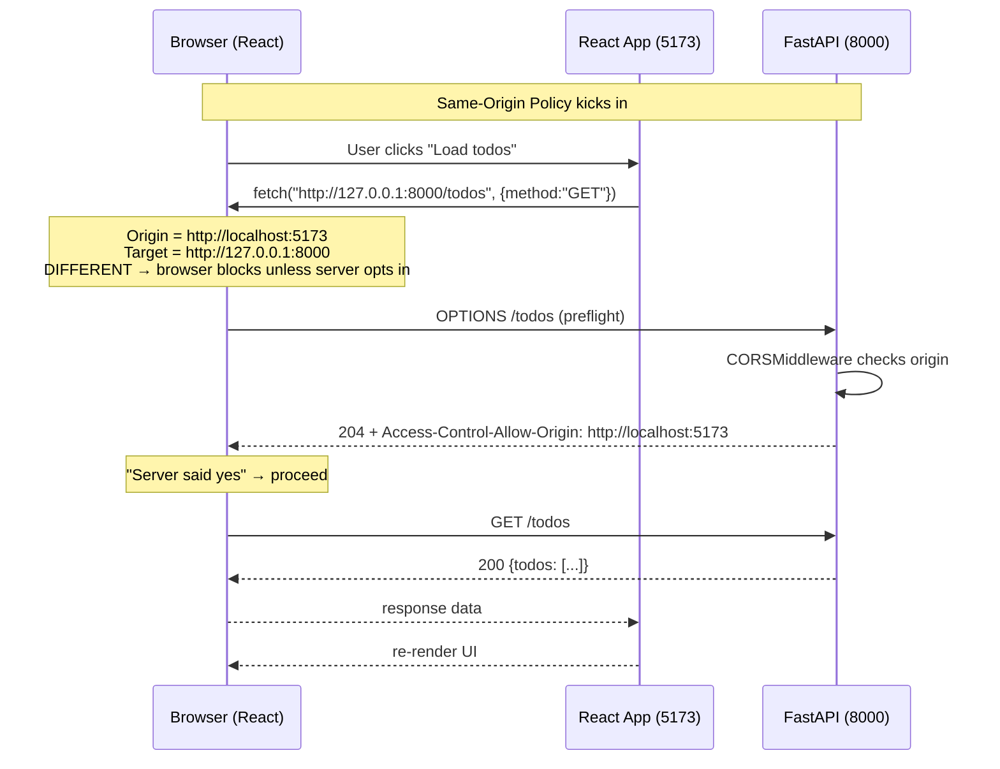

<div align="center">

# 🌐 A025 — CORS Explained (Connect React with FastAPI)

### *The browser says "different origin" — your server says "I trust them".*

<br/>


</div>

---

## 🧠 The One-Sentence Summary

> **Browsers block cross-origin `fetch` calls by default. `CORSMiddleware` is the FastAPI way of saying "I trust this origin — go ahead and let it through".**

If you remember *"**S-O-P** — **S**ame-**O**rigin **P**olicy, with a CORS escape hatch"*, the rest of this README is decoration.

---

## 📑 Table of Contents

- [🧠 The One-Sentence Summary](#-the-one-sentence-summary)
- [📖 The Story: The Bouncer at Two Clubs](#-the-story-the-bouncer-at-two-clubs)
- [🎯 What You Will Learn (10 Skills)](#-what-you-will-learn-10-skills)
- [📂 Project Structure](#-project-structure)
- [⚙️ Installation & Setup (both apps)](#-installation--setup-both-apps)
- [🧬 Anatomy of `main.py` — Line by Line (Heavily Commented)](#-anatomy-of-mainpy--line-by-line-heavily-commented)
- [🧬 Anatomy of the React app](#-anatomy-of-the-react-app)
- [🛣️ API Endpoints](#-api-endpoints)
- [🧠 The Mental Model: How CORS Works](#-the-mental-model-how-cors-works)
- [🆕 Every New Keyword Explained](#-every-new-keyword-explained)
- [🆚 same-origin vs cross-origin](#-same-origin-vs-cross-origin)
- [🧪 Try It](#-try-it)
- [🔧 Variations](#-variations)
- [⚠️ Common Pitfalls & Fixes](#-common-pitfalls--fixes)
- [🧠 Mnemonic Cheat Sheet](#-mnemonic-cheat-sheet)
- [🧪 Recall Test](#-recall-test)
- [🎯 Interview Q&A](#-interview-qa)
- [🚀 Where to Go Next](#-where-to-go-next)

---

## 📖 The Story: The Bouncer at Two Clubs 🍺

Imagine two nightclubs on the same street:

| Club | Door policy |
|:-----|:------------|
| 🍺 **Club FastAPI** (port 8000) | "We serve anyone from our own club" |
| ⚛️ **Club React** (port 5173) | "We serve anyone from our own club" |

By default, a guest from **Club React** can't walk into **Club FastAPI** — the bouncer says: *"Different origin. I don't know you."* That's the **Same-Origin Policy**.

CORS is a **note on the door** of Club FastAPI that says: *"Guests from `http://localhost:5173` are welcome."* Now the React guests can come in. 🪪

> 🧠 **Mnemonic:** "**S-O-P** — **S**ame-**O**rigin **P**olicy, with a **CORS** escape hatch."

---

## 🎯 What You Will Learn (10 Skills)

| # | 🎯 Skill | 🧠 You'll remember it because... |
|:-:|:---------|:--------------------------------|
| 1 | 🚧 **Same-Origin Policy** | "Browser blocks cross-origin by default" |
| 2 | 🌐 **What an "origin" is** | "scheme + host + port" |
| 3 | 📜 **CORS headers** | "`Access-Control-Allow-Origin`" |
| 4 | ✈️ **Preflight `OPTIONS` request** | "Browser asks first" |
| 5 | 🛡️ **`CORSMiddleware`** | "FastAPI's allow-list" |
| 6 | 📋 **`allow_origins`** | "Which origins are trusted" |
| 7 | 🍪 **`allow_credentials`** | "Cookies + Authorization headers" |
| 8 | 🔧 **`allow_methods` / `allow_headers`** | "What verbs and headers" |
| 9 | 🪪 **No `*` with credentials** | "Either explicit origins or no creds" |
| 10 | 🐍 **React + FastAPI combo** | "Two ports, one CORS rule" |

---

## 📂 Project Structure

```
📁 A025_CORS_Explained_Connect_React_with_FastAPI/
├── 🐍 main.py                       ← FastAPI + CORSMiddleware
├── 📦 requirements.txt              ← fastapi[standard]
├── 🛣️ api-spec (3 routes)           ← GET /, GET /todos, POST /todos
├── ⚛️ frontend/                     ← Vite + React 18 demo app
│   ├── 📦 package.json
│   ├── ⚙️ vite.config.js
│   ├── 📄 index.html
│   ├── 📁 src/
│   │   ├── 🚪 main.jsx              ← React entry
│   │   ├── 🎨 App.jsx               ← the demo UI
│   │   ├── 🔌 api.js                ← fetch helpers
│   │   └── 🎨 index.css
│   ├── 🙈 .gitignore                ← ignores node_modules/
│   └── 📖 README.md                 ← React-side quick start
└── 📖 README.md                     ← you are here
```

---

## ⚙️ Installation & Setup (both apps)

You'll run **two** dev servers in **two** terminals.

### Terminal 1 — FastAPI (port 8000)

```powershell
cd "D:\AllProgram\LEARN\Python\FastAPI\A025_CORS_Explained_Connect_React_with_FastAPI"
python -m venv .venv
.\.venv\Scripts\Activate.ps1
pip install -r requirements.txt
uvicorn main:app --reload
```

### Terminal 2 — React (port 5173)

```powershell
cd "D:\AllProgram\LEARN\Python\FastAPI\A025_CORS_Explained_Connect_React_with_FastAPI\frontend"
npm install
npm run dev
```

Then open <http://localhost:5173>. Click the buttons. If CORS works, you see todos.

> ⚠️ **Open the React app via `http://localhost:5173` — not `http://127.0.0.1:5173`.** Browsers treat `localhost` and `127.0.0.1` as **different origins** even though they resolve to the same IP.

---

## 🧬 Anatomy of `main.py` — Line by Line (Heavily Commented)

The full file is now annotated. Key sections:

```python
# =========================================================
# STEP 1 — Define the allowed origins
# =========================================================
# An "origin" = scheme + host + port.
#   http://localhost:5173/   ← Vite (default dev port)
#   http://127.0.0.1:5173/   ← Vite (alt)
#   http://localhost:3000/   ← Create React App (legacy)
ALLOWED_ORIGINS = [
    "http://localhost:5173",
    "http://127.0.0.1:5173",
    "http://localhost:3000",
]


# =========================================================
# STEP 2 — Add the CORS middleware
# =========================================================
app.add_middleware(
    CORSMiddleware,
    allow_origins=ALLOWED_ORIGINS,        # which origins may call us
    allow_credentials=True,               # allow cookies / Authorization headers
    allow_methods=["*"],                  # GET, POST, PUT, DELETE, PATCH, OPTIONS
    allow_headers=["*"],                  # Content-Type, Authorization, X-*, ...
)
```

| Section | Code | 🧠 Why it's there |
|:--------|:-----|:------------------|
| Imports | `CORSMiddleware` | The CORS wrapper |
| Setup | `app = FastAPI()` | App instance |
| Origins | `ALLOWED_ORIGINS` | Whitelist of allowed origins |
| Middleware | `app.add_middleware(...)` | Wires the CORS handler |
| Middleware | `allow_origins=...` | Tells middleware which origins to allow |
| Middleware | `allow_credentials=True` | Allows cookies + `Authorization` |
| Middleware | `allow_methods=["*"]` | Allow every HTTP verb |
| Middleware | `allow_headers=["*"]` | Allow any request header |
| Routes | `GET /` | Health check |
| Routes | `GET /todos` | Sample list |
| Routes | `POST /todos` | Sample create |

### The Magic Block

```python
app.add_middleware(
    CORSMiddleware,
    allow_origins=["http://localhost:5173"],
    allow_credentials=True,
    allow_methods=["*"],
    allow_headers=["*"],
)
```

That's it. Five lines, and your React app can call your FastAPI.

### 🎯 If you remember ONE thing
> **`add_middleware(CORSMiddleware, allow_origins=[...])` is the entire CORS story.**

---

## 🧬 Anatomy of the React app

The frontend is a minimal Vite + React 18 app. Three files do all the work:

| File | Role |
|:-----|:-----|
| `src/api.js` | `fetch` helpers — `getHome`, `getTodos`, `addTodo` |
| `src/App.jsx` | Three buttons, three pieces of state, inline rendering |
| `src/main.jsx` | Mounts `<App />` into `<div id="root">` |

The base URL is hard-coded in `api.js`:

```js
const API_BASE = 'http://127.0.0.1:8000'
```

Change it to point at a deployed server, an env var, or a relative URL behind a reverse proxy.

---

## 🛣️ API Endpoints

| Method | Endpoint | Returns |
|:------:|:---------|:--------|
| 🟢 GET | `/` | `{message, cors_origins}` |
| 🟢 GET | `/todos` | `{todos: [{id, title, done}]}` |
| 🟡 POST | `/todos` | `{message, data: {title, done}}` |

---

## 🧠 The Mental Model: How CORS Works



> 🧠 **The browser sends a preflight `OPTIONS` request first, asks "is this allowed?", and only then sends the real request.** For simple `GET`/`POST` with safe headers, the preflight is skipped.

---

## 🆕 Every New Keyword Explained

### 1. Origin

**What:** The combination of **scheme + host + port** of a URL. Two URLs have the same origin only if all three match.

| URL | Origin |
|:----|:-------|
| `http://localhost:5173/` | `http://localhost:5173` |
| `http://localhost:5173/todos` | `http://localhost:5173` (same) |
| `http://127.0.0.1:5173/` | `http://127.0.0.1:5173` (**different** from above) |
| `https://localhost:5173/` | `https://localhost:5173` (different scheme) |
| `http://localhost:8000/` | `http://localhost:8000` (different port) |

> 🧠 **Mnemonic:** "**Same scheme + host + port = same origin.**"

### 2. Same-Origin Policy

**What:** The browser's built-in rule: by default, a page can only `fetch` its own origin. Cross-origin fetches need **explicit server permission** (CORS).

> 🧠 **Mnemonic:** "**Same-Origin Policy = the default lock.**"

### 3. CORS — Cross-Origin Resource Sharing

**What:** A protocol where the **server** says "I trust this origin" via response headers (`Access-Control-Allow-Origin`). The browser then lets the response through.

> 🧠 **Mnemonic:** "**CORS = the server's guest list.**"

### 4. Preflight request

**What:** A `OPTIONS` request the browser sends **before** certain "complex" requests (custom headers, `PUT`/`DELETE`, JSON content-type, etc.). The server answers with `Access-Control-*` headers. If the answer is "yes", the browser sends the real request.

> 🧠 **Mnemonic:** "**Preflight = 'may I?'**"

### 5. Simple request

**What:** A request that does **not** need a preflight: `GET` / `HEAD` / `POST` with a `Content-Type` of `application/x-www-form-urlencoded`, `multipart/form-data`, or `text/plain`. The browser just sends it; the server can still refuse via CORS headers (but the browser won't ask first).

> 🧠 **Mnemonic:** "**Simple request = no 'may I?'**"

### 6. `Access-Control-Allow-Origin`

**What:** The response header that says "I trust this origin". Value is either a specific origin or `*` (but `*` is incompatible with `allow_credentials=True`).

```
Access-Control-Allow-Origin: http://localhost:5173
```

> 🧠 **Mnemonic:** "**This is the guest list.**"

### 7. `Access-Control-Allow-Methods`

**What:** The response header listing allowed HTTP verbs (in preflight responses). Equivalent to `allow_methods` in FastAPI.

```
Access-Control-Allow-Methods: GET, POST, PUT, DELETE, OPTIONS
```

### 8. `Access-Control-Allow-Headers`

**What:** The response header listing allowed request headers. Equivalent to `allow_headers` in FastAPI.

```
Access-Control-Allow-Headers: Content-Type, Authorization
```

### 9. `Access-Control-Allow-Credentials`

**What:** Tells the browser it's OK to send cookies / `Authorization` headers cross-origin. Must be `true`, and `allow_origins` cannot be `*`.

```
Access-Control-Allow-Credentials: true
```

### 10. `CORSMiddleware`

**What:** FastAPI's built-in middleware that adds the right `Access-Control-*` headers to every response (and answers preflights automatically).

```python
from fastapi.middleware.cors import CORSMiddleware

app.add_middleware(
    CORSMiddleware,
    allow_origins=[...],
    allow_credentials=True,
    allow_methods=["*"],
    allow_headers=["*"],
)
```

> 🧠 **Mnemonic:** "**`CORSMiddleware` = FastAPI's guest-list bouncer.**"

---

## 🆚 same-origin vs cross-origin

| Scenario | Origin of page | Origin of request | Same? | Need CORS? |
|:---------|:---------------|:------------------|:------|:-----------|
| React dev → FastAPI dev | `http://localhost:5173` | `http://127.0.0.1:8000` | ❌ | ✅ |
| React dev → FastAPI dev (both `localhost`) | `http://localhost:5173` | `http://localhost:8000` | ❌ (different port) | ✅ |
| React dev → itself | `http://localhost:5173` | `http://localhost:5173` | ✅ | ❌ |
| Production behind one domain | `https://app.example.com` | `https://app.example.com/api` | ✅ | ❌ |
| Frontend on `app.com`, API on `api.app.com` | `https://app.com` | `https://api.app.com` | ❌ (different host) | ✅ |
| `localhost` vs `127.0.0.1` | `http://localhost:5173` | `http://127.0.0.1:5173` | ❌ (different host) | ✅ |

> 🧠 **Mnemonic:** "**Same scheme + host + port = same origin. Anything else = CORS.**"

---

## 🧪 Try It

### 1. Start both servers

```powershell
# Terminal 1
cd "A025_CORS_Explained_Connect_React_with_FastAPI"
.\.venv\Scripts\Activate.ps1
uvicorn main:app --reload

# Terminal 2
cd "A025_CORS_Explained_Connect_React_with_FastAPI\frontend"
npm run dev
```

### 2. Open <http://localhost:5173> in your browser

Click **GET /** → see the health response.
Click **GET /todos** → see the two sample todos.
Click **POST /todos** → add your own.

### 3. See the CORS preflight in DevTools

Open DevTools → Network → click any request → look at the response headers:

```
Access-Control-Allow-Origin: http://localhost:5173
Access-Control-Allow-Credentials: true
```

> 🧠 If you don't see those headers, the request was made to a different origin (e.g. `127.0.0.1` instead of `localhost`).

### 4. Reproduce the error: comment out the middleware

```python
# app.add_middleware(CORSMiddleware, ...)   ← comment this out
```

Reload the React app. Click "GET /". You'll see:

```
Access to fetch at 'http://127.0.0.1:8000/' from origin 'http://localhost:5173'
has been blocked by CORS policy: No 'Access-Control-Allow-Origin' header
is present on the requested resource.
```

That's the Same-Origin Policy in action. Uncomment to fix it.

---

## 🔧 Variations

### Variation 1: Allow **all** origins (dev only)

```python
app.add_middleware(
    CORSMiddleware,
    allow_origins=["*"],
    allow_credentials=False,    # ← must be False with "*"
    allow_methods=["*"],
    allow_headers=["*"],
)
```

> ⚠️ Never use `*` in production. Anyone can call your API.

### Variation 2: Read origins from env

```python
import os

ALLOWED_ORIGINS = os.environ.get("ALLOWED_ORIGINS", "http://localhost:5173").split(",")
```

### Variation 3: Allow a regex pattern

```python
app.add_middleware(
    CORSMiddleware,
    allow_origin_regex=r"^https://.*\.example\.com$",    # any subdomain of example.com
    allow_credentials=True,
    allow_methods=["*"],
    allow_headers=["*"],
)
```

### Variation 4: Per-route CORS (rare)

CORS is normally global via middleware. If you need per-route, you'd build a custom dependency — but the standard pattern is one global allow-list.

### Variation 5: Add `expose_headers`

By default, JS can only read a few response headers. To expose more:

```python
app.add_middleware(
    CORSMiddleware,
    allow_origins=ALLOWED_ORIGINS,
    allow_credentials=True,
    allow_methods=["*"],
    allow_headers=["*"],
    expose_headers=["X-Total-Count", "X-Request-Id"],    # ← readable by JS
)
```

---

## ⚠️ Common Pitfalls & Fixes

| 😖 Pitfall | 🔍 Cause | ✅ Fix |
|:-----------|:---------|:------|
| `No 'Access-Control-Allow-Origin' header` | Middleware not added, or wrong origin in the list | Check `allow_origins` includes the page's origin |
| `localhost` blocked but `127.0.0.1` works | Two different origins in the browser's eyes | Add both to `allow_origins` |
| `allow_credentials=True` + `allow_origins=["*"]` rejected | Spec disallows the combo | Use a literal list, not `*` |
| CORS works in Postman but not browser | Postman doesn't enforce SOP — only browsers do | Add the `CORSMiddleware` to FastAPI |
| Preflight fails with 405 | The route doesn't accept `OPTIONS` | `CORSMiddleware` handles OPTIONS automatically; just make sure it's added |
| React app can GET but not POST JSON | Preflight on `Content-Type: application/json` fails | Allow `Content-Type` in `allow_headers` (or use `*`) |
| `Vary: Origin` not set | Some caches return wrong response to wrong origin | `CORSMiddleware` sets this automatically |
| Cookies not sent | `allow_credentials=True` missing, or `fetch` missing `credentials: 'include'` | Set both |

### The "POST with JSON" Trap

```bash
# ❌ This triggers a preflight, which fails without CORS headers
fetch("http://127.0.0.1:8000/todos", {
  method: "POST",
  headers: { "Content-Type": "application/json" },
  body: JSON.stringify({ title: "x" })
})

# ✅ CORS middleware must allow Content-Type header
allow_headers=["*"]    # or specifically ["Content-Type"]
```

### The "`*` + credentials" Trap

```python
# ❌ Server will reject this config at startup / first request
allow_origins=["*"],
allow_credentials=True,

# ✅ Either list specific origins, or drop credentials
allow_origins=["http://localhost:5173"],
allow_credentials=True,

# OR

allow_origins=["*"],
allow_credentials=False,
```

### The "localhost vs 127.0.0.1" Trap

```python
# ❌ App opened at http://localhost:5173, server allows 127.0.0.1 → blocked
ALLOWED_ORIGINS = ["http://127.0.0.1:5173"]

# ✅ Allow both
ALLOWED_ORIGINS = ["http://localhost:5173", "http://127.0.0.1:5173"]
```

> 🧠 **Mnemonic:** "**Same scheme + host + port. `localhost` ≠ `127.0.0.1`.**"

---

## 🧠 Mnemonic Cheat Sheet

| Concept | Mnemonic | Story |
|:--------|:---------|:------|
| Same-Origin Policy | **Default lock** | Browser blocks cross-origin |
| Origin | **scheme + host + port** | Anything else = cross-origin |
| CORS | **Guest list on the door** | Server opts in |
| Preflight | **"May I?"** | OPTIONS before the real request |
| Simple request | **No "may I?"** | Plain GET/POST/Form |
| `Access-Control-Allow-Origin` | **The allow header** | Tells browser it's OK |
| `allow_credentials` | **Cookies / Auth** | Must pair with explicit origin |
| `localhost` vs `127.0.0.1` | **Different hosts** | Add both |
| React + FastAPI | **Two ports, one rule** | CORS bridges them |
| `*` + credentials | **Forbidden combo** | Pick one |

---

## 🧪 Recall Test

1. What three things make up an "origin"?
2. What is the Same-Origin Policy?
3. What header tells the browser "I trust this origin"?
4. What is a preflight request?
5. Which FastAPI class adds CORS headers?
6. Why can't you use `allow_origins=["*"]` with `allow_credentials=True`?
7. Why is `http://localhost:5173` a different origin from `http://127.0.0.1:5173`?
8. How do you start both the React and FastAPI servers in dev?

> 8/8 → CORS is yours.

---

## 🎯 Interview Q&A

### Q1: What is the Same-Origin Policy?

**Answer:** A browser security rule that prevents a page from making `fetch` (or `XMLHttpRequest`) calls to a **different origin** unless the server explicitly opts in via CORS. It protects users from malicious sites reading their data on other sites.

> **One-liner:** *"Default browser lock. Cross-origin fetches need server permission."*

### Q2: What is an "origin"?

**Answer:** The combination of **scheme + host + port** of a URL. Two URLs share an origin only if all three match. `http://localhost:5173` and `http://127.0.0.1:5173` are **different** origins.

> **One-liner:** *"scheme + host + port. Anything else = cross-origin."*

### Q3: What is a preflight request?

**Answer:** A `OPTIONS` request the browser sends **before** a "complex" cross-origin request (custom headers, `PUT`/`DELETE`, JSON content-type, etc.). The server answers with `Access-Control-*` headers; if the answer is "yes", the browser sends the real request. Simple requests (plain `GET`/`POST` with form-encoded body) skip it.

> **One-liner:** *"Preflight = 'may I?' before the real request."*

### Q4: How do you enable CORS in FastAPI?

**Answer:** Add `CORSMiddleware` to the app:

```python
from fastapi.middleware.cors import CORSMiddleware

app.add_middleware(
    CORSMiddleware,
    allow_origins=["http://localhost:5173"],
    allow_credentials=True,
    allow_methods=["*"],
    allow_headers=["*"],
)
```

> **One-liner:** *"`add_middleware(CORSMiddleware, ...)` and you're done."*

### Q5: Why can't `allow_origins=["*"]` be combined with `allow_credentials=True`?

**Answer:** The CORS spec forbids it. A `*` means "any origin", but credentials (cookies, `Authorization`) carry user identity — letting **any** origin send them would defeat the Same-Origin Policy. You must either list explicit origins or drop credentials.

> **One-liner:** *"Pick: explicit origins, OR no credentials."*

### Q6: Why is `http://localhost:5173` a different origin from `http://127.0.0.1:5173`?

**Answer:** The browser treats `localhost` and `127.0.0.1` as **different hosts**, even though they resolve to the same IP. The host part of the origin must match exactly. Always add both to `allow_origins` if you want both to work.

> **One-liner:** *"`localhost` ≠ `127.0.0.1` in the browser's eyes."*

### Q7: What headers does `CORSMiddleware` add?

**Answer:** On every response:

- `Access-Control-Allow-Origin` — the allowed origin
- `Vary: Origin` — so caches don't confuse origins
- `Access-Control-Allow-Credentials` — `true` if configured
- `Access-Control-Expose-Headers` — the exposed response headers
- `Access-Control-Max-Age` — preflight cache duration

And on `OPTIONS` preflight responses:

- `Access-Control-Allow-Methods`
- `Access-Control-Allow-Headers`

> **One-liner:** *"`Access-Control-*` headers, all auto-managed."*

### Q8: Postman can call my API without CORS, but the browser can't. Why?

**Answer:** Postman is a **client** — it doesn't enforce the Same-Origin Policy because it's not a browser. The SOP is a browser-only rule. Browsers enforce it because a malicious page could otherwise read data from another site the user is logged into. Postman has no such risk; it can call any origin.

> **One-liner:** *"CORS is a browser thing. Postman / curl / Python don't care."*

---

## 🚀 Where to Go Next

| Direction | Module |
|:----------|:-------|
| ⬅️ Previous | [A024](../A024_File_Upload_Serve_Static_Files_(Images_PDFs)/) |
| ⬅️ Back | [Root README](../README.md) |
| ➡️ Next | A026 (planned) — Authenticated CORS (cookies + JWT) |
| ➡️ Future | A027 (planned) — Deploy the React + FastAPI stack |

---

<div align="center">

### 🌐 *The browser blocks by default. CORS is how you say "yes, this origin is welcome".* 🌐

Made with ❤️, `CORSMiddleware`, and `allow_origins=[...]`.

</div>