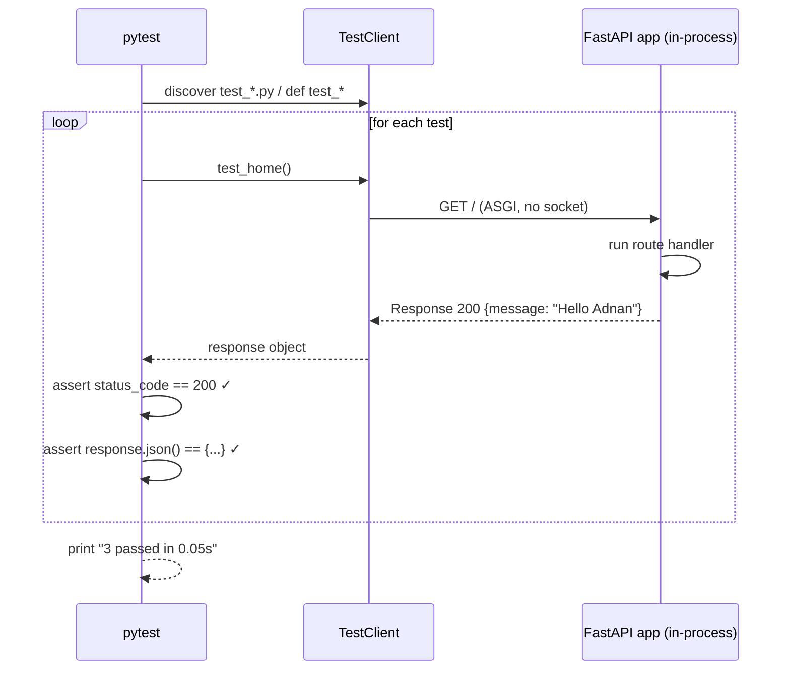

<div align="center">

# 🧪 A027 — API Testing with Pytest (Test Endpoints)

### *Hit your endpoints in Python, assert what came back. No browser, no curl, no server.*

<br/>


</div>

---

## 🧠 The One-Sentence Summary

> **Wrap your FastAPI app in `TestClient`, call your endpoints like an HTTP client, and assert the status code + JSON body — `pytest` runs each `def test_*` and reports pass/fail in a colorful summary.**

If you remember *"**T-A-A** — **T**estClient, **A**ssert status, **A**ssert body"*, the rest of this README is decoration.

---

## 📑 Table of Contents

- [🧠 The One-Sentence Summary](#-the-one-sentence-summary)
- [📖 The Story: The Robot Waiter](#-the-story-the-robot-waiter)
- [🎯 What You Will Learn (10 Skills)](#-what-you-will-learn-10-skills)
- [📂 Project Structure](#-project-structure)
- [⚙️ Installation & Setup](#-installation--setup)
- [🧬 Anatomy of `test_main.py` — Line by Line (Heavily Commented)](#-anatomy-of-test_mainpy--line-by-line-heavily-commented)
- [🛣️ The App Under Test](#-the-app-under-test)
- [🧠 The Mental Model: How pytest + TestClient Works](#-the-mental-model-how-pytest--testclient-works)
- [🆕 Every New Keyword Explained](#-every-new-keyword-explained)
- [🆚 TestClient vs httpx vs curl vs browser](#-testclient-vs-httpx-vs-curl-vs-browser)
- [🧪 Try It With pytest](#-try-it-with-pytest)
- [🔧 Variations](#-variations)
- [⚠️ Common Pitfalls & Fixes](#-common-pitfalls--fixes)
- [🧠 Mnemonic Cheat Sheet](#-mnemonic-cheat-sheet)
- [🧪 Recall Test](#-recall-test)
- [🎯 Interview Q&A](#-interview-qa)
- [🚀 Where to Go Next](#-where-to-go-next)

---

## 📖 The Story: The Robot Waiter 🤖🍽️

You wrote a chef (your FastAPI app) and a menu (the OpenAPI schema at `/docs`). Now you want to **test the chef** without sitting at a table every time. So you build a **robot customer**:

| Human | Robot |
|:------|:------|
| Walks into the restaurant | `client = TestClient(app)` |
| Reads the menu | The app's route table |
| Places an order | `client.get("/")` |
| Waits for the food | `response` comes back synchronously |
| Tastes it | `assert response.json() == {...}` |
| Writes a review | `def test_*` is a "test passed" line |

The robot never leaves the kitchen. It tastes everything instantly and never tips. Perfect employee.

> 🧠 **Mnemonic:** "**T-A-A** — **T**estClient, **A**ssert status, **A**ssert body.**"

---

## 🎯 What You Will Learn (10 Skills)

| # | 🎯 Skill | 🧠 You'll remember it because... |
|:-:|:---------|:--------------------------------|
| 1 | 🧪 **`pytest`** | "The test runner" |
| 2 | 🤖 **`TestClient`** | "Robot customer; no real server" |
| 3 | 📥 **`client.get("/...")`** | "Call an endpoint" |
| 4 | 📊 **`response.status_code`** | "Check the HTTP status" |
| 5 | 📦 **`response.json()`** | "Read the parsed body" |
| 6 | ✅ **`assert`** | "Pass if true, fail if false" |
| 7 | 🔍 **`def test_*`** | "pytest finds it by name" |
| 8 | 🚦 **422 on bad input** | "Validation runs before your code" |
| 9 | 🏃 **No server needed** | "TestClient calls ASGI in-process" |
| 10 | 📂 **`pytest discovery`** | "`test_*.py` files, `test_*` functions" |

---

## 📂 Project Structure

```
📁 A027_API_Testing_with_Pytest_FastAPI_Test_Endpoints/
├── 🐍 main.py             ← the app under test (2 routes)
├── 🧪 test_main.py        ← 3 test functions
├── 📦 requirements.txt    ← fastapi[standard] + pytest + httpx
└── 📖 README.md           ← you are here
```

---

## ⚙️ Installation & Setup

```powershell
cd "D:\AllProgram\LEARN\Python\FastAPI\A027_API_Testing_with_Pytest_FastAPI_Test_Endpoints"
python -m venv .venv
.\.venv\Scripts\Activate.ps1
pip install -r requirements.txt
```

Run the tests:

```powershell
pytest -v
```

> 🧠 **No need to start `uvicorn` first.** `TestClient` calls your app in-process.

---

## 🧬 Anatomy of `test_main.py` — Line by Line (Heavily Commented)

```python
# --- fastapi's built-in test client ---
# `TestClient` wraps the ASGI app and lets you call endpoints
# exactly like an HTTP client — without spinning up a real server.
from fastapi.testclient import TestClient

# --- the app under test ---
from main import app

# --- one TestClient instance, shared by all tests ---
client = TestClient(app)


# =========================================================
# Test: GET /
# =========================================================
def test_home():
    response = client.get("/")
    assert response.status_code == 200
    assert response.json() == {"message": "Hello Adnan"}


# =========================================================
# Test: GET /add?a=5&b=3
# =========================================================
def test_add():
    response = client.get("/add?a=5&b=3")
    assert response.status_code == 200
    assert response.json() == {"result": 8}


# =========================================================
# Test: GET /add with bad input → 422
# =========================================================
def test_add_validation_error():
    response = client.get("/add?a=5")
    assert response.status_code == 422
```

| Line | Code | 🧠 Why it's there |
|:----:|:-----|:------------------|
| 6 | `from fastapi.testclient import TestClient` | FastAPI's built-in client |
| 8 | `from main import app` | The app under test |
| 11 | `client = TestClient(app)` | Reusable client (one per file) |
| 16 | `def test_home():` | pytest picks up any `test_*` function |
| 17 | `client.get("/")` | Call the endpoint |
| 20 | `assert response.status_code == 200` | Status check |
| 22 | `assert response.json() == {...}` | Body check |
| 28 | `client.get("/add?a=5&b=3")` | Query params work just like the real HTTP |
| 39 | `client.get("/add?a=5")` | Missing param → 422 |

### The Three Magic Lines

```python
client = TestClient(app)              # set up the robot
response = client.get("/add?a=5&b=3") # place an order
assert response.json() == {"result":8} # taste the food
```

> 🧠 **Mnemonic:** "**Set up, place order, taste.**"

### 🎯 If you remember ONE thing
> **`client = TestClient(app)` + `client.get/post/...` + `assert` = API test.**

---

## 🛣️ The App Under Test

| Method | Endpoint | Returns |
|:------:|:---------|:--------|
| 🟢 GET | `/` | `{message: "Hello Adnan"}` |
| 🟢 GET | `/add?a=5&b=3` | `{result: 8}` (or 422 on bad input) |

---

## 🧠 The Mental Model: How pytest + TestClient Works



> 🧠 **No real HTTP.** `TestClient` calls the ASGI app **in the same Python process**. That's why tests are fast and need no server.

---

## 🆕 Every New Keyword Explained

### 1. `pytest`

**What:** The de-facto Python test runner. Discovers files named `test_*.py`, runs every function named `test_*`, and reports pass/fail.

```bash
pip install pytest
pytest -v
```

> 🧠 **Mnemonic:** "**`pytest` finds `test_*` and runs them.**"

### 2. `TestClient` (from `fastapi.testclient`)

**What:** A thin wrapper around `httpx` that calls your ASGI app directly. Same API as `httpx.Client` (`get`, `post`, `put`, `delete`, …).

```python
from fastapi.testclient import TestClient
client = TestClient(app)
```

> 🧠 **Mnemonic:** "**`TestClient` = a robot that calls your ASGI app.**"

### 3. `response.status_code`

**What:** The HTTP status code returned by the endpoint. Compare with `==`.

```python
assert response.status_code == 200
assert response.status_code == 422
```

### 4. `response.json()`

**What:** Parses the response body as JSON. Raises if the body is not valid JSON.

```python
data = response.json()    # dict
assert data["result"] == 8
```

### 5. `assert`

**What:** Python's built-in assertion. If the expression is `True`, the test continues. If `False`, the test **fails** and pytest shows a diff.

```python
assert response.status_code == 200
assert response.json() == {"message": "Hello Adnan"}
```

> 🧠 **Mnemonic:** "**`assert` = 'this must be true'**."

### 6. `def test_*()`

**What:** A test function. pytest's discovery rule: any file `test_*.py` containing `def test_*()` functions.

```python
def test_home():
    ...
```

> 🧠 **Mnemonic:** "**`test_` prefix is the discovery rule.**"

### 7. ASGI

**What:** **A**synchronous **S**erver **G**ateway **I**nterface — the protocol FastAPI uses. `TestClient` speaks ASGI to your app directly, no TCP socket, no uvicorn.

> 🧠 **Mnemonic:** "**ASGI = the protocol; TestClient speaks it in-process.**"

### 8. `httpx`

**What:** A modern async HTTP client (the spiritual successor to `requests`). `TestClient` is built on it. The `requests` import is **not** needed.

> 🧠 **Mnemonic:** "**`httpx` is to `TestClient` as `requests` is to Postman.**"

### 9. `-v` (verbose flag)

**What:** Makes pytest print the name and result of every test, not just dots.

```bash
pytest -v
# test_main.py::test_home PASSED
# test_main.py::test_add PASSED
# test_main.py::test_add_validation_error PASSED
```

### 10. `pytest -k "name"`

**What:** Runs only tests whose name matches the substring.

```bash
pytest -k home          # only test_home
pytest -k "add and not validation"  # test_add but not test_add_validation_error
```

---

## 🆚 TestClient vs httpx vs curl vs browser

| Tool | What it does | Use for | Fast? |
|:-----|:-------------|:--------|:------|
| **`TestClient`** | Calls your ASGI app in-process | ✅ Unit / integration tests | ⚡⚡⚡ |
| **`httpx.AsyncClient`** | Real HTTP client (async) | End-to-end tests against a running server | ⚡⚡ |
| **`curl`** | CLI HTTP tool | Manual smoke tests | ⚡ |
| **Browser DevTools** | Click around | Manual UI tests | 🐢 |

> 🧠 **Mnemonic:** "**TestClient = no server, no socket, no wait.**"

---

## 🧪 Try It With pytest

### 1. Run all tests

```powershell
pytest -v
```

```text
test_main.py::test_home                       PASSED
test_main.py::test_add                        PASSED
test_main.py::test_add_validation_error       PASSED

3 passed in 0.04s
```

### 2. Run just one test

```powershell
pytest -v -k home
```

### 3. Run with stop-on-first-failure

```powershell
pytest -x
```

### 4. Run and print stdout (e.g. for `print(response.json())` debug)

```powershell
pytest -v -s
```

### 5. Manually poke the app in a REPL (no test framework needed)

```powershell
python -c "from fastapi.testclient import TestClient; from main import app; print(TestClient(app).get('/add?a=10&b=20').json())"
# {'result': 30}
```

---

## 🔧 Variations

### Variation 1: Test POST with JSON body

```python
def test_create_user():
    response = client.post(
        "/users",
        json={"username": "adnan", "email": "adnan@example.com"},
    )
    assert response.status_code == 201
    data = response.json()
    assert data["username"] == "adnan"
```

### Variation 2: Test with headers (e.g. auth token)

```python
def test_secure_with_token():
    headers = {"Authorization": "Bearer fake-token-for-test"}
    response = client.get("/secure", headers=headers)
    assert response.status_code == 200
```

### Variation 3: Test with file upload

```python
def test_upload(tmp_path):
    fake = tmp_path / "photo.png"
    fake.write_bytes(b"\x89PNG\r\n\x1a\n...")
    with open(fake, "rb") as f:
        response = client.post("/upload", files={"file": ("photo.png", f, "image/png")})
    assert response.status_code == 200
```

### Variation 4: Parametrize (run the same test with many inputs)

```python
import pytest

@pytest.mark.parametrize("a,b,expected", [
    (1, 2, 3),
    (0, 0, 0),
    (-1, 1, 0),
    (100, 200, 300),
])
def test_add_parametrized(a, b, expected):
    response = client.get(f"/add?a={a}&b={b}")
    assert response.json() == {"result": expected}
```

### Variation 5: Test an endpoint that depends on a DB (override the dep)

```python
from main import app, get_db
from sqlalchemy import create_engine
from sqlalchemy.orm import sessionmaker

# In-memory test DB
engine = create_engine("sqlite:///:memory:")
TestSession = sessionmaker(bind=engine)

def override_get_db():
    db = TestSession()
    try:
        yield db
    finally:
        db.close()

app.dependency_overrides[get_db] = override_get_db

def test_list_todos():
    response = client.get("/todos")
    assert response.status_code == 200
```

---

## ⚠️ Common Pitfalls & Fixes

| 😖 Pitfall | 🔍 Cause | ✅ Fix |
|:-----------|:---------|:------|
| `ModuleNotFoundError: No module named 'main'` | `pytest` can't find the file | Add `conftest.py` at the root, or run from the module folder, or install the module as a package |
| Tests pass alone but fail together | Shared state (a global list, a DB row) | Reset state with a fixture (`@pytest.fixture`) |
| `RuntimeError: Event loop is closed` | Async tests with stale loops | Use `pytest-asyncio` and `@pytest.mark.asyncio` |
| `ImportError: httpx` | `TestClient` needs `httpx` | `pip install httpx` |
| 422 instead of 200 in tests | Test sent the wrong param name | Match the function signature exactly |
| `assert response.json() == {...}` fails on floats | JSON returns floats; int ≠ float | `pytest.approx(8.0)` for floats |
| Tests "pass" but don't actually call the endpoint | Typo in the path | `print(response.status_code, response.text)` to debug |
| `DeprecationWarning: TestClient(app)` constructor | Old style | Modern: `TestClient(app)` is fine; warnings are about deprecation of internal details |

### The "Test runs but asserts nothing" Trap

```python
# ❌ No assert — pytest reports PASS even if the endpoint is broken
def test_home():
    client.get("/")    # nothing checked!

# ✅ Always assert at least one thing
def test_home():
    response = client.get("/")
    assert response.status_code == 200
    assert response.json() == {"message": "Hello Adnan"}
```

### The "Module not found" Trap

```
ModuleNotFoundError: No module named 'main'
```

Two fixes:

```powershell
# 1. Run pytest from inside the module folder
cd A027_...
pytest -v
```

Or add a `conftest.py` so pytest adds the folder to `sys.path`:

```python
# conftest.py  (anywhere in the test root)
import sys, pathlib
sys.path.insert(0, str(pathlib.Path(__file__).parent))
```

### The "Floating-point JSON" Trap

```python
# ❌ 8.0 ≠ 8 in Python's eyes
assert response.json() == {"result": 8.0}

# ✅ Use pytest.approx for floats, or compare with ==
result = response.json()["result"]
assert result == 8     # 8.0 == 8 in Python (numeric)
```

> 🧠 **Mnemonic:** "**No assert = no test.**"

---

## 🧠 Mnemonic Cheat Sheet

| Concept | Mnemonic | Story |
|:--------|:---------|:------|
| 3-step test | **T-A-A** | TestClient, Assert status, Assert body |
| `TestClient(app)` | **Robot customer** | No socket, no server |
| `client.get(...)` | **Place an order** | Returns a `Response` |
| `response.status_code` | **HTTP code** | Compare with `==` |
| `response.json()` | **Parsed body** | Raises if not JSON |
| `assert` | **"This must be true"** | Fails the test if false |
| `def test_*` | **Discovery rule** | pytest finds it by name |
| `pytest -v` | **Verbose** | Shows every test name |
| `pytest -k name` | **Filter by name** | Run a subset |
| No server | **In-process ASGI** | That's why it's fast |
| `httpx` | **The HTTP lib behind TestClient** | Modern, async, requests-style |

---

## 🧪 Recall Test

1. How do you create a `TestClient` for your app?
2. How do you call `GET /add?a=5&b=3` in a test?
3. How do you check the response body is `{"result": 8}`?
4. What status code does FastAPI return for bad input?
5. How do you run a single test by name?
6. Why don't you need to start `uvicorn` before running tests?
7. How do you test a POST endpoint with a JSON body?
8. What's the discovery rule for pytest?

> 8/8 → API testing is yours.

---

## 🎯 Interview Q&A

### Q1: What is `TestClient`?

**Answer:** A FastAPI class (built on `httpx`) that calls your ASGI app **in-process**, without a real server. You use it to write fast unit / integration tests for your endpoints.

```python
from fastapi.testclient import TestClient
client = TestClient(app)
response = client.get("/")
```

> **One-liner:** *"A robot that calls your app directly. No socket, no uvicorn."*

### Q2: How do you assert a response body in a test?

**Answer:** Use `response.json()` to parse the body, then `assert` it equals the expected value.

```python
response = client.get("/add?a=5&b=3")
assert response.status_code == 200
assert response.json() == {"result": 8}
```

> **One-liner:** *"`assert response.json() == {...}`."*

### Q3: What status code does FastAPI return for bad input?

**Answer:** `422 Unprocessable Entity`. The validation layer (Pydantic / type hints) rejects the input **before** your function runs.

```python
response = client.get("/add?a=5")    # missing b
assert response.status_code == 422
```

> **One-liner:** *"Bad input = 422. Validation runs before your code."*

### Q4: Why don't you need to start `uvicorn` to test?

**Answer:** `TestClient` speaks the ASGI protocol **in the same Python process**. It calls your app's internal callable directly, so there's no TCP socket, no port, no process to start. That's why tests are sub-second.

> **One-liner:** *"TestClient = in-process ASGI. No socket = no server."*

### Q5: How do you run a single test?

**Answer:** Use the `-k` flag to filter by name substring.

```bash
pytest -v -k home
```

> **One-liner:** *"`pytest -k name` filters by name."*

### Q6: How do you test a POST endpoint with a JSON body?

**Answer:** Pass `json=...` to `client.post`:

```python
response = client.post("/users", json={"username": "adnan"})
assert response.status_code == 201
```

`TestClient` serializes the dict to JSON and sets `Content-Type: application/json` automatically.

> **One-liner:** *"`client.post(url, json=dict)`."*

### Q7: How do you test an endpoint that depends on a database?

**Answer:** Use `app.dependency_overrides` to swap the real `get_db` for one that returns an in-memory SQLite session.

```python
def override_get_db():
    db = TestSession()
    try: yield db
    finally: db.close()

app.dependency_overrides[get_db] = override_get_db
```

Tests run against a clean, isolated DB; the override is automatically undone after the test session.

> **One-liner:** *"`app.dependency_overrides[get_db] = test_db`."*

### Q8: What is the pytest discovery rule?

**Answer:** pytest collects any file matching `test_*.py` or `*_test.py`, and inside those files, any function (or method, or class) matching `test_*`. Everything else is ignored.

> **One-liner:** *"`test_*.py` files, `def test_*()` functions."*

---

## 🚀 Where to Go Next

| Direction | Module |
|:----------|:-------|
| ⬅️ Previous | [A026](../A026_Environment_Variables_env_Setup_python_dotenv/) |
| ⬅️ Back | [Root README](../README.md) |
| ➡️ Next | A028 (planned) — Async tests with `pytest-asyncio` + `AsyncClient` |
| ➡️ Future | A029 (planned) — Coverage with `pytest-cov` |

---

<div align="center">

### 🧪 *TestClient in, assert out, pytest reports.* 🧪

Made with ❤️, `TestClient(app)`, and `assert response.json() == {...}`.

</div>