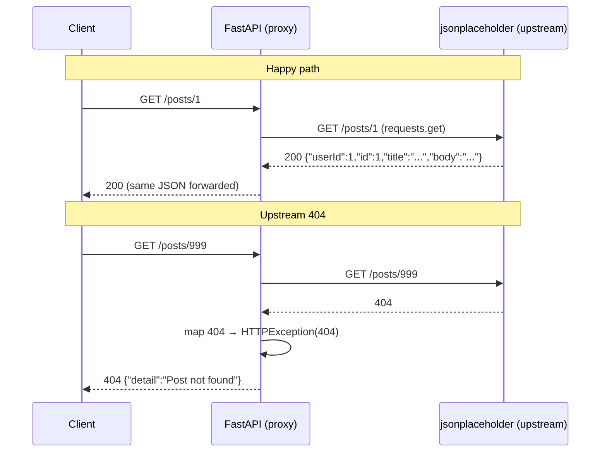

<div align="center">

# 🔌 A028 — Third-Party API Integration (requests library)

### *Forward requests to an external API — and translate its errors into your own.*

<br/>


</div>

---

## 🧠 The One-Sentence Summary

> **A FastAPI route can act as a client to another HTTP API — call it with `requests.get/post`, check `.status_code`, forward `.json()`, and translate upstream errors into your own `HTTPException`s.**

If you remember *"**F-E-T-C-H** — **F**orward, **E**rror-check, **T**ranslate, **C**lient, **H**andler"*, the rest of this README is decoration.

---

## 📑 Table of Contents

- [🧠 The One-Sentence Summary](#-the-one-sentence-summary)
- [📖 The Story: The Concierge](#-the-story-the-concierge)
- [🎯 What You Will Learn (10 Skills)](#-what-you-will-learn-10-skills)
- [📂 Project Structure](#-project-structure)
- [⚙️ Installation & Setup](#-installation--setup)
- [🧬 Anatomy of `main.py` — Line by Line (Heavily Commented)](#-anatomy-of-mainpy--line-by-line-heavily-commented)
- [🛣️ API Endpoints](#-api-endpoints)
- [🧠 The Mental Model: How Proxy API Works](#-the-mental-model-how-proxy-api-works)
- [🆕 Every New Keyword Explained](#-every-new-keyword-explained)
- [🆚 `requests` vs `httpx` vs `urllib`](#-requests-vs-httpx-vs-urllib)
- [🆚 Sync vs Async upstream calls](#-sync-vs-async-upstream-calls)
- [🧪 Try It With curl](#-try-it-with-curl)
- [🔧 Variations](#-variations)
- [⚠️ Common Pitfalls & Fixes](#-common-pitfalls--fixes)
- [🧠 Mnemonic Cheat Sheet](#-mnemonic-cheat-sheet)
- [🧪 Recall Test](#-recall-test)
- [🎯 Interview Q&A](#-interview-qa)
- [🚀 Where to Go Next](#-where-to-go-next)

---

## 📖 The Story: The Concierge 🛎️

You're a concierge (FastAPI), and a guest (client) asks:

> "Please get me all posts from `jsonplaceholder`."

You are **not** a mailroom employee — you don't store the letters. You pick up the phone, call the post office (`requests.get`), and hand the letter back to the guest. If the post office says "404, we don't have that", you don't just hang up — you say:

> "Sorry, that post doesn't exist" — *and you translate the upstream error into your own polite response.*

> 🧠 **Mnemonic:** "**F-E-T-C-H** — **F**orward, **E**rror-check, **T**ranslate, **C**lient, **H**andler."

---

## 🎯 What You Will Learn (10 Skills)

| # | 🎯 Skill | 🧠 You'll remember it because... |
|:-:|:---------|:--------------------------------|
| 1 | 🔌 **`requests.get()`** | "The simplest HTTP call" |
| 2 | 📊 **`response.status_code`** | "200 = OK, 404 = miss, others = error" |
| 3 | 📦 **`response.json()`** | "Parse the body" |
| 4 | 🐍 **`HTTPException(502)`** | "Translate upstream errors" |
| 5 | 🔄 **Proxy route pattern** | "Forward request → return response" |
| 6 | 🔐 **Timeouts** | "Don't hang forever" |
| 7 | 🛡️ **Error translation** | "Upstream 404 → my 404" |
| 8 | ⚙️ **`async def` + `httpx`** | "Don't block the event loop" |
| 9 | 🧯 **`try/except requests.RequestException`** | "Network is unreliable" |
| 10 | 🏗️ **Caching** | "Forward then cache" |

---

## 📂 Project Structure

```
📁 A028_Third_Party_API_Integration_Requests_Library_Fetch_External_Data/
├── 🐍 main.py              ← 75 lines: forward + error-translating routes
├── 📦 requirements.txt     ← fastapi[standard] + requests
└── 📖 README.md             ← you are here
```

---

## ⚙️ Installation & Setup

```powershell
cd "D:\AllProgram\LEARN\Python\FastAPI\A028_Third_Party_API_Integration_Requests_Library_Fetch_External_Data"
python -m venv .venv
.\.venv\Scripts\Activate.ps1
pip install -r requirements.txt
uvicorn main:app --reload
```

> 🧠 **You need network access** — the app calls `jsonplaceholder.typicode.com` on startup of each request.

---

## 🧬 Anatomy of `main.py` — Line by Line (Heavily Commented)

```python
# --- FastAPI: framework + HTTP error handling ---
from fastapi import FastAPI, HTTPException

# --- `requests`: the classic sync HTTP client ---
# (fastapi[standard] does NOT include it; install separately.)
import requests

# 1. Create the FastAPI app instance
app = FastAPI()


# =========================================================
# GET /posts
# =========================================================
@app.get("/posts")
def get_posts():
    upstream_url = "https://jsonplaceholder.typicode.com/posts"
    response = requests.get(upstream_url)

    # Bubble up upstream failures as 502 Bad Gateway
    if response.status_code != 200:
        raise HTTPException(
            status_code=502,
            detail=f"Upstream API returned HTTP {response.status_code}"
        )

    return response.json()


# =========================================================
# GET /posts/{post_id}
# =========================================================
@app.get("/posts/{post_id}")
def get_post(post_id: int):
    upstream_url = f"https://jsonplaceholder.typicode.com/posts/{post_id}"
    response = requests.get(upstream_url)

    # Map upstream 404 to our own 404
    if response.status_code == 404:
        raise HTTPException(status_code=404, detail="Post not found")
    if response.status_code != 200:
        raise HTTPException(status_code=502, detail=f"Upstream returned {response.status_code}")

    return response.json()
```

| Line | Code | 🧠 Why it's there |
|:----:|:-----|:------------------|
| 6 | `import requests` | The HTTP client library |
| 9 | `app = FastAPI()` | App instance |
| 17 | `requests.get(url)` | Call the upstream API |
| 23 | `if response.status_code != 200` | Detect upstream errors |
| 24–28 | `raise HTTPException(502, ...)` | Translate to our own |
| 44 | `if response.status_code == 404` | Map 404 to 404 |
| 47 | `raise HTTPException(502, ...)` | Generic upstream error |
| 52 | `return response.json()` | Forward the parsed body |

### The Three Magic Lines

```python
response = requests.get(url)        # call upstream
if response.status_code != 200: ...   # check the status
return response.json()              # forward the body
```

### 🎯 If you remember ONE thing
> **`requests.get(url)` + check `.status_code` + return `.json()`. Translate upstream errors into your own `HTTPException`s.**

---

## 🛣️ API Endpoints

| Method | Endpoint | Upstream | Returns |
|:------:|:---------|:---------|:--------|
| 🟢 GET | `/` | — | `{message: "A028 proxy running..."}` |
| 🟢 GET | `/posts` | `GET /posts` | `list[dict]` (100 posts) |
| 🟢 GET | `/posts/{post_id}` | `GET /posts/{id}` | `dict` (one post) or 404 |

> ⚠️ `/posts/999` (non-existent) → `404 Post not found`. `/posts/0` (bad input) → `422` from FastAPI validation before the route runs.

---

## 🧠 The Mental Model: How Proxy API Works



> 🧠 **You translate upstream errors into your own HTTP status codes and messages.**

---

## 🆕 Every New Keyword Explained

### 1. `requests.get(url, ...)` — the simple call

**What:** The most common HTTP call. Returns a `Response` object.

```python
import requests
response = requests.get("https://api.example.com")
```

### 2. `response.status_code`

**What:** The HTTP status code of the response (`200`, `404`, `500`, ...). Compare with `==`.

```python
if response.status_code == 200:
    ...
```

> 🧠 **Mnemonic:** "**Status code is a number, not `ok`.**"

### 3. `response.json()`

**What:** Parses the response body as JSON. Raises `requests.JSONDecodeError` if the body is not JSON.

```python
data = response.json()    # list or dict
```

> 🧠 **Mnemonic:** "**`.json()` = parse body to Python.**"

### 4. `HTTPException(502)` — Bad Gateway

**What:** FastAPI's way to return an HTTP error. `502` means "my upstream failed" — perfect for a proxy.

```python
if upstream.status_code != 200:
    raise HTTPException(502, detail="Upstream failed")
```

| Code | Meaning | Use for |
|:-----|:--------|:--------|
| `502` | Bad Gateway | Upstream returned an error |
| `504` | Gateway Timeout | Upstream was too slow |
| `422` | Unprocessable Entity | Client sent bad params (FastAPI auto) |

> 🧠 **Mnemonic:** "**502 = my backend failed. 504 = my backend was too slow.**"

### 5. `try/except requests.RequestException`

**What:** Catches all `requests` network errors (connection refused, DNS failure, timeout, etc.). **Always wrap upstream calls in try/except.**

```python
try:
    response = requests.get(url, timeout=5)
except requests.RequestException as exc:
    raise HTTPException(502, str(exc))
```

> 🧠 **Mnemonic:** "**Network calls can fail. Catch `RequestException`.**"

### 6. `timeout=5` — request timeout

**What:** Maximum seconds to wait for the upstream response. Without it, a hung upstream can block your worker forever.

```python
response = requests.get(url, timeout=5)
```

> 🧠 **Mnemonic:** "**Always set a timeout.**"

### 7. `response.raise_for_status()` — convenience

**What:** Raises an `HTTPError` if the status is 4xx/5xx. Alternative to manual `if != 200` checks.

```python
response = requests.get(url, timeout=5)
response.raise_for_status()    # raises if 4xx/5xx
return response.json()
```

> 🧠 **Mnemonic:** "**raise_for_status = 'throw if bad'**."

### 8. Proxy route pattern

**What:** A FastAPI route that forwards to an external API.

```python
@app.get("/posts")
def get_posts():
    r = requests.get("https://...")
    if r.status_code != 200: raise HTTPException(502)
    return r.json()
```

> 🧠 **Mnemonic:** "**Forward → check → return.**"

### 9. Error translation

**What:** The practice of mapping upstream error codes into your own consistent error shape.

```python
if upstream.status_code == 404:
    raise HTTPException(404, "Post not found")
if upstream.status_code != 200:
    raise HTTPException(502, "Upstream error")
```

> 🧠 **Mnemonic:** "**Your 404 ≠ their 404. Translate it.**"

### 10. `jsonplaceholder.typicode.com`

**What:** A free fake REST API (`posts`, `comments`, `users`, `albums`, `todos`, `photos`). Perfect for tutorials that need an external API without credentials.

> 🧠 **Mnemonic:** "**jsonplaceholder = a fake internet to play with.**"

---

## 🆚 `requests` vs `httpx` vs `urllib`

| Feature | `urllib.request` (stdlib) | `requests` | `httpx` |
|:--------|:--------------------------|:-----------|:--------|
| Built-in | ✅ | ❌ | ❌ |
| Sync | ✅ | ✅ | ✅ |
| Async | ❌ | ❌ (via `aiohttp`) | ✅ `httpx.AsyncClient` |
| `response.json()` | ❌ (manual) | ✅ | ✅ |
| `params=` / `json=` kwargs | ❌ | ✅ | ✅ |
| Streaming | manual | ✅ | ✅ |

> 🧠 **Mnemonic:** "**`requests` = sync comfort. `httpx` = sync + async.**"

---

## 🆚 Sync vs Async upstream calls

| `requests` (sync) | `httpx.AsyncClient` (async) |
|:------------------|:----------------------------|
| `requests.get(url)` | `async with httpx.AsyncClient() as client: await client.get(url)` |
| Blocks the worker | Frees the worker during the HTTP call |
| Fine for low traffic | Required for high-concurrency FastAPI apps |
| Simpler code | Slightly more verbose |

> 🧠 **Mnemonic:** "**`requests` = simple. Async = scale.**" (See Variations for the async version.)

---

## 🧪 Try It With curl

### 1. Health check

```bash
curl http://127.0.0.1:8000/
# {"message":"A028 proxy running. Use /posts or /posts/{id}."}
```

### 2. List all posts

```bash
curl http://127.0.0.1:8000/posts | head -c 300
# [{"userId": 1, "id": 1, "title": "sunt aut...", "body": "..."}, ...]
```

### 3. Get one post

```bash
curl http://127.0.0.1:8000/posts/1
# {"userId": 1, "id": 1, "title": "sunt aut...", "body": "..."}
```

### 4. Non-existent post (404)

```bash
curl -i http://127.0.0.1:8000/posts/999
```

```http
HTTP/1.1 404 Not Found
{"detail":"Post not found"}
```

### 5. Bad input (422, before the upstream is called)

```bash
curl -i http://127.0.0.1:8000/posts/abc
```

```http
HTTP/1.1 422 Unprocessable Entity
{... "msg": "Input should be a valid integer" ...}
```

---

## 🔧 Variations

### Variation 1: Add a timeout + try/except

```python
@app.get("/posts")
def get_posts():
    try:
        r = requests.get("https://jsonplaceholder.typicode.com/posts", timeout=5)
    except requests.RequestException as exc:
        raise HTTPException(502, str(exc))

    if r.status_code != 200:
        raise HTTPException(502, f"Upstream returned {r.status_code}")
    return r.json()
```

### Variation 2: Async version with `httpx`

```python
import httpx

@app.get("/posts")
async def get_posts():
    async with httpx.AsyncClient(timeout=5) as client:
        try:
            r = await client.get("https://jsonplaceholder.typicode.com/posts")
        except httpx.HTTPError as exc:
            raise HTTPException(502, str(exc))
    if r.status_code != 200:
        raise HTTPException(502, str(r.status_code))
    return r.json()
```

### Variation 3: Add a cache header

```python
from fastapi.responses import Response

@app.get("/posts")
def get_posts(resp: Response):
    data = requests.get(URL).json()
    resp.headers["Cache-Control"] = "max-age=60"    # cache for 60s
    return data
```

### Variation 4: Query an API that needs a key

```python
HEADERS = {"Authorization": "Bearer YOUR_API_TOKEN"}

@app.get("/weather")
def get_weather():
    r = requests.get("https://api.openweathermap.org/data/2.5/weather",
                     params={"q": "London"},
                     headers=HEADERS,
                     timeout=5)
    return r.json()
```

### Variation 5: POST to an upstream

```python
@app.post("/posts")
def create_post(post: dict):
    r = requests.post("https://jsonplaceholder.typicode.com/posts", json=post, timeout=5)
    if r.status_code != 201:
        raise HTTPException(502, str(r.status_code))
    return r.json()
```

---

## ⚠️ Common Pitfalls & Fixes

| 😖 Pitfall | 🔍 Cause | ✅ Fix |
|:-----------|:---------|:------|
| `ModuleNotFoundError: No module named 'requests'` | `requests` not installed (it's not in `fastapi[standard]`) | `pip install requests` |
| 502 on every request | Upstream is down or URL is wrong | Double-check the upstream URL; use `timeout` |
| 504 Gateway Timeout | Upstream took too long | Set `timeout=5` on `requests.get` |
| 422 before the upstream is called | `post_id` not an int | That's FastAPI validation working — the user sent `abc` |
| Upstream 404 → my 200 with `null` | Didn't check `r.status_code` | Always check, then translate |
| Blocking the event loop | Used `requests` in `async def` route | Use `httpx.AsyncClient`, or declare the route as `def` (sync) |
| No error message in 502 | `detail` is just a number | `raise HTTPException(502, detail=f"Upstream {e}")` |
| Caching the wrong data | Upstream returned stale data | Add `Cache-Control` or fetch fresh each time |

### The "No timeout" Trap

```python
# ❌ If the upstream hangs, your worker hangs forever
r = requests.get(url)

# ✅ Always set a timeout
r = requests.get(url, timeout=5)    # 5s max
```

### The "Forgot to check status" Trap

```python
# ❌ Returns an error page (HTML 404) as if it was the data
r = requests.get(url)
return r.json()

# ✅ Check, then return
if r.status_code != 200:
    raise HTTPException(502, f"Upstream returned {r.status_code}")
return r.json()
```

### The "Async route + sync requests" Trap

```python
# ❌ Blocks the event loop — defeats the purpose of async
@app.get("/posts")
async def get_posts():
    r = requests.get(url)    # blocks the loop
    return r.json()

# ✅ Either use httpx.AsyncClient, or make it a sync route
@app.get("/posts")           # sync def — FastAPI runs in a threadpool
def get_posts():
    r = requests.get(url, timeout=5)
    return r.json()
```

> 🧠 **Mnemonic:** "**No timeout = hung worker. No status check = bad data.**"

---

## 🧠 Mnemonic Cheat Sheet

| Concept | Mnemonic | Story |
|:--------|:---------|:------|
| 3-step flow | **F-E-T-C-H** | Forward, Error-check, Translate, Client, Handler |
| `requests.get` | **Simple call** | Gets a Response object |
| `.status_code` | **Number, not .ok** | 200 = OK, others = problem |
| `.json()` | **Parse body** | Turns JSON → Python |
| `HTTPException(502)` | **My backend failed** | Upstream error |
| `timeout=5` | **Don't hang** | Always set it |
| `RequestException` | **Network can fail** | Catch it |
| `raise_for_status` | **Throw if bad** | Convenience |
| jsonplaceholder | **Fake internet** | Free test API |
| Async vs sync | **`httpx` for scale** | `requests` for simplicity |

---

## 🧪 Recall Test

1. What library does this module use to call the upstream API?
2. How do you check if the upstream call succeeded?
3. What status code do you return when the upstream fails?
4. How do you translate an upstream 404 into your own?
5. How do you handle network errors (`requests` raises)?
6. Why must you set a `timeout`?
7. What happens if `post_id` is `abc` (not a number)?
8. How do you make this async instead of sync?

> 8/8 → third-party API integration is yours.

---

## 🎯 Interview Q&A

### Q1: How do you call a third-party API from a FastAPI route?

**Answer:** Use the `requests` library (sync) or `httpx.AsyncClient` (async). Call the upstream, check `.status_code`, then return `.json()`:

```python
import requests

@app.get("/posts")
def get_posts():
    r = requests.get("https://jsonplaceholder.typicode.com/posts", timeout=5)
    if r.status_code != 200:
        raise HTTPException(502, "Upstream failed")
    return r.json()
```

> **One-liner:** *"Fetch upstream, check, return json."*

### Q2: When should you return 502 vs 504?

**Answer:**

| Code | Meaning | Use case |
|:-----|:--------|:---------|
| `502 Bad Gateway` | The upstream returned an error status | Upstream returned 500, 404, etc. |
| `504 Gateway Timeout` | The upstream didn't respond in time | Upstream timed out |

> **One-liner:** *"502 = upstream bad. 504 = upstream slow."*

### Q3: What's the difference between a proxy route and a normal route?

**Answer:** A **normal route** returns data your app owns/computes. A **proxy route** forwards the request to an external service, transforms the response, and returns it — the client doesn't see the upstream, only your endpoint.

> **One-liner:** *"Proxy = forward + transform, client never talks to upstream."*

### Q4: Why do you translate upstream errors into your own `HTTPException`s?

**Answer:** So the client receives a **consistent error shape** no matter which backend failed. If you just forwarded upstream errors, the client would get different status codes, messages, and formats from different services. By translating, every error looks the same to your client.

> **One-liner:** *"Consistent errors > raw upstream errors."*

### Q5: How do you add a timeout to a `requests` call?

**Answer:** Pass a `timeout=` argument. It accepts a tuple `(connect_timeout, read_timeout)` for fine control.

```python
r = requests.get(url, timeout=5)            # 5s total
r = requests.get(url, timeout=(3, 5))       # 3s connect, 5s read
```

Without a timeout, a stalled upstream can block your worker forever.

> **One-liner:** *"`requests.get(url, timeout=5)`."*

### Q6: What exceptions can `requests` raise?

**Answer:** The base is `requests.RequestException`. Sub-errors include:

- `ConnectionError` — DNS or connection refused
- `Timeout` — upstream too slow
- `HTTPError` — raised by `raise_for_status()`
- `JSONDecodeError` — body wasn't JSON

Always catch `requests.RequestException` (the base) to cover all cases.

> **One-liner:** *"Catch `requests.RequestException` to cover all network errors."*

### Q7: How do you make the upstream call async?

**Answer:** Use `httpx.AsyncClient`:

```python
import httpx

@app.get("/posts")
async def get_posts():
    async with httpx.AsyncClient(timeout=5) as client:
        try:
            r = await client.get("https://jsonplaceholder.typicode.com/posts")
        except httpx.HTTPError as exc:
            raise HTTPException(502, str(exc))
    if r.status_code != 200:
        raise HTTPException(502, str(r.status_code))
    return r.json()
```

> **One-liner:** *"`httpx.AsyncClient` + `async def` + `await`."*

### Q8: Should you cache the upstream response?

**Answer:** It depends on how fresh the data needs to be. For a proxy that forwards public data, a short cache (e.g. `Cache-Control: max-age=60`) reduces upstream load. For sensitive or ever-changing data, skip it. You can also use `httpx`'s transport-level caching or an external cache (Redis) — but always set a TTL.

> **One-liner:** *"Cache public data. Don't cache sensitive data."*

---

## 🚀 Where to Go Next

| Direction | Module |
|:----------|:-------|
| ⬅️ Previous | [A027](../A027_API_Testing_with_Pytest_FastAPI_Test_Endpoints/) |
| ⬅️ Back | [Root README](../README.md) |
| ➡️ Next | A029 (planned) — Async upstream calls with `httpx` + circuit breaker |
| ➡️ Future | A030 (planned) — GraphQL gateway (forward `.graphql` queries) |

---

<div align="center">

### 🔌 *Forward, check the status, return the json, translate the errors.* 🔌

Made with ❤️, `requests.get()`, and `raise HTTPException(502, ...)`.

</div>