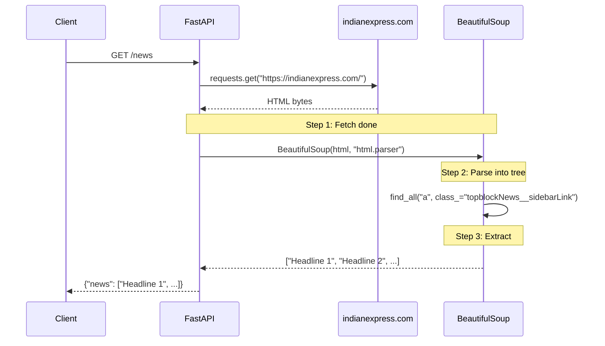

<div align="center">

# 🕷️ A029 — Web Crawling with requests + BeautifulSoup

### *Fetch an HTML page. Parse the DOM. Pluck out the headlines.*

<br/>


</div>

---

## 🧠 The One-Sentence Summary

> **A FastAPI route can fetch a live webpage with `requests.get`, parse its HTML into a searchable tree with `BeautifulSoup`, and extract headlines (or any element) with CSS selectors or `find_all`, then return the data as JSON.**

If you remember *"**F-P-E** — **F**etch, **P**arse, **E**xtract"***, the rest of this README is decoration.

---

## 📑 Table of Contents

- [🧠 The One-Sentence Summary](#-the-one-sentence-summary)
- [📖 The Story: The Scrapbook Keeper](#-the-story-the-scrapbook-keeper)
- [🎯 What You Will Learn (10 Skills)](#-what-you-will-learn-10-skills)
- [📂 Project Structure](#-project-structure)
- [⚙️ Installation & Setup](#-installation--setup)
- [🧬 Anatomy of `main.py` — Line by Line (Heavily Commented)](#-anatomy-of-mainpy--line-by-line-heavily-commented)
- [🛣️ API Endpoints](#-api-endpoints)
- [🧠 The Mental Model: How Web Scraping Works](#-the-mental-model-how-web-scraping-works)
- [🆕 Every New Keyword Explained](#-every-new-keyword-explained)
- [🆚 requests + BeautifulSoup vs Selenium vs Playwright](#-requests--beautifulsoup-vs-selenium-vs-playwright)
- [🆚 CSS selectors vs XPath](#-css-selectors-vs-xpath)
- [🧪 Try It](#-try-it)
- [🔧 Variations](#-variations)
- [⚠️ Common Pitfalls & Fixes](#-common-pitfalls--fixes)
- [🧠 Mnemonic Cheat Sheet](#-mnemonic-cheat-sheet)
- [🧪 Recall Test](#-recall-test)
- [🎯 Interview Q&A](#-interview-qa)
- [🚀 Where to Go Next](#-where-to-go-next)

---

## 📖 The Story: The Scrapbook Keeper 📰

You're a journalist who needs to read a newspaper every day, but the newspaper's website is a mess of ads and sidebars. Your job:

1. **`requests.get(url)`** — send a robot to fetch the paper (raw HTML)
2. **`BeautifulSoup(html, "html.parser")`** — lay the paper flat on the table so you can see its structure
3. **`soup.find_all("a", class_="...")`** — cut out the headlines and paste them in your scrapbook

> 🧠 **Mnemonic:** "**F-P-E** — **F**etch, **P**arse, **E**xtract."

---

## 🎯 What You Will Learn (10 Skills)

| # | 🎯 Skill | 🧠 You'll remember it because... |
|:-:|:---------|:--------------------------------|
| 1 | 🕷️ **`requests.get(url)`** | "Fetch the raw HTML" |
| 2 | 📜 **`response.text`** | "The HTML string" |
| 3 | 🌳 **`BeautifulSoup(html, parser)`** | "Build a searchable tree" |
| 4 | 🔍 **`.find_all(selector)`** | "Select matching elements" |
| 5 | 📝 **`.text`** | "Extract text from an element" |
| 6 | 🧹 **`.strip()`** | "Clean whitespace" |
| 7 | ⏱️ **`timeout=10`** | "Don't hang forever" |
| 8 | 🕷️‍♀️ **CSS `.class` selectors** | "Fragile but common" |
| 9 | 🐍 **`html.parser` vs `lxml`** | "Stdlib vs fast native" |
| 10 | 🚫 **Robots.txt + legality** | "Scrape responsibly" |

---

## 📂 Project Structure

```
📁 A029_Web_Crawling_Requests_BeautifulSoup_Fetch_Website_Data/
├── 🐍 main.py                ← 55 lines: GET /news that scrapes indianexpress.com
├── 📦 requirements.txt       ← fastapi[standard] + requests + beautifulsoup4
└── 📖 README.md              ← you are here
```

---

## ⚙️ Installation & Setup

```powershell
cd "D:\AllProgram\LEARN\Python\FastAPI\A029_Web_Crawling_Requests_BeautifulSoup_Fetch_Website_Data"
python -m venv .venv
.\.venv\Scripts\Activate.ps1
pip install -r requirements.txt
uvicorn main:app --reload
```

> ⚠️ This module fetches a **live URL** (`https://indianexpress.com`). You need network access. The CSS selector may break if the site redesigns its HTML.

---

## 🧬 Anatomy of `main.py` — Line by Line (Heavily Commented)

```python
# --- FastAPI: framework + HTTP error handling ---
from fastapi import FastAPI, HTTPException

# --- `requests`: fetch the upstream HTML page ---
import requests

# --- `beautifulsoup4`: parse the HTML and extract headlines ---
# `bs4.BeautifulSoup` builds a parse tree from raw HTML.
from bs4 import BeautifulSoup

# 1. Create the FastAPI app instance
app = FastAPI()


# =========================================================
# GET /news  —  crawl + parse a news site
# =========================================================
@app.get("/news")
def get_news():
    # The page we want to scrape (a real news site).
    url = "https://indianexpress.com/"

    # 1. Fetch the raw HTML. Always set a timeout.
    try:
        response = requests.get(url, timeout=10)
    except requests.RequestException as exc:
        raise HTTPException(502, f"Failed to fetch upstream: {exc}")

    # 2. Check the HTTP status before parsing
    if response.status_code != 200:
        raise HTTPException(502, f"Upstream returned HTTP {response.status_code}")

    # 3. Parse the HTML into a searchable tree.
    #    "html.parser" is the stdlib parser bundled with Python.
    soup = BeautifulSoup(response.text, "html.parser")

    # 4. Extract headlines. CSS selectors are FRAGILE.
    titles = []
    for item in soup.find_all("a", class_="topblockNews__sidebarLink"):
        titles.append(item.text.strip())

    return {"news": titles}
```

| Line | Code | 🧠 Why it's there |
|:----:|:-----|:------------------|
| 12 | `from bs4 import BeautifulSoup` | The HTML parser |
| 20 | `requests.get(url, timeout=10)` | Fetch HTML |
| 21–24 | `try/except RequestException` | Network errors → 502 |
| 27–29 | `status_code != 200 → 502` | Upstream HTTP error → 502 |
| 32 | `BeautifulSoup(text, "html.parser")` | Build parse tree |
| 36–38 | `find_all("a", class_=...)` | Select matching elements |
| 39 | `item.text.strip()` | Extract + clean text |

### The Three Magic Lines

```python
response = requests.get(url, timeout=10)       # 1. Fetch HTML
soup = BeautifulSoup(response.text, "html.parser")  # 2. Parse into tree
items = soup.find_all("a", class_="sidebarLink")     # 3. Extract
```

> 🧠 **Mnemonic:** "**F-P-E** — Fetch, Parse, Extract.**"

### 🎯 If you remember ONE thing
> **`requests.get()` fetches HTML; `BeautifulSoup()` builds a tree; `find_all()` extracts the bits you want.**

---

## 🛣️ API Endpoints

| Method | Endpoint | Returns |
|:------:|:---------|:--------|
| 🟢 GET | `/news` | `{"news": ["headline1", "headline2", ...]}` or 502 |

---

## 🧠 The Mental Model: How Web Scraping Works



> 🧠 **The scrape happens on every request.** Add caching if the page is expensive to fetch.

---

## 🆕 Every New Keyword Explained

### 1. `requests.get(url, timeout=N)` — fetch HTML

**What:** Downloads the page and returns a `Response`. `.text` is the HTML string.

```python
import requests
response = requests.get("https://example.com", timeout=10)
html = response.text
```

> 🧠 **Mnemonic:** "**`timeout` prevents hanging.**"

### 2. `BeautifulSoup(html, "html.parser")` — build a tree

**What:** Parses the raw HTML string into a **DOM tree** you can navigate with `find_all`, `select`, `find`, etc.

```python
from bs4 import BeautifulSoup
soup = BeautifulSoup(html, "html.parser")
```

| Parser | Pros | Cons |
|:-------|:-----|:-----|
| `html.parser` | ✅ Stdlib (no install) | Slightly slower |
| `lxml` | ✅ Fast, lenient | `pip install lxml` (native deps) |
| `html5lib` | ✅ Parses like a browser | Slow, heavy |

> 🧠 **Mnemonic:** "**`html.parser` = 0 deps. `lxml` = fast.**"

### 3. `soup.find_all(name, attrs)` — select all matching

**What:** Returns a **list** of all elements matching the tag name and/or attributes (class, id).

```python
soup.find_all("a", class_="sidebarLink")        # <a class="sidebarLink">...
soup.find_all("div", id="main")                 # <div id="main">...
soup.find_all("h1")                             # all h1's
```

> 🧠 **Mnemonic:** "**`find_all` = list of matches.**"

### 4. `soup.find(name, attrs)` — select the first matching

**What:** Like `find_all` but returns only the **first** match (or `None`).

```python
title = soup.find("title")    # the <title> tag
```

### 5. `element.text` — extract text

**What:** Returns the concatenated text content of an element, stripping tags.

```python
a = soup.find("a")
print(a.text)    # "Read more"
```

### 6. `.text.strip()` — clean whitespace

**What:** `BeautifulSoup` preserves whitespace from the source HTML. `.strip()` removes leading/trailing spaces, tabs, and newlines.

```python
item.text.strip()    # "Headline" not "  Headline  \n"
```

> 🧠 **Mnemonic:** "**Always `.strip()` before saving.**"

### 7. `soup.select(selector)` — CSS-selector query

**What:** Use real CSS selectors (`a.class`, `#id`, `div > p`, `[href]`).

```python
soup.select("a.topblockNews__sidebarLink")       # class selector
soup.select("#main h2")                           # id + descendant
soup.select("ul > li.item a[href]")               # complex
```

> 🧠 **Mnemonic:** "**`select` = real CSS.**"

### 8. `soup.title.text` — the page title

**What:** Convenience accessor for `<title>...</title>`.

```python
print(soup.title.text)    # "Some Page Title"
```

### 9. `requests.RequestException`

**What:** The base class for all `requests` network errors. Catch it to handle connection failures gracefully.

```python
try:
    r = requests.get(url, timeout=10)
except requests.RequestException as e:
    print("Network error:", e)
```

> 🧠 **Mnemonic:** "**`RequestException` = catch-all for network.**"

### 10. `robots.txt`

**What:** A file at `https://example.com/robots.txt` that tells crawlers which paths are off-limits. **Ethical scraping = check it**; legal reality varies by jurisdiction.

> 🧠 **Mnemonic:** "**Check robots.txt. Be polite.**"

---

## 🆚 requests + BeautifulSoup vs Selenium vs Playwright

| Tool | Handles JS? | Headless browser? | Use for |
|:-----|:------------|:------------------|:--------|
| requests + BeautifulSoup | ❌ (static HTML only) | ❌ | Fast, static scraping |
| Selenium | ✅ | ✅ (Chrome/Firefox driver) | JS-heavy pages, automation |
| Playwright | ✅ | ✅ (built-in, fast) | Modern JS, PDFs, multi-browser |
| Scrapy | ❌ (mostly) | ❌ | Large-scale crawl projects |

> 🧠 **Mnemonic:** "**BeautifulSoup = fast HTML cut. Selenium/Playwright = full browser for JS.**"

---

## 🆚 CSS selectors vs XPath

| CSS | XPath |
|:----|:-----|
| `a.class` | `//a[@class="class"]` |
| `#id` | `//*[@id="id"]` |
| `ul > li` | `//ul/li` |
| `a[href]` | `//a[@href]` |
| Simpler syntax | More powerful (parent, axes) |
| `select()` in BeautifulSoup | Not supported (use `lxml` directly) |

> 🧠 **Mnemonic:** "**CSS = `select()`. XPath = `//`.**"

---

## 🧪 Try It

### 1. Start the server

```powershell
uvicorn main:app --reload
```

### 2. Hit the endpoint

```bash
curl http://127.0.0.1:8000/news
```

```json
{
  "news": ["Headline 1 – some news", "Headline 2 – more news", ...]
}
```

> 🧠 If the site has changed its HTML, you might get `"news": []`. That's the fragility of CSS selectors — see Pitfalls.

### 3. Check the DevTools tab

Open <http://127.0.0.1:8000/docs>, click **Try it out**, then **Execute**.

---

## 🔧 Variations

### Variation 1: Use a different page + selector

```python
@app.get("/quotes")
def get_quotes():
    html = requests.get("http://quotes.toscrape.com", timeout=10).text
    soup = BeautifulSoup(html, "html.parser")
    quotes = [q.text.strip() for q in soup.select(".quote > .text")]
    return {"quotes": quotes}
```

### Variation 2: Extract attributes (not just text)

```python
@app.get("/links")
def get_links():
    html = requests.get("https://example.com", timeout=10).text
    soup = BeautifulSoup(html, "html.parser")
    links = [
        {"text": a.text.strip(), "href": a.get("href")}
        for a in soup.find_all("a")
        if a.get("href")
    ]
    return {"links": links}
```

### Variation 3: Use `lxml` for speed

```python
# pip install lxml
soup = BeautifulSoup(html, "lxml")    # faster than html.parser
```

### Variation 4: Add a cache

```python
from functools import lru_cache
import time

@lru_cache(maxsize=1)
def _fetch_news_cached():
    return requests.get("https://indianexpress.com/", timeout=10).text

@app.get("/news")
def get_news():
    html = _fetch_news_cached()
    soup = BeautifulSoup(html, "html.parser")
    ...

# To invalidate: _fetch_news_cached.cache_clear()
```

### Variation 5: Parse JSON-LD (structured data)

```python
import json

@app.get("/jsonld")
def get_jsonld():
    html = requests.get("https://example.com/post", timeout=10).text
    soup = BeautifulSoup(html, "html.parser")
    for s in soup.find_all("script", type="application/ld+json"):
        # Many sites embed structured article data in JSON-LD
        data = json.loads(s.string)
        print(data.get("headline"))
```

---

## ⚠️ Common Pitfalls & Fixes

| 😖 Pitfall | 🔍 Cause | ✅ Fix |
|:-----------|:---------|:------|
| `"news": []` (empty) | CSS selector is stale (site redesigned) | Inspect the new HTML, update the class name |
| `html.parser` not found | `beautifulsoup4` not installed | `pip install beautifulsoup4` |
| Server hangs | No `timeout` on `requests.get` | Always pass `timeout=10` |
| `AttributeError: 'NoneType'` | `find` / `select` returned nothing | Check `if item is None` before using `.text` |
| `FeatureNotFound: html.parser` | Typo: `"html.parse"` instead of `"html.parser"` | Use the exact string `html.parser` |
| 429 Too Many Requests | Scraped too aggressively | Add `time.sleep(1)` between calls; respect rate limits |
| `requests.exceptions.ConnectionError` | No network | Catch it; return a 502 with a helpful message |
| Legal trouble | Scraped a site that forbids it | Check `robots.txt`; prefer official APIs |

### The "Stale Selector" Trap

```python
# ❌ This worked last month. The site redesign broke it.
items = soup.find_all("a", class_="oldClassName")
# → titles = []  (silently empty!)
```

**Fix:** Inspect the new HTML and update the selector. Always test.

> 🧠 **Mnemonic:** "**Selectors break. Re-inspect the DOM.**"

### The "No timeout" Trap

```python
# ❌ If the server never responds, your worker hangs forever
response = requests.get(url)

# ✅ Always set a timeout
response = requests.get(url, timeout=10)
```

### The Parser Typo Trap

```python
# ❌ "html.parse" is not a valid parser name
soup = BeautifulSoup(html, "html.parse")
# raises: FeatureNotFound: html.parse

# ✅ "html.parser" is the correct stdlib name
soup = BeautifulSoup(html, "html.parser")
```

> 🧠 **Mnemonic:** **"`parser`, not `parse`**."

---

## 🧠 Mnemonic Cheat Sheet

| Concept | Mnemonic | Story |
|:--------|:---------|:------|
| 3-step flow | **F-P-E** | Fetch, Parse, Extract |
| `requests.get` | **Fetch HTML** | With `timeout=10` |
| `BeautifulSoup` | **Build tree** | `"html.parser"` |
| `find_all` | **List of matches** | `("a", class_=...)` |
| `find` | **First match** | Or `None` |
| `.text` | **Text content** | Tags stripped |
| `.text.strip()` | **Clean it** | No leading/trailing space |
| `select()` | **Real CSS** | `a.class`, `#id` |
| `RequestException` | **Catch network** | All `requests` errors |
| Fragile selectors | **Re-inspect DOM** | They break silently |
| `lxml` | **Fast parser** | Needs install |
| `html.parser` | **Stdlib, slow** | Zero deps |
| robots.txt | **Be polite** | Check before scraping |

---

## 🧪 Recall Test

1. What library fetches the HTML?
2. What library parses the HTML into a tree?
3. How do you extract all matching elements?
4. How do you get clean text from an element?
5. What parser string is the stdlib default?
6. Why must you always set `timeout`?
7. What exception do you catch for network errors?
8. How do you extract an attribute value (not text)?

> 8/8 → web scraping is yours.

---

## 🎯 Interview Q&A

### Q1: How do you scrape a webpage in Python?

**Answer:** Two steps: fetch with `requests`, parse with `BeautifulSoup`.

```python
import requests, bs4
html = requests.get("https://example.com", timeout=10).text
soup = BeautifulSoup(html, "html.parser")
for a in soup.find_all("a"):
    print(a.text.strip(), a.get("href"))
```

> **One-liner:** *"Fetch HTML with requests. Parse with BeautifulSoup."*

### Q2: What's the difference between `find` and `find_all`?

**Answer:**

| `soup.find(...)` | `soup.find_all(...)` |
|:-----------------|:---------------------|
| Returns the **first** match or `None` | Returns a **list** of all matches |
| Good for a single element | Good for collections |

> **One-liner:** *"One → `find`. Many → `find_all`."*

### Q3: Why should you use `lxml` over `html.parser`?

**Answer:** `lxml` is a native C parser — **much faster** than the stdlib's pure-Python `html.parser`, especially on large pages. Trade-off: it requires a native C extension (`pip install lxml`).

| `html.parser` | `lxml` |
|:--------------|:-------|
| ✅ No extra install | ❌ native deps |
| Slower | Faster |
| Stdlib only | Third-party |

> **One-liner:** *"`lxml` = fast C parser. `html.parser` = 0-deps stdlib."*

### Q4: How do you protect a scraper from hanging?

**Answer:** Always pass a `timeout` to `requests.get`:

```python
requests.get(url, timeout=10)        # 10s total
requests.get(url, timeout=(3, 10))   # 3s connect, 10s read
```

And wrap it in `try/except requests.RequestException` to catch network failures.

> **One-liner:** *"`timeout=` + `RequestException` = no hangs."*

### Q5: What is `robots.txt` and why does it matter?

**Answer:** A file at `https://site.com/robots.txt` that tells crawlers which paths are allowed/disallowed. It's an **ethical convention** (not a technical one — `requests` doesn't read it automatically). Scraping a path listed as `Disallow:` can be a ToS violation.

```bash
curl https://example.com/robots.txt
```

> **One-liner:** *"robots.txt = 'please don't crawl these parts'. Respect it."*

### Q6: How do you extract a link's URL (not its text)?

**Answer:** Use `.get("href")` (or `.attrs["href"]`), not `.text`:

```python
for a in soup.find_all("a"):
    print(a.get("href"))   # the URL
    print(a.text.strip())  # the display text
```

> **One-liner:** *"URL = `a.get('href')`. Text = `a.text.strip()`."*

### Q7: What's the difference between `requests` + `BeautifulSoup` and `Selenium`?

**Answer:**

| requests + BeautifulSoup | Selenium |
|:--------------------------|:---------|
| Static HTML only (no JS) | Executes JavaScript (headless browser) |
| Fast | Slower, launches a browser |
| No browser needed | Needs Chrome/Firefox driver |
| Simple scraping | Dynamic / interactive pages |

Use `BeautifulSoup` for static content; `Selenium`/`Playwright` when the content is rendered by JavaScript.

> **One-liner:** *"Static = BeautifulSoup. JS = Selenium."*

### Q8: How do you make scraping more robust against selector changes?

**Answer:**

1. Use more general selectors (`div h2` instead of `.a.b.c.d.title`)
2. Inspect the DOM regularly (the live site changes)
3. Prefer official APIs if available
4. Add a cache so a broken selector doesn't hammer the source
5. Log when extraction returns empty results

```python
# Prefer simple, stable classes
soup.select("h2.title")      # more stable than
soup.select("div.x > ul.y > li.z > a.w")
```

> **One-liner:** *"Simple selectors age better. Prefer APIs over scraping."*

---

## 🚀 Where to Go Next

| Direction | Module |
|:----------|:-------|
| ⬅️ Previous | [A028](../A028_Third_Party_API_Integration_Requests_Library_Fetch_External_Data/) |
| ⬅️ Back | [Root README](../README.md) |
| ➡️ Next | A030 (planned) — Async scraping with `httpx` + `parsel` |
| ➡️ Future | A031 (planned) — Headless browser scraping with Playwright |

---

<div align="center">

### 🕷️ *Fetch the HTML. Parse the tree. Pluck out the headlines.* 🕷️

Made with ❤️, `requests.get(url, timeout=10)`, and `BeautifulSoup(html, "html.parser")`.

</div>