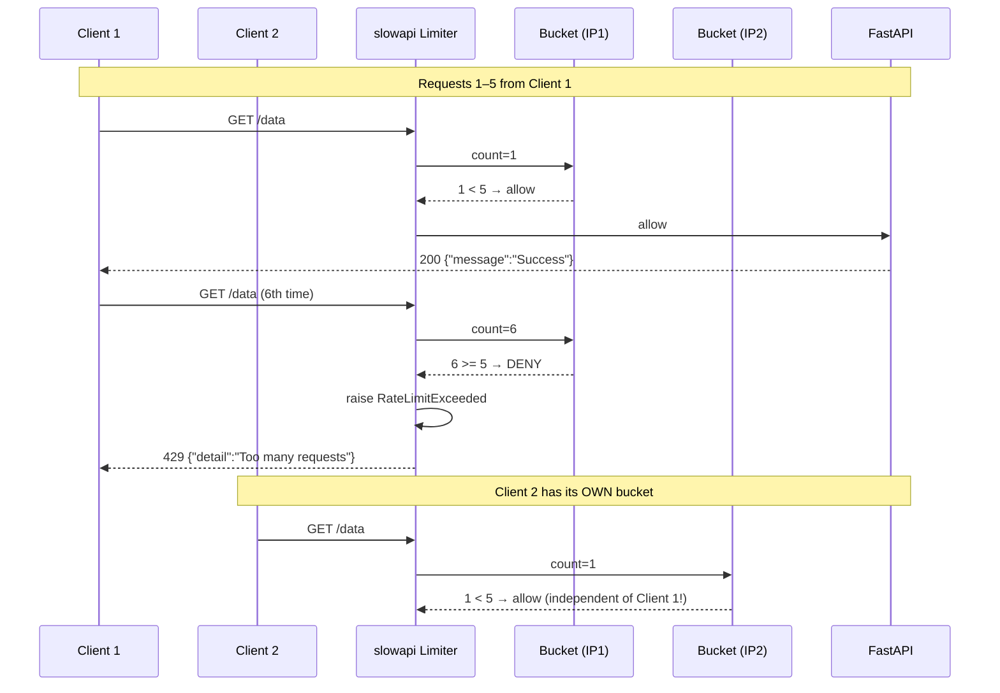

<div align="center">

# 🚦 A032 — Rate Limiting (slowapi) — Protect Your APIs from Abuse

### *Cap how often each client can call an endpoint. 6th request in a minute → 429.*

<br/>


</div>

---

## 🧠 The One-Sentence Summary

> **Rate limiting caps how many requests a client can make in a time window. `slowapi` gives you Flask-Limiter-style `@limiter.limit("N/minute")` decorators for FastAPI, with per-IP buckets and a `429 Too Many Requests` response when the limit is exceeded.**

If you remember *"limiter + `@limiter.limit()` + 429 handler"*, the rest of this README is decoration.

---

## 📑 Table of Contents

- [🧠 The One-Sentence Summary](#-the-one-sentence-summary)
- [📖 The Story: The Bouncer with a Clipboard](#-the-story-the-bouncer-with-a-clipboard)
- [🎯 What You Will Learn (10 Skills)](#-what-you-will-learn-10-skills)
- [📂 Project Structure](#-project-structure)
- [⚙️ Installation & Setup](#-installation--setup)
- [🧬 Anatomy of `main.py` — Line by Line (Heavily Commented)](#-anatomy-of-mainpy--line-by-line-heavily-commented)
- [🛣️ API Endpoints](#-api-endpoints)
- [🧠 The Mental Model: How Rate Limiting Works](#-the-mental-model-how-rate-limiting-works)
- [🆕 Every New Keyword Explained](#-every-new-keyword-explained)
- [🆚 In-memory vs Redis-backed rate limiting](#-in-memory-vs-redis-backed-rate-limiting)
- [🆚 Token Bucket vs Fixed Window vs Sliding Log](#-token-bucket-vs-fixed-window-vs-sliding-log)
- [🧪 Try It](#-try-it)
- [🔧 Variations](#-variations)
- [⚠️ Common Pitfalls & Fixes](#-common-pitfalls--fixes)
- [🧠 Mnemonic Cheat Sheet](#-mnemonic-cheat-sheet)
- [🧪 Recall Test](#-recall-test)
- [🎯 Interview Q&A](#-interview-qa)
- [🚀 Where to Go Next](#-where-to-go-next)

---

## 📖 The Story: The Bouncer with a Clipboard 🚧

At a VIP club, a bouncer has a rule: **"5 people per minute from any taxi."**

- The first 5 passengers get in ✅
- The 6th passenger is told: **"Come back in a minute."** ❌ (this is HTTP `429 Too Many Requests`)

Each **taxi** (client IP) has its **own counter**. Passengers from taxi #1 don't affect taxi #2.

> 🧠 **Mnemonic:** "**One counter per IP. 6th request in a minute → 429.**"

---

## 🎯 What You Will Learn (10 Skills)

| # | 🎯 Skill | 🧠 You'll remember it because... |
|:-:|:---------|:--------------------------------|
| 1 | 🚦 **What rate limiting is** | "Cap requests per time window" |
| 2 | 📋 **`@limiter.limit("5/minute")`** | "The decorator syntax" |
| 3 | 🪪 **`get_remote_address`** | "IP-based bucket" |
| 4 | 🧮 **`Limiter`** | "The counter object" |
| 5 | 🚨 **429 Too Many Requests** | "The limit-exceeded response" |
| 6 | 🛡️ **`@app.exception_handler`** | "Custom 429 body" |
| 7 | 🎯 **Per-IP vs per-user** | `get_remote_address` vs custom key |
| 8 | ⏱️ **Time-window syntaxes** | `"5/minute"`, `"100/hour"`, `"2/second"` |
| 9 | 🧠 **Decorator order matters** | `@app.get` then `@limiter.limit` |
| 10 | 🐍 **slowapi vs Starlette-Limiter** | "The maintained one" |

---

## 📂 Project Structure

```
📁 A032_Rate_Limiting_slowapi_Protect_Your_APIs_from_Abuse/
├── 🐍 main.py         ← app + Limiter + 429 handler + GET /data (5/minute)
├── 📦 requirements.txt ← fastapi[standard] + slowapi
└── 📖 README.md       ← you are here
```

---

## ⚙️ Installation & Setup

```powershell
cd "D:\AllProgram\LEARN\Python\FastAPI\A032_Rate_Limiting_slowapi_Protect_Your_APIs_from_Abuse"
python -m venv .venv
.\.venv\Scripts\Activate.ps1
pip install -r requirements.txt
uvicorn main:app --reload
```

> 🧠 `slowapi` is **not** in `fastapi[standard]` — you must `pip install slowapi`.

---

## 🧬 Anatomy of `main.py` — Line by Line (Heavily Commented)

The full file is now annotated (code logic unchanged — only comments added).

```python
from fastapi import FastAPI, Request
from fastapi.responses import JSONResponse

from slowapi import Limiter
from slowapi.util import get_remote_address
from slowapi.errors import RateLimitExceeded

app = FastAPI()

# Limiter keyed by client IP
limiter = Limiter(key_func=get_remote_address)
app.state.limiter = limiter

# 429 handler
@app.exception_handler(RateLimitExceeded)
def rate_limit_handler(request: Request, exc: RateLimitExceeded):
    return JSONResponse(status_code=429, content={"detail": "Too many requests"})

# Rate-limited endpoint
@app.get("/data")
@limiter.limit("5/minute")
def get_data(request: Request):
    return {"message": "Success"}
```

| Line | Code | 🧠 Why it's there |
|:----:|:-----|:------------------|
| 1 | `from slowapi import Limiter` | The rate-limiting engine |
| 2 | `from slowapi.util import get_remote_address` | Bucket-by-IP strategy |
| 3 | `from slowapi.errors import RateLimitExceeded` | Exception to handle |
| 10 | `Limiter(key_func=get_remote_address)` | Per-IP counters |
| 11 | `app.state.limiter = limiter` | Attach to the app for slowapi |
| 14 | `@app.exception_handler(RateLimitExceeded)` | Custom 429 handler |
| 25 | `@limiter.limit("5/minute")` | The limit value |
| 26 | `def get_data(request: Request)` | The handler (note the `Request`) |

### The Three Magic Lines

```python
limiter = Limiter(key_func=get_remote_address)        # the counter
app.state.limiter = limiter                            # wire it
@app.get("/data"); @limiter.limit("5/minute")          # cap at 5/min/IP
```

### 🎯 If you remember ONE thing
> **`@limiter.limit("5/minute")` + `app.state.limiter` + a `429` handler = rate-limited.**

---

## 🛣️ API Endpoints

| Method | Endpoint | Limit | Returns |
|:------:|:---------|:------|:--------|
| 🟢 GET | `/data` | 5 requests/minute per IP | `{message: "Success"}` or `429` |

---

## 🧠 The Mental Model: How Rate Limiting Works



> 🧠 **Each IP gets its own counter (bucket). Your 6th request doesn't block my 6th request.**

---

## 🆕 Every New Keyword Explained

### 1. `Limiter`

**What:** The rate-limiting engine from `slowapi`. Holds the rules and the counters. You configure it with a `key_func` that decides how to group clients.

```python
from slowapi import Limiter
limiter = Limiter(key_func=get_remote_address)
```

> 🧠 **Mnemonic:** "**`Limiter` = the traffic cop.**"

### 2. `key_func=get_remote_address`

**What:** A callable that `slowapi` calls with the `Request` to decide which **bucket** the request falls into. `get_remote_address` returns the client's IP, so each IP gets its own quota.

```python
def get_remote_address(request):
    return request.client.host
```

> 🧠 **Mnemonic:** "**`get_remote_address` = bucket-per-IP.**"

### 3. `@limiter.limit("5/minute")`

**What:** A decorator. It parses the rate string, attaches the rule to the endpoint, and slowapi enforces it on every call.

**Time-window syntaxes:**

| Syntax | Meaning |
|:------|:--------|
| `"5/minute"` | 5 per minute (resets each minute) |
| `"100/hour"` | 100 per hour |
| `"10/day"` | 10 per day |
| `"2/second"` | 2 per second |
| `"100/5minutes"` | 100 per 5-minute window |

> 🧠 **Mnemonic:** "**`N/window`** is the rule syntax."

### 4. `RateLimitExceeded`

**What:** The exception `slowapi` raises when a request exceeds the limit. You catch it with `@app.exception_handler` to return a custom JSON `429`.

```python
from slowapi.errors import RateLimitExceeded
@app.exception_handler(RateLimitExceeded)
def handler(request, exc):
    return JSONResponse(429, {"detail": "Too many requests"})
```

> 🧠 **Mnemonic:** "**`RateLimitExceeded` → handler → `429`.**"**

### 5. `app.state.limiter = limiter`

**What:** The line that wires the `Limiter` to the FastAPI app. **Without this, `@limiter.limit` does nothing** (slowapi reads the limiter from `app.state`).

```python
limiter = Limiter(key_func=get_remote_address)
app.state.limiter = limiter    # ← REQUIRED
```

> 🧠 **Mnemonic:** "**`app.state.limiter` = the on switch.**"

### 6. `@app.exception_handler(...)`

**What:** Registers a global handler for a specific exception. Every time `RateLimitExceeded` is raised anywhere, this handler returns the `429` JSON.

> 🧠 **Already covered in A012's README.**

### 7. 429 Too Many Requests

**What:** The HTTP status code for "you've sent too many requests in a given amount of time." Defined in **RFC 6585**.

| Code | Meaning |
|:-----|:--------|
| 429 | Too Many Requests — slow down |

> 🧠 **Mnemonic:** "**429 = slow down, friend.**"

### 8. Bucket

**What:** The unit of counting. A bucket stores (count, window_start). When `count >= limit` and `now - window_start < window`, the request is denied. Each `key_func` result (each IP) gets its own bucket.

> 🧠 **Mnemonic:** "**One bucket per IP.**"

### 9. Decorator order

**What:** `@app.get` **must** be applied after `@limiter.limit`. That's because `limiter.limit` wraps the function, and `app.get` registers the wrapper.

```python
@app.get("/data")           # 2. register with FastAPI
@limiter.limit("5/minute")  # 1. wrap with rate-limit check
def get_data(request): ...
```

> 🧠 **Mnemonic:** "**`@limiter.limit` closest to the function.**"

### 10. `request: Request`

**What:** The FastAPI `Request` object. `slowapi` injects it automatically when you declare it as the first parameter (it needs it to run `key_func`).

> 🧠 **Mnemonic:** "**slowapi needs the request to know who's calling.**"

---

## 🆚 In-memory vs Redis-backed rate limiting

| In-memory (default) | Redis |
|:--------------------|:------|
| Counters in process RAM | Counters in Redis |
| One counter set per server | Shared across all servers |
| Resets on restart | Persists |
| Simple setup | Needs Redis server |
| Good for single instance | Required for multi-replica |

```python
# In-memory (this module)
limiter = Limiter(key_func=get_remote_address)

# Redis-backed
from slowapi.middleware import LimiterMiddleware
limiter = Limiter(
    key_func=get_remote_address,
    storage_uri="redis://localhost:6379",
)
```

> 🧠 **Mnemonic:** "**In-memory = one server. Redis = many servers.**"

---

## 🆚 Token Bucket vs Fixed Window vs Sliding Log

`slowapi`'s default uses an **inspired-by** fixed window. Here's the comparison:

| Strategy | How it works | Pros | Cons |
|:---------|:-------------|:-----|:-----|
| **Fixed window** | Count per minute; resets each minute | Simple | Bursts at window boundary |
| **Sliding log** | Timestamp each request; drop old ones | Accurate | Memory heavy |
| **Token bucket** | Tokens refill at a rate; each request spends a token | Smooth | Slightly more complex |

> 🧠 **Mnemonic:** "**Fixed = simple. Token bucket = smooth. Sliding log = accurate.**"

---

## 🧪 Try It

### 1. Start the server

```powershell
uvicorn main:app --reload
```

### 2. Hit `/data` 5 times

```bash
for ($i=1; $i -le 5; $i++) {
  curl -s http://127.0.0.1:8000/data; echo
}
```

```
{"message":"Success"}
{"message":"Success"}
{"message":"Success"}
{"message":"Success"}
{"message":"Success"}
```

### 3. Hit it a 6th time — rate limited

```bash
curl -i http://127.0.0.1:8000/data
```

```http
HTTP/1.1 429 Too Many Requests
content-type: application/json

{"detail":"Too many requests"}
```

### 4. Wait 60 seconds, try again

```bash
Start-Sleep -Seconds 61
curl http://127.0.0.1:8000/data
# {"message":"Success"}   ← bucket reset
```

---

## 🔧 Variations

### Variation 1: Static rate limit (`@limiter.shared_limit`)

```python
from slowapi import Limiter, Request

limiter = Limiter(key_func=get_remote_address)
app.state.limiter = limiter

# A limit shared across ALL IPs (not per-IP) — e.g. 100 total/minute
shared = limiter.shared_limit("100/minute", scope="global")

@app.get("/popular")
@shared
def popular():
    return {"message": "Global limit applies to everyone"}
```

### Variation 2: Per-user rate limit (from a JWT)

```python
def get_user_id(request: Request):
    # Custom key: user id from token, not IP
    token = request.headers.get("Authorization", "").replace("Bearer ", "")
    try:
        payload = jwt.decode(token, SECRET, algorithms=["HS256"])
        return payload.get("sub", "anonymous")
    except Exception:
        return "anonymous"

limiter = Limiter(key_func=get_user_id)

@app.get("/secure-data")
@limiter.limit("10/minute")
def secure_data(request: Request):
    return {"message": "Per-user limit: 10/min"}
```

### Variation 3: Different limits per endpoint

```python
@app.get("/login")
@limiter.limit("5/minute")        # very tight — brute-force protection
def login(): ...

@app.get("/feed")
@limiter.limit("60/minute")       # more generous
def feed(): ...

@app.get("/export")
@limiter.limit("1/hour")          # expensive, rare
def export(): ...
```

### Variation 4: Redis-backed (multi-replica)

```python
limiter = Limiter(
    key_func=get_remote_address,
    storage_uri="redis://localhost:6379",   # shared counter store
)
app.state.limiter = limiter
```

### Variation 5: Return rate-limit headers (RFC 6585 hints)

```python
@app.exception_handler(RateLimitExceeded)
def handler(request: Request, exc: RateLimitExceeded):
    return JSONResponse(
        status_code=429,
        headers={
            "Retry-After": "60",    # tells the client: "wait 60s"
            "X-RateLimit-Limit": "5",
            "X-RateLimit-Remaining": "0",
        },
        content={"detail": "Too many requests"},
    )
```

> 🧠 **Mnemonic:** "**`Retry-After` tells the client when to try again.**"

---

## ⚠️ Common Pitfalls & Fixes

| 😖 Pitfall | 🔍 Cause | ✅ Fix |
|:-----------|:---------|:------|
| `@limiter.limit` does nothing | Forgot `app.state.limiter = limiter` | Add the wiring line |
| 429 fires on every request | Wrong `key_func` or TTL is tiny | Verify `get_remote_address` returns a stable key |
| No custom 429 body | No `exception_handler` registered | Add `@app.exception_handler(RateLimitExceeded)` |
| Rate limit shared across all IPs | Used `shared_limit` by mistake | Use per-call `@limiter.limit("N/window")` |
| Limits reset on restart | In-memory counters | Use Redis (`storage_uri`) |
| Decorator in wrong order | `@limiter.limit` outside `@app.get` | Put `@limiter.limit` **immediately below** the function |
| `request` param missing | slowapi can't read the key | Always declare `request: Request` as the first param |

### The "Limiter not wired" Trap

```python
# ❌ limit is NEVER enforced — the line is missing
limiter = Limiter(key_func=get_remote_address)
# app.state.limiter = limiter   ← FORGOTTEN!

@app.get("/data")
@limiter.limit("5/minute")    # ← does nothing
def get_data(): ...
```

```python
# ✅ Always wire it
limiter = Limiter(key_func=get_remote_address)
app.state.limiter = limiter    # ← REQUIRED
```

> 🧠 **Mnemonic:** "**`Limit`er + `limit` → `app.state.limiter` on.**"

### The "Decorator order" Trap

```python
# ❌ WRONG order — limiter limit not applied
@limiter.limit("5/minute")
@app.get("/data")
def get_data(): ...

# ✅ RIGHT order — @app.get outermost, @limiter.limit inner
@app.get("/data")
@limiter.limit("5/minute")
def get_data(): ...
```

> 🧠 **Mnemonic:** "**`@limiter.limit` closest to the function.**"

---

## 🧠 Mnemonic Cheat Sheet

| Concept | Mnemonic | Story |
|:--------|:---------|:------|
| Core idea | **Cap per window** | N requests per minute |
| `@limiter.limit` | **The decorator** | `"5/minute"` |
| `Limiter(key_func)` | **Traffic cop** | Buckets per key |
| `get_remote_address` | **Bucket = IP** | Per-client |
| `app.state.limiter` | **The on switch** | REQUIRED |
| `RateLimitExceeded` | **Limit broken** | → handler → 429 |
| 429 | **Slow down** | Too many requests |
| Decorator order | **Limiter inner** | `@limiter.limit` under `@app.get` |
| In-memory | **One server** | Resets on restart |
| Redis | **Many servers** | Shared counters |
| Token bucket | **Smooth flow** | Refills over time |
| Retry-After | **When to retry** | Header in 429 |
| `shared_limit` | **Everyone shares** | Global quota |

---

## 🧪 Recall Test

1. What does `@limiter.limit("5/minute")` do?
2. Why must you set `app.state.limiter = limiter`?
3. How does `get_remote_address` group requests?
4. What status code is returned when the limit is exceeded?
5. Does the decorator order (`@app.get` vs `@limiter.limit`) matter?
6. When would you use `Redis` instead of in-memory?
7. How would you rate-limit by user ID instead of IP?
8. How can you tell the client when to retry?

> 8/8 → rate limiting is yours.

---

## 🎯 Interview Q&A

### Q1: What is rate limiting?

**Answer:** A technique that caps how many requests a client can make in a given time window. Exceeding the limit returns `429 Too Many Requests`.

> **One-liner:** *"Cap requests per time window. 429 when exceeded."*

### Q2: How do you apply a per-IP rate limit in FastAPI with slowapi?

**Answer:** Create a `Limiter` keyed by IP, wire it to the app, then decorate:

```python
from slowapi import Limiter
from slowapi.util import get_remote_address

limiter = Limiter(key_func=get_remote_address)
app.state.limiter = limiter

@app.get("/data")
@limiter.limit("5/minute")
def get_data(request: Request):
    return {"message": "Success"}
```

> **One-liner:** *"Limiter + `app.state.limiter` + `@limiter.limit`."*

### Q3: What's the correct order of `@app.get` and `@limiter.limit`?

**Answer:** `@limiter.limit` **must** be applied **first** (closest to the function), and `@app.get` **second** (outermost):

```python
@app.get("/data")           # outer — registered with FastAPI
@limiter.limit("5/minute")  # inner — wraps with rate-limit check
def get_data(request): ...
```

> **One-liner:** *"`@limiter.limit` directly on the function; `@app.get` on top.**"*

### Q4: How do you return a custom 429 body?

**Answer:** Register an exception handler for `RateLimitExceeded`:

```python
from slowapi.errors import RateLimitExceeded
from fastapi.responses import JSONResponse

@app.exception_handler(RateLimitExceeded)
def rate_limit_handler(request: Request, exc: RateLimitExceeded):
    return JSONResponse(status_code=429, content={"detail": "Too many requests"})
```

> **One-liner:** *"Catch `RateLimitExceeded`, return `429` JSON."*

### Q5: How do you share a quota across all clients (not per-IP)?

**Answer:** Use `limiter.shared_limit`:

```python
shared = limiter.shared_limit("100/minute", scope="global")

@app.get("/popular")
@shared
def popular():
    return {"message": "100 total per minute"}
```

> **One-liner:** *"`shared_limit` = global quota, not per-client.**"*

### Q6: When would you use Redis with slowapi?

**Answer:** When you run **multiple server replicas** that must share rate-limit counters. In-memory counters are per-process; each replica has its own counter, so a distributed denial-of-service is still possible.

```python
limiter = Limiter(
    key_func=get_remote_address,
    storage_uri="redis://localhost:6379",
)
```

> **One-liner:** *"Redis = shared counters. In-memory = one per server.**"*

### Q7: How would you rate-limit by user ID instead of IP?

**Answer:** Write a custom `key_func` that extracts the user ID from the token:

```python
def get_user_id(request: Request):
    token = request.headers.get("Authorization", "").replace("Bearer ", "")
    payload = jwt.decode(token, SECRET, algorithms=["HS256"])
    return payload.get("sub")

limiter = Limiter(key_func=get_user_id)

@app.get("/data")
@limiter.limit("5/minute")
def get_data(request: Request):
    ...
```

> **One-liner:** *"Custom `key_func` = rate-limit by anything (user ID, API key, etc.)."*

### Q8: How can you tell the client how long to wait?

**Answer:** Add a `Retry-After` header to the 429 response:

```python
@app.exception_handler(RateLimitExceeded)
def handler(request, exc):
    return JSONResponse(
        status_code=429,
        headers={"Retry-After": "60"},
        content={"detail": "Too many requests"},
    )
```

> **One-liner:** *"429 + `Retry-After` header = 'wait 60s'.\"*

---

## 🚀 Where to Go Next

| Direction | Module |
|:----------|:-------|
| ⬅️ Previous | [A031](../A031_Caching_Explained_TTL_Boost_API_Performancec/) |
| ⬅️ Back | [Root README](../README.md) |
| ➡️ Next | A033 (planned) — Async rate limiting with `slowapi` + Redis |
| ➡️ Future | A034 (planned) — API gateway (nginx) rate limiting |

---

<div align="center">

### 🚦 *Rate-limit per IP. 429 on the 6th request. Custom body via exception handler.* 🚦

Made with ❤️, `@limiter.limit("5/minute")`, and `app.state.limiter = limiter`.

</div>
