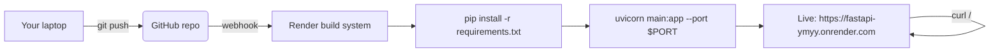

<div align="center">

# 🚀 A033 — Deploy a FastAPI Project on Render (GitHub Live)

### *Your FastAPI app, live on the internet. Deploy with one push.*

<br/>


</div>

---

## 🧠 The One-Sentence Summary

> **Push your FastAPI app to GitHub, click "New Web Service" on Render, connect the repo, and Render auto-builds + deploys on every push — your app gets a live URL like `https://fastapi-ymyy.onrender.com`.**

If you remember *"GitHub → Render → build → live URL"*, the rest of this README is decoration.

---

## 📑 Table of Contents

- [🧠 The One-Sentence Summary](#-the-one-sentence-summary)
- [📖 The Story: The Apartment](#-the-story-the-apartment)
- [🎯 What You Will Learn (10 Skills)](#-what-you-will-learn-10-skills)
- [📂 Project Structure](#-project-structure)
- [🔗 Live Demo](#-live-demo)
- [⚙️ Render Setup](#-render-setup)
- [🧬 Anatomy of the Files](#-anatomy-of-the-files)
- [🧠 The Mental Model: Build-Deploy Lifecycle](#-the-mental-model-build-deploy-lifecycle)
- [🆕 Every New Keyword Explained](#-every-new-keyword-explained)
- [🆚 Render vs Railway vs Fly.io vs Heroku](#-render-vs-railway-vs-flyio-vs-heroku)
- [🔧 Variations](#-leveraging)
- [⚠️ Common Pitfalls & Fixes](#-common-pitfalls--fixes)
- [🧠 Mnemonic Cheat Sheet](#-mnemonic-cheat-sheet)
- [🧪 Recall Test](#-recall-test)
- [🎯 Interview Q&A](#-interview-qa)
- [🚀 Where to Go Next](#-where-to-go-next)

---

## 📖 The Story: The Apartment 🏠

Deploying a FastAPI app to the internet is like turning your **local script on your laptop** into a **rented apartment** that anyone can visit:

| Phase | Your laptop | Render |
|:------|:------------|:-------|
| Code | `main.py` on disk | GitHub repo |
| Builder | You, running `uvicorn` | Render's build system |
| Power / internet | Your laptop must stay on | Always on, real network |
| Address | `http://127.0.0.1:8000` | `https://fastapi-ymyy.onrender.com` |

> 🧠 **Mnemonic:** "**`127.0.0.1` is a studio. Render is a public apartment.**"

---

## 🎯 What You Will Learn (10 Skills)

| # | 🎯 Skill | 🧠 You'll remember it because... |
|:-:|:---------|:--------------------------------|
| 1 | 🐍 **`requirements.txt`** | "Frozen deps for reproducible build" |
| 2 | 🏗️ **`startCommand`** | "How Render launches your app" |
| 3 | 🔄 **Auto-deploy on push** | "Git → GitHub → Render deploy" |
| 4 | 🔗 **Live URL** | `https://<name>.onrender.com` |
| 5 | 📄 **`uvicorn main:app --host 0.0.0.0`** | The Render launch command |
| 6 | 🚦 **`PORT` env var** | "Render assigns the port; listen to it" |
| 7 | 📜 **`/docs` in production** | Swagger travels everywhere |
| 8 | 🧯 **Cold start** | "Free tier sleeps; wake takes seconds" |
| 9 | 🔐 **`.env` → Render env vars** | "Never commit secrets" |
| 10 | 🐞 **Render build logs** | "Find errors in the dashboard" |

---

## 📂 Project Structure

```
📁 A033_Deploy_Project_on_Render_GitHub_Live_API/
├── 🐍 main.py              ← the FastAPI app (GET / → hello)
├── 📦 requirements.txt     ← pinned deps (fastapi==0.141.1, uvicorn==0.52.4, ...)
├── 📄 .env                 ← local secrets (git-ignored)
└── 📖 README.md             ← you are here
```

> 🧠 The `venv/` and `__pycache__/` folders are build/run artifacts. The repo relies on `requirements.txt` to rebuild them in the cloud.

---

## 🔗 Live Demo

The live deployment of this app is already up on Render:

> ### **[https://fastapi-ymyy.onrender.com](https://fastapi-ymyy.onrender.com)**

You can hit any of these endpoints from your browser:

| URL | What you'll see |
|:----|:----------------|
| <https://fastapi-ymyy.onrender.com/> | `{"message":"Hello from FastAPI"}` |
| <https://fastapi-ymyy.onrender.com/docs> | 🎨 Swagger UI |
| <https://fastapi-ymyy.onrender.com/openapi.json> | 📄 OpenAPI schema |

> 🧠 **Render gives you HTTPS automatically. No manual cert setup.**

---

## ⚙️ Render Setup

Deploy this app takes ~2 minutes. Here's the exact walkthrough:

### 1. Push your app to GitHub

```powershell
cd "D:\AllProgram\LEARN\Python\FastAPI\A033_Deploy_Project_on_Render_GitHub_Live_API"
git init
git remote add origin https://github.com/yourname/your-repo.git
git add .
git commit -m "Initial FastAPI app"
git push -u origin main
```

### 2. Create a Web Service on Render

1. Go to [https://render.com](https://render.com) → **New** → **Web Service**
2. Connect your GitHub repo
3. Choose **Python 3** as the environment
4. Fill in the settings:

| Field | Value |
|:------|:------|
| **Name** | `fastapi-ymyy` (or any unique name) |
| **Region** | `Oregon` (or your nearest) |
| **Branch** | `main` |
| **Build Command** | `pip install -r requirements.txt` |
| **Start Command** | `uvicorn main:app --host 0.0.0.0 --port $PORT` |
| **Environment** | Free (or paid for always-on) |

### 3. Click "Create Web Service"

Render will:
1. **Build** your app (installs `requirements.txt`)
2. **Run** the start command
3. Give you a live URL: `https://fastapi-ymyy.onrender.com`

Every subsequent `git push` triggers an automatic rebuild and redeploy.

> 🧠 **Mnemonic:** "**Build = `pip install`. Start = `uvicorn`. Deploy = push.**"

---

## 🧬 Anatomy of the Files

### `requirements.txt` — frozen dependencies

Render reads this file verbatim to build the environment. Having it pinned
(`fastapi==0.141.1`, `uvicorn==0.52.4`) guarantees the cloud env matches your
local env.

```txt
annotated-doc==0.0.5
annotated-types==0.8.0
anyio==4.14.2
click==8.5.0
fastapi==0.141.1
h11==0.16.0
idna==3.19
pydantic==2.13.5
pydantic_core==2.46.5
python-dotenv==1.2.3
starlette==1.6.0
typing-inspection==0.4.4
typing_extensions==4.16.0
uvicorn==0.52.4
```

> You can regenerate this with `pip freeze > requirements.txt`.

### `startCommand` — how Render launches your app

```sh
uvicorn main:app --host 0.0.0.0 --port $PORT
```

| Flag | Why it's needed in the cloud |
|:-----|:-----------------------------|
| `--host 0.0.0.0` | Listen on all interfaces (not just localhost) |
| `--port $PORT` | Render assigns the port dynamically via an env var |

> 🧠 **Locally**, you'd run `uvicorn main:app --reload`. In the cloud, you **must** read the port from the `PORT` env var — Render rejects connections on a hard-coded port.

### `main.py` — the app

```python
from fastapi import FastAPI

app = FastAPI()

@app.get("/")
def home():
    return {"message": "Hello from FastAPI"}
```

> 🧠 Even this one-liner app gets `/docs` (Swagger) and `/openapi.json` for free.

---

## 🧠 The Mental Model: Build-Deploy Lifecycle



> 🧠 **The loop:** edit → push → build → deploy. Repeat. No manual servers.

---

## 🆕 Every New Keyword Explained

### 1. `requirements.txt`

**What:** A flat list of `package==version` lines. Render's build phase runs
`pip install -r requirements.txt` to recreate your environment in the cloud.

```bash
pip freeze > requirements.txt    # freeze your local env
```

> 🧠 **Mnemonic:** "**.txt = the recipe. No .txt = no deploy.**"

### 2. `startCommand`

**What:** The shell command Render runs to **launch** your app after building it.

```yaml
# In a render.yaml:
services:
  - type: web
    startCommand: uvicorn main:app --host 0.0.0.0 --port $PORT
```

> 🧠 **Mnemonic:** "**`startCommand` = the launch button.**"

### 3. `--host 0.0.0.0`

**What:** Tells uvicorn to listen on **all network interfaces**, not just
`127.0.0.1` (localhost). Required in cloud environments where your process is
not bound to the loopback interface.

> 🧠 **Mnemonic:** "`0.0.0.0` = open the front door. `127.0.0.1` = knock on the back door (local only)."

### 4. `--port $PORT`

**What:** Render assigns a random port at deploy time and exposes it via the
`PORT` environment variable. Your app **must** read this port, or Render can't
route traffic to it.

```bash
echo $PORT     # 10000 (or whatever Render chose)
```

> 🧠 **Mnemonic:** "**`PORT` env var = the door Render opens for you.**"

### 5. `--reload`

**What:** A **dev-only** flag that auto-restarts uvicorn on file changes.
**Never** use it in production — it's slow and breaks on file watchers.

```bash
# Local dev:
uvicorn main:app --reload

# Render / production:
uvicorn main:app --host 0.0.0.0 --port $PORT   # ← NO --reload
```

> 🧠 **Mnemonic:** "**`--reload` is a dev perk. Production turns it off.**"

### 6. Cold start

**What:** When a free-tier Render service sleeps (after ~15 min of inactivity)
and then receives its first request, it has to wake up and boot — causing a
**1–3 second delay**. Paid plans stay warm.

> 🧠 **Mnemonic:** "**Free tier = sleeper car. Wake-up = cold start.**"

### 7. Build log

**What:** Render's console output from `pip install` + build. If your deploy
fails, the build log shows you which package or step broke.

> 🧠 **Mnemonic:** "**Build log = the error report your code writes on deploy day.**"

### 8. `render.yaml` (infrastructure-as-code)

**What:** A version-controlled config file that defines your Render service
(build command, start command, env vars, plan, etc.). Commit it to the repo.

```yaml
services:
  - type: web
    name: fastapi-ymyy
    runtime: python
    buildCommand: pip install -r requirements.txt
    startCommand: uvicorn main:app --host 0.0.0.0 --port $PORT
    plan: free
```

> 🧠 **Mnemonic:** "**`render.yaml` = deploy config committed to git.**"

### 9. Environment variables (Render dashboard)

**What:** In the Render dashboard, you add env vars per service (e.g.
`DATABASE_URL`, `SECRET_KEY`). These are injected at runtime and never
committed to git.

> 🧠 **Mnemonic:** "**`.env` local. Render dashboard in the cloud.**"

### 10. Auto-deploy on push

**What:** When you push to the connected GitHub branch, Render rebuilds +
restarts automatically. You can also turn this off and deploy via the
"Manual Deploy" button.

> 🧠 **Mnemonic:** "**Push → Render auto-builds. No buttons to press.**"

---

## 🆚 Render vs Railway vs Fly.io vs Heroku

| Provider | Free tier? | Auto-deploy from git? | Notes |
|:---------|:-----------|:----------------------|:------|
| **Render** | ✅ (with sleep) | ✅ | Great docs, simple, HTTPS built-in |
| **Railway** | ✅ | ✅ | Good for full-stack apps |
| **Fly.io** | ✅ (tiny shared) | ✅ | Great for global, edge-deployed apps |
| **Heroku** (legacy) | ❌ | ✅ | Removed free tier; expensive now |
| **Docker + own VPS** | ❌ (cost) | manual | Full control |

> 🧠 **Mnemonic:** "**Render = simple. Fly = global. Heroku = expensive now.**"

---

## 🔧 Variations

### Variation 1: Add a `render.yaml` (IaC)

```yaml
# render.yaml — commit to repo root
services:
  - type: web
    name: fastapi-ymyy
    runtime: python
    buildCommand: pip install -r requirements.txt
    startCommand: uvicorn main:app --host 0.0.0.0 --port $PORT
    plan: free
    envVars:
      - key: APP_ENV
        value: production
```

Push this file and Render auto-creates the service (no dashboard clicks).

### Variation 2: Read the port dynamically

```python
import os

if __name__ == "__main__":
    import uvicorn
    port = int(os.environ.get("PORT", 8000))
    uvicorn.run("main:app", host="0.0.0.0", port=port)
```

### Variation 3: Add more env vars in the Render dashboard

In the Render dashboard → your service → Environment → Add Environment Variable:

| Key | Value |
|:----|:------|
| `APP_ENV` | `production` |
| `DEBUG` | `false` |

Then read them in your app:

```python
import os
debug = os.getenv("DEBUG", "false").lower() == "true"
```

### Variation 4: Custom domain

In the Render dashboard → your service → Custom Domains → add your domain
(e.g. `api.yourname.com`). Render provisions the SSL certificate for you.

---

## ⚠️ Common Pitfalls & Fixes

| 😖 Pitfall | 🔍 Cause | ✅ Fix |
|:-----------|:---------|:------|
| "Your service is taking too long to respond" | App crashed or didn't bind to `$PORT` | Listen on `0.0.0.0:$PORT`, check build logs |
| `ModuleNotFoundError` on deploy | A package isn't in `requirements.txt` | Add it and push |
| 502 / connection refused after deploy | Start command wrong or `--reload` still on | Use `uvicorn main:app --host 0.0.0.0 --port $PORT` |
| Free tier sleeps after 15 min | Render free web services idle-sleep | Upgrade plan or accept the cold start |
| `SECRET_KEY` leaked | Committed `.env` | Delete the file from git (`git rm --cached .env`), rotate the key |
| `/docs` not found | App didn't start at all | Check that `main:app` matches the actual file/variable names |
| Build hangs on a package | Package with C extension fails to build in Render's env | Pin an older version or remove optional deps |
| Wrong Python version | `runtime.txt` says `python-3.x` but deps need newer | Render uses the latest 3.x; match your local |

### The "Not binding to $PORT" Trap

```python
# ❌ Hard-codes a port that won't match what Render exposes
uvicorn.run(app, host="0.0.0.0", port=8000)

# ✅ Read the PORT env var
import os
port = int(os.environ.get("PORT", "8000"))
uvicorn.run("main:app", host="0.0.0.0", port=port)
```

> 🧠 **Mnemonic:** "**`PORT` env var is the door. Hard-coding blocks it.**"

### The "`--reload` in production" Trap

```bash
# ❌ Dev-only flag. Causes extra memory + crashes in prod sometimes
uvicorn main:app --reload --host 0.0.0.0 --port $PORT

# ✅ Production-safe
uvicorn main:app --host 0.0.0.0 --port $PORT
```

### The "Forgot a dependency" Trap

If your app imports `requests` but it's missing from `requirements.txt`,
the build succeeds but the **runtime crashes**:

```
ModuleNotFoundError: No module named 'requests'
```

**Fix:** add it to `requirements.txt` and push.

---

## 🧠 Mnemonic Cheat Sheet

| Concept | Mnemonic | Story |
|:--------|:---------|:------|
| Deploy flow | **GitHub → Render → Build → Live** | Auto on push |
| `requirements.txt` | **Frozen recipe** | `pip install -r` recreates env |
| `--host 0.0.0.0` | **Open the front door** | Not just localhost |
| `--port $PORT` | **Render's door** | Read the env var |
| `--reload` | **Dev only** | Never in prod |
| Cold start | **Sleeper car** | Free tier wakes up slow |
| `render.yaml` | **Deploy config in git** | IaC |
| Env vars | **Secrets in dashboard** | `.env` never shared |
| `/docs` travels | **Swagger goes everywhere** | Even in the cloud |
| Build log | **The deploy diary** | Where errors show up |

---

## 🧪 Recall Test

1. What file tells Render which packages to install?
2. Why must you use `--host 0.0.0.0` in the cloud?
3. Why must you read `$PORT` instead of hard-coding `8000`?
4. Should you use `--reload` in the production start command?
5. What causes a cold start on free Render tiers?
6. Where do you put secrets like `SECRET_KEY` on Render?
7. What is `render.yaml` and when would you use it?
8. How does auto-deploy work?

> 8/8 → deployment is yours.

---

## 🎯 Interview Q&A

### Q1: What are the two essential parts of a Render deployment?

**Answer:** `requirements.txt` (packages to build) and a `startCommand` (how to launch).

| File | Role |
|:-----|:-----|
| `requirements.txt` | `pip install -r` | Build the environment |
| `startCommand` | `uvicorn main:app --host 0.0.0.0 --port $PORT` | Launch the app |

> **One-liner:** *"Requirements = build. Start command = launch."*

### Q2: Why is `--host 0.0.0.0` required in the cloud?

**Answer:** Because in the cloud, your process listens on a network interface that's **not** localhost. `--host 127.0.0.1` (the uvicorn default) only accepts local connections — the cloud router can't reach it. `0.0.0.0` says "listen on all interfaces."

> **One-liner:** *"`0.0.0.0` = open to the internet. `127.0.0.1` = locked to local only."**

### Q3: What is a cold start?

**Answer:** When a free-tier service sleeps (after ~15 min idle) and gets woken by the first request, it has to boot up, which takes 1–3 seconds. Paid plans stay warm and avoid this.

> **One-liner:** *"Free tier sleeps. Waking up = cold start = slow first request."*

### Q4: Should you commit your `.env` file?

**Answer:** **No.** `.env` holds secrets. Committing it leaks keys to anyone with repo access. Instead:

- Commit a `.env.example` template (placeholders)
- Add `.env` to `.gitignore`
- Put real secrets in the Render dashboard (Environment Variables)

> **One-liner:** *"Never commit `.env`. Dashboard for secrets.*

### Q5: How does auto-deploy work on Render?

**Answer:** Render connects to your GitHub repo via webhook. Every `git push` to the connected branch triggers a fresh build + deploy. No manual steps after the initial setup.

> **One-liner:** "*Push → Render auto-builds + restarts.*

### Q6: What is `render.yaml`?

**Answer:** An infrastructure-as-code file (committed to the repo) that defines your Render service — name, plan, build command, start command, env vars. Committing it means you can spin up the whole service by just clicking "deploy" — no dashboard clicks needed.

```yaml
services:
  - type: web
    name: fastapi-ymyy
    runtime: python
    buildCommand: pip install -r requirements.txt
    startCommand: uvicorn main:app --host 0.0.0.0 --port $PORT
    plan: free
```

> **One-liner:** *"render.yaml = deploy config as code, in git.*

### Q7: How do you get HTTPS on Render?

**Answer:** Automatically. Every `*.onrender.com` URL (and every custom domain you add) gets a free TLS/SSL certificate from Let's Encrypt, provisioned and renewed automatically — no config needed.

> **One-liner:** *"HTTPS comes free. Automatic certs.*

### Q8: What should you do with `requirements.txt` before deploying?

**Answer:** Freeze your working environment so the cloud matches local:

```bash
pip freeze > requirements.txt
```

Make sure `fastapi`, `uvicorn`, and any other direct imports (`requests`, `python-jose`, etc.) are listed. Missing deps → `ModuleNotFoundError` on deploy.

> **One-liner:** *"Freeze deps. Missing one → runtime crash.*

---

## 🚀 Where to Go Next

| Direction | Module |
|:----------|:-------|
| ⬅️ Previous | [A032](../A032_Rate_Limiting_slowapi_Protect_Your_APIs_from_Abuse/) |
| ⬅️ Back | [Root README](../README.md) |
| ➡️ Next | A034 (planned) — Custom domain + HTTPS on Render |
| ➡️ Future | A035 (planned) — Dockerfile for full control |

---

<div align="center">

### 🚀 *Code → GitHub → Render → Live URL. Auto-rebuild on every push.* 🚀

Made with ❤️, `requirements.txt`, and `uvicorn main:app --host 0.0.0.0 --port \$PORT`.

</div>
