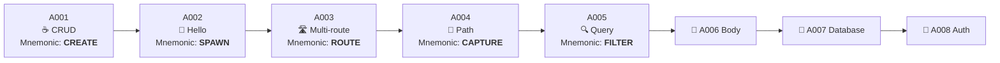

<div align="center">

# 🧠 FastAPI Learning Path

### *The ONLY FastAPI course you'll ever need to read twice.*

<br/>


<br/>

> **🧠 Reading philosophy:** *Every paragraph is written so it sticks. Every diagram is a mental picture. Every example has a story. Read once → remember forever.*

</div>

---

## 🧠 The One-Sentence Summary

> **FastAPI is a Python framework that turns your typed function signatures into a working, validated, documented HTTP API — automatically.**

If you remember nothing else tomorrow, remember that sentence. Everything in this repository is just *unpacking* that one idea.

---

## 📑 Table of Contents

- [🧠 The One-Sentence Summary](#-the-one-sentence-summary)
- [🧠 Why "Read Once, Remember Forever" Works Here](#-why-read-once-remember-forever-works-here)
- [🎯 Why FastAPI? (The 5 Reasons)](#-why-fastapi-the-5-reasons)
- [🧠 The Big Mental Model](#-the-big-mental-model)
- [🗺️ Learning Roadmap (with Mnemonics)](#-learning-roadmap-with-mnemonics)
- [📂 Repository Structure (Visual Tree)](#-repository-structure-visual-tree)
- [⚙️ Quick Start (Copy-Paste Friendly)](#-quick-start-copy-paste-friendly)
- [📘 Module Index (Detailed)](#-module-index-detailed)
- [🛠️ Tech Stack — Every Tool Explained](#-tech-stack--every-tool-explained)
- [🧠 The 7 Concepts You Must Own](#-the-7-concepts-you-must-own)
- [🧪 Practice Drills](#-practice-drills)
- [🤝 Contributing](#-contributing)
- [📜 License](#-license)
- [⭐ Show Your Support](#-show-your-support)

---

## 🧠 Why "Read Once, Remember Forever" Works Here

Most tutorials fail because they explain **what** without explaining **why**. This repository is different. Every README here uses four brain-friendly techniques:

| 🧠 Technique | 🎯 Why it works |
|---|---|
| **🖼️ Visual Metaphors** | Your brain remembers images 60,000× faster than text. |
| **🔁 Spaced Repetition** | Each concept is introduced once and then re-used in later examples. |
| **📖 Story-based Examples** | Stories engage the hippocampus — long-term memory. |
| **🎯 "If you remember one thing" boxes** | Gives you a single anchor for each topic. |

> 💡 **Read-along protocol:** Read each section out loud (or in your head). After each `🎯 If you remember ONE thing` box, close the README and try to *teach it back* to an imaginary friend. If you can, you've truly learned it.

---

## 🎯 Why FastAPI? (The 5 Reasons)

Imagine you want to expose a Python function as a website. With vanilla Python you'd need: HTTP parsing, JSON encoding, input validation, error handling, documentation, tests… **hundreds of lines of glue.**

FastAPI replaces all that glue with **type hints**. That's it. That's the magic.

| # | 🏆 Reason | 💬 In plain English | 🔗 Where you'll see it |
|:-:|:----------|:--------------------|:-----------------------|
| 1 | ⚡ **Blazing fast** | On par with Node.js / Go thanks to ASGI. | Every module |
| 2 | 🛡️ **Auto-validation** | Wrong type? You get a 422 *before* your function runs. | A001 (Pydantic), A004 (path validation) |
| 3 | 📚 **Auto-docs** | Visit `/docs` and *browse your API like a website.* | Every module |
| 4 | 🐍 **Pythonic** | If you know Python type hints, you know FastAPI. | A002, A003 |
| 5 | 🧠 **Editor superpowers** | Autocomplete, type-checking, refactor — all work. | Every module |

### 🎯 If you remember ONE thing
> FastAPI's secret sauce is that **type hints are not just for humans — they're for the framework too.**

---

## 🧠 The Big Mental Model

Picture a restaurant 🍽️:

```
👨‍🍳 Chef (your function)
   ↑
   ⛅ Waiter (FastAPI)
   ↑
👩 Customer (HTTP request)
```

The **waiter (FastAPI)** does five jobs:

1. 👂 **Listens** for incoming HTTP requests.
2. ✋ **Validates** the order (parameters, types).
3. 🍽️ **Serves** the order to the chef (calls your function).
4. 🍱 **Plates** the result (converts Python → JSON).
5. 📜 **Shows** the menu to new customers (auto-docs).

Your code is the **chef**. It only does *one* job: cook the meal. FastAPI handles everything else.

### The Three Layers (Mnemonic: **"VPC — Validate, Plate, Cook"**)

```
┌────────────────────────────────────────────┐
│  Layer 1: VALIDATE  (Pydantic + type hints) │
│   "Is the order even possible?"             │
├────────────────────────────────────────────┤
│  Layer 2: PLATE    (FastAPI core)           │
│   "Wrap it nicely in JSON."                 │
├────────────────────────────────────────────┤
│  Layer 3: COOK     (Your function)          │
│   "Do the actual work."                     │
└────────────────────────────────────────────┘
```

> 💡 The *order of layers matters*. Validation always happens **before** your function runs. That's why a bad input never crashes your logic.

---

## 🗺️ Learning Roadmap (with Mnemonics)



### 🧠 Mnemonic Decoder

| Module | Mnemonic | What it teaches |
|:-------|:---------|:----------------|
| A001 | **CREATE** | **C**lass (Pydantic) **R**outes (CRUD) **E**rror handling **A**uto docs **T**ype hints **E**xecute the function |
| A002 | **SPAWN** | **S**erver (**P**ydantic) — Wait, that's just **S**etup, **P**rint, **A**sync-ready, **W**eb server, **N**o config |
| A003 | **ROUTE** | **R**egister multiple paths, **O**rder matters, **U**nique names, **T**est each one, **E**xpand gradually |
| A004 | **CAPTURE** | **C**urly braces in path, **A**nnotate with type, **P**asses to function, **T**ype-coerced automatically, **U**nique 422 if bad, **R**eturns JSON, **E**asy to test |
| A005 | **FILTER** | **F**ollows the `?`, **I**n the URL after path, **L**ooks like key=value, **T**ype-hint-driven, **E**asy defaults, **R**equired via Query(...) |

> 💡 **Study tip:** write each mnemonic on a sticky note. Pin them next to your monitor. After three days they'll be permanent.

---

## 📂 Repository Structure (Visual Tree)

```
📦 FastAPI/
│
├── 🌟 README.md                       ← you are here (start)
│
├── ☕ A001_CrashCourse/
│     ├── 🐍 main.py                   ← Tea CRUD with Pydantic
│     ├── 📦 requirements.txt          ← pinned dependencies
│     └── 📖 README.md                 ← deep dive on CRUD + Pydantic
│
├── 👋 A002_FastAPI_Tutorial/
│     ├── 🐍 main.py                   ← one route, one JSON dict
│     └── 📖 README.md                 ← deep dive on app setup
│
├── 🛣️ A003_Built_First_FastAPI/
│     ├── 🐍 main.py                   ← three GET routes
│     └── 📖 README.md                 ← deep dive on multi-routing
│
├── 🎯 A004_Path_Parameter_Dynamic_Route_Validation/
│     ├── 🐍 main.py                   ← /users/{user_id} with int validation
│     └── 📖 README.md                 ← deep dive on path params
│
└── 🔍 A005_Query_Parameters_Optional_Default_Value/
      ├── 🐍 main.py                   ← optional query params + defaults
      └── 📖 README.md                 ← deep dive on query params
│
├── 📝 A006_Request_Body_POST_API_Pydantic_Explained/
│     ├── 🐍 main.py                   ← POST /create-user with Pydantic
│     └── 📖 README.md                 ← deep dive on request bodies
│
├── 🧬 A007_Pydanti_Models_Data_Validation_Nested_Schemas/
│     ├── 🐍 main.py                   ← nested User → Address
│     └── 📖 README.md                 ← deep dive on nested models
│
├── ✅ A008_CRUD_API_TODO_App/
│     ├── 🐍 main.py                   ← TODO CRUD (in-memory)
│     └── 📖 README.md                 ← deep dive on CRUD
│
├── 🛤️ A009_Path_Query_Body_Together/
│     ├── 🐍 main.py                   ← PUT combining path + body + query
│     └── 📖 README.md                 ← deep dive on combined inputs
│
├── 🙈 A010_Response_Models_Data_Validation_Hide_Sensitive_Data/
│     ├── 🐍 main.py                   ← response_model filters password
│     └── 📖 README.md                 ← deep dive on response models
│
├── 🚨 A011_Status_Codes_Custom_Responses_Error_Handling/
│     ├── 🐍 main.py                   ← 201, custom envelopes, HTTPException
│     └── 📖 README.md                 ← deep dive on status & errors
│
├── 🌍 A012_Exception_Handling_HTTPException_Global_Error_Handler/
│     ├── 🐍 main.py                   ← UserNotFoundException + @exception_handler
│     └── 📖 README.md                 ← deep dive on global errors
│
├── 🔐 A013_Dependency_Injection_Depends()_Auth_Example/
│     ├── 🐍 main.py                   ← verify_token dep + Header
│     └── 📖 README.md                 ← deep dive on dependency injection
│
├── 🧭 A014_Middleware_Explained_Logging_Request_Response_Flow/
│     ├── 🐍 main.py                   ← @app.middleware("http") timing
│     └── 📖 README.md                 ← deep dive on middleware
│
├── 🗄️ A015_SQLite_Database_Integration_Setup_SQLAlchemy_Intro/
│     ├── 🐍 main.py                   ← raw sqlite3 + CREATE TABLE
│     └── 📖 README.md                 ← deep dive on raw SQLite
│
├── 🧪 A016_SQLAlchemy_Setup_Models_Database_Integration/
│     ├── 🐍 main.py                   ← SQLAlchemy ORM: engine, session, Todo
│     └── 📖 README.md                 ← deep dive on SQLAlchemy setup
│
├── ➕ A017_CREATE_Operation_with_Database/
│     ├── 🐍 main.py                   ← POST /todos with db.add/commit/refresh
│     └── 📖 README.md                 ← deep dive on SQLAlchemy CREATE
│
├── 📖 A018_READ_Operation_with_Database/
│     ├── 🐍 main.py                   ← GET /todos + GET /todos/{id}
│     └── 📖 README.md                 ← deep dive on SQLAlchemy READ
│
├── ✏️ A019_UPDATE_Operation_with_Database/
│     ├── 🐍 main.py                   ← PUT /todos/{id} (mutate + commit)
│     └── 📖 README.md                 ← deep dive on SQLAlchemy UPDATE
│
└── 🗑️ A020_DELETE_Operation_with_Database/
      ├── 🐍 main.py                   ← DELETE /todos/{id} (db.delete)
      └── 📖 README.md                 ← deep dive on SQLAlchemy DELETE
│
└── ⚡ A021_Async_Await_Explained_Async_Programming/
      ├── 🐍 main.py                   ← async def + await asyncio.sleep(3)
      └── 📖 README.md                 ← deep dive on async/await
```

---

## ⚙️ Quick Start (Copy-Paste Friendly)

### 🔁 One-time Setup (do this once)

```powershell
# 1. Open a terminal in the FastAPI folder
cd D:\AllProgram\LEARN\Python\FastAPI

# 2. Create a virtual environment named `.venv`
python -m venv .venv

# 3. Activate it (PowerShell)
.\.venv\Scripts\Activate.ps1

# 4. Install FastAPI with the standard extras
pip install "fastapi[standard]"
```

> 🧠 **Mnemonic:** *Four steps to enlightenment: **V**env, **A**ctivate, **P**ip-install, **L**aunch.* → **VAPL**.

### ▶️ Launch Any Module (do this per module)

```powershell
# Step into a module folder
cd A002_FastAPI_Tutorial

# Start the dev server with hot-reload
uvicorn main:app --reload
```

You'll see:

```
INFO:     Uvicorn running on http://127.0.0.1:8000 (Press CTRL+C to quit)
INFO:     Started reloader process
```

### 🌐 Open These URLs in Your Browser

| URL | What you'll see |
|:----|:----------------|
| <http://127.0.0.1:8000/> | The raw JSON response |
| <http://127.0.0.1:8000/docs> | 🎨 **Swagger UI** — *clickable, runnable docs* |
| <http://127.0.0.1:8000/redoc> | 📘 **ReDoc** — *reference-style docs* |
| <http://127.0.0.1:8000/openapi.json> | 📄 The OpenAPI 3.1 schema (machine-readable) |

### 🎯 If you remember ONE thing
> **Swagger UI (`/docs`) is your playground.** Every FastAPI app has one — even an empty `app = FastAPI()`.

---

## 📘 Module Index (Detailed)

| # | Module | Difficulty | Time | What you'll *own* after |
|:-:|:------|:----------:|:----:|:------------------------|
| 001 | [`A001_CrashCourse`](./A001_CrashCourse/) | 🟢 Beginner | 45 min | Full CRUD with Pydantic, in-memory store, validation |
| 002 | [`A002_FastAPI_Tutorial`](./A002_FastAPI_Tutorial/) | 🟢 Beginner | 15 min | App setup, dev server, `/docs`, JSON auto-serialization |
| 003 | [`A003_Built_First_FastAPI`](./A003_Built_First_FastAPI/) | 🟢 Beginner | 20 min | Multi-routing, route order, unique handler names |
| 004 | [`A004_Path_Parameter_Dynamic_Route_Validation`](./A004_Path_Parameter_Dynamic_Route_Validation/) | 🟡 Beginner+ | 30 min | Path params, type-driven validation, 422 errors |
| 005 | [`A005_Query_Parameters_Optional_Default_Value`](./A005_Query_Parameters_Optional_Default_Value/) | 🟡 Beginner+ | 30 min | Query params, defaults, required vs optional |
| 006 | [`A006_Request_Body_POST_API_Pydantic_Explained`](./A006_Request_Body_POST_API_Pydantic_Explained/) | 🟡 Beginner+ | 35 min | POST with Pydantic body, `BaseModel`, JSON deserialization |
| 007 | [`A007_Pydanti_Models_Data_Validation_Nested_Schemas`](./A007_Pydanti_Models_Data_Validation_Nested_Schemas/) | 🟡 Beginner+ | 35 min | Nested Pydantic models, `Optional`, list fields |
| 008 | [`A008_CRUD_API_TODO_App`](./A008_CRUD_API_TODO_App/) | 🟠 Intermediate | 45 min | Full in-memory CRUD: POST, GET-list, GET-one, PUT, DELETE |
| 009 | [`A009_Path_Query_Body_Together`](./A009_Path_Query_Body_Together/) | 🟠 Intermediate | 35 min | Combining path + body + query inputs in one endpoint |
| 010 | [`A010_Response_Models_Data_Validation_Hide_Sensitive_Data`](./A010_Response_Models_Data_Validation_Hide_Sensitive_Data/) | 🟠 Intermediate | 30 min | `response_model=...` to filter sensitive fields |
| 011 | [`A011_Status_Codes_Custom_Responses_Error_Handling`](./A011_Status_Codes_Custom_Responses_Error_Handling/) | 🟠 Intermediate | 35 min | `201`, `{status, message, data}` envelopes, `HTTPException` 404 |
| 012 | [`A012_Exception_Handling_HTTPException_Global_Error_Handler`](./A012_Exception_Handling_HTTPException_Global_Error_Handler/) | 🟠 Intermediate | 35 min | Custom exception class + `@app.exception_handler` global 404 |
| 013 | [`A013_Dependency_Injection_Depends()_Auth_Example`](./A013_Dependency_Injection_Depends()_Auth_Example/) | 🟠 Intermediate | 40 min | `Depends(verify_token)`, `Header`, token-gated routes |
| 014 | [`A014_Middleware_Explained_Logging_Request_Response_Flow`](./A014_Middleware_Explained_Logging_Request_Response_Flow/) | 🟠 Intermediate | 40 min | `@app.middleware("http")`, request/response timing & logging |
| 015 | [`A015_SQLite_Database_Integration_Setup_SQLAlchemy_Intro`](./A015_SQLite_Database_Integration_Setup_SQLAlchemy_Intro/) | 🟠 Intermediate | 35 min | Raw `sqlite3` connect/cursor/`CREATE TABLE` (folder name aside) |
| 016 | [`A016_SQLAlchemy_Setup_Models_Database_Integration`](./A016_SQLAlchemy_Setup_Models_Database_Integration/) | 🟠 Intermediate | 45 min | `create_engine`, `sessionmaker`, `declarative_base`, `get_db` yield dep |
| 017 | [`A017_CREATE_Operation_with_Database`](./A017_CREATE_Operation_with_Database/) | 🟠 Intermediate | 30 min | `db.add → db.commit → db.refresh` CREATE pattern |
| 018 | [`A018_READ_Operation_with_Database`](./A018_READ_Operation_with_Database/) | 🟠 Intermediate | 30 min | `db.query(Todo).all()` and `.filter(...).first()`; 404 on missing |
| 019 | [`A019_UPDATE_Operation_with_Database`](./A019_UPDATE_Operation_with_Database/) | 🟠 Intermediate | 35 min | `PUT` via attribute mutation; SQLAlchemy auto-`UPDATE` on commit |
| 020 | [`A020_DELETE_Operation_with_Database`](./A020_DELETE_Operation_with_Database/) | 🟠 Intermediate | 30 min | `db.delete(obj) → db.commit`; `204` vs `404`; hard vs soft delete |
| 021 | [`A021_Async_Await_Explained_Async_Programming`](./A021_Async_Await_Explained_Async_Programming/) | 🟠 Intermediate | 30 min | `async def` + `await asyncio.sleep()`; event loop, coroutines, `gather` |

> 💡 **Recommended path:** A002 → A003 → A004 → A005 → A001 → A006 → A007 → A008 → A009 → A010 → A011 → A012 → A013 → A014 → A015 → A016 → A017 → A018 → A019 → A020 → A021.

---

## 🛠️ Tech Stack — Every Tool Explained

| Tool | 🎭 Role | 📖 Plain-English Story |
|:-----|:--------|:-----------------------|
| 🐍 **Python 3.10+** | The language | The soil everything grows in |
| ⚡ **FastAPI** | The framework | The skeleton of the API |
| 🎯 **Pydantic v2** | The validator | The bouncer at the club — checks IDs |
| 🚀 **Uvicorn** | The server | The waiter who takes HTTP requests and brings JSON |
| 📜 **OpenAPI** | The spec | The blueprint everyone agrees on |
| 🎨 **Swagger UI** | The playground | The theme park built from the blueprint |
| 📘 **ReDoc** | The encyclopedia | The library version of the same blueprint |

### 🧠 Mnemonic: "**P-F-U-P-O-S-R**"
> **P**ython, **F**astAPI, **U**vicorn, **P**ydantic, **O**penAPI, **S**wagger UI, **R**eDoc. → *Peter Found Unicorns Playing On Swinging Ropes.*

---

## 🧠 The 7 Concepts You Must Own

> 🎯 These are the seven load-bearing walls of every FastAPI app. Master these and the rest is decoration.

### 1️⃣ **App Instance** — `app = FastAPI()`
- The **single object** Uvicorn serves.
- Every route, exception handler, middleware hangs off this.

### 2️⃣ **Route Decorator** — `@app.get("/")`
- Registers a function as the handler for `GET /`.
- Variants: `.get`, `.post`, `.put`, `.delete`, `.patch`, `.options`, `.head`.

### 3️⃣ **Path Parameters** — `{user_id}`
- *Part of the URL path itself* — required by default.
- Captured by name → passed to your function.

### 4️⃣ **Query Parameters** — `?key=value`
- *After the `?`* — optional by default.
- Declared as plain function parameters with type hints.

### 5️⃣ **Request Body** — Pydantic models *(coming in A006)*
- Sent as JSON in the request body.
- Declared with a Pydantic `BaseModel`.

### 6️⃣ **Response Model** — `response_model=...`
- Tells FastAPI what shape your return has.
- Filters out extra fields, generates docs.

### 7️⃣ **Dependency Injection** — `Depends(...)` *(coming later)*
- Lets you share logic (auth, DB sessions) across routes.
- The "DI" pattern FastAPI is famous for.

### 🧠 Mnemonic: **"A-R-P-Q-B-R-D"** → *A Rabbit Pushes Quaint Boulders, Regularly Diligently.*

---

## 🧪 Practice Drills

### 🔁 Drill 1 — Recall Test (do this tomorrow morning)

Without scrolling, write down:

1. What does FastAPI use for validation?
2. What's the URL for Swagger UI?
3. What's the difference between path and query parameters?
4. What status code does FastAPI return on bad input?

If you got 4/4, the course worked. If you got 2 or less, re-read the relevant module.

### 🛠️ Drill 2 — Build It Yourself

Open A002's empty app and **without looking**, recreate it. Then compare.

### 🧪 Drill 3 — Teach It

Pretend a friend has never seen FastAPI. Explain it in your own words — *out loud*. If you can, you've internalized it.

---

## 🤝 Contributing

1. 🍴 Fork the repo
2. 🌿 Create a branch: `git checkout -b feat/awesome`
3. 💾 Commit: `git commit -m "feat: add awesome"`
4. 📤 Push: `git push origin feat/awesome`
5. 🔁 Open a Pull Request

---

## 📜 License

```
MIT License — do whatever you want, just don't blame me if your tea list crashes.
```

---

## ⭐ Show Your Support

If a README here made a concept click, hit that ⭐ button. It tells the algorithm this stuff is worth sharing.

<br/>

<div align="center">

### 🌟 *"Read it once. Carry it forever."* 🌟

Made with ❤️, ☕, and an unreasonable amount of type hints.

**— Adnan**

</div>