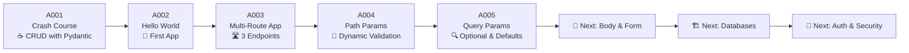

<div align="center">

# 🚀 FastAPI Learning Path

### *A hands-on journey from `Hello World` to production-ready APIs*

<br/>


<br/>

> *"FastAPI is a modern, fast (high-performance) web framework for building APIs with Python based on standard type hints."*
> — <https://fastapi.tiangolo.com>

</div>

---

## 📑 Table of Contents

- [✨ Overview](#-overview)
- [🎯 Why FastAPI?](#-why-fastapi)
- [🗺️ Learning Roadmap](#-learning-roadmap)
- [📂 Repository Structure](#-repository-structure)
- [⚙️ Quick Start](#-quick-start)
- [📘 Module Index](#-module-index)
- [🛠️ Tech Stack](#-tech-stack)
- [📸 Screenshots & Live Demo](#-screenshots--live-demo)
- [🤝 Contributing](#-contributing)
- [📜 License](#-license)
- [⭐ Show Your Support](#-show-your-support)

---

## ✨ Overview

Welcome to my **personal FastAPI learning lab** 🎓. This repository is a *step-by-step, project-based* guide that takes you from writing your very first API to building fully-validated, production-grade services. Every folder is a **self-contained mini-project** you can clone, run, and tweak.

```
╔══════════════════════════════════════════════════════════════╗
║  📦 5 Modules  ·  🚦 Beginner → Intermediate  ·  ⚡ Hands-On ║
╚══════════════════════════════════════════════════════════════╝
```

---

## 🎯 Why FastAPI?

| 💨 **Fast**            | 🔒 **Type-Safe**              | 📚 **Auto Docs**              | 🐍 **Pythonic**         |
|------------------------|-------------------------------|-------------------------------|--------------------------|
| Async ASGI performance | Built-in Pydantic validation   | Swagger UI & ReDoc out of box | Standard type hints     |
| One of the fastest Py frameworks | Catches bugs at runtime   | No extra config needed        | Minimal boilerplate      |

---

## 🗺️ Learning Roadmap



---

## 📂 Repository Structure

```
FastAPI/
│
├── 🟢 A001_CrashCourse/
│   ├── main.py            # Tea CRUD API
│   ├── requirements.txt   # Pinned deps
│   └── README.md          # Detailed guide
│
├── 🟢 A002_FastAPI_Tutorial/
│   ├── main.py            # Hello World
│   └── README.md          # Detailed guide
│
├── 🟢 A003_Built_First_FastAPI/
│   ├── main.py            # 3 GET routes
│   └── README.md          # Detailed guide
│
├── 🟢 A004_Path_Parameter_Dynamic_Route_Validation/
│   ├── main.py            # /users/{user_id}
│   └── README.md          # Detailed guide
│
└── 🟢 A005_Query_Parameters_Optional_Default_Value/
    ├── main.py            # Query params scaffold
    └── README.md          # Detailed guide
```

---

## ⚙️ Quick Start

### 🔁 One-time Setup

```powershell
# 1. Clone the repository
git clone <your-repo-url>
cd FastAPI

# 2. Create a virtual environment (root level)
python -m venv .venv
.\.venv\Scripts\Activate.ps1

# 3. Install FastAPI with all standard extras
pip install "fastapi[standard]"
```

### ▶️ Launch Any Module

```powershell
# Move into a module folder
cd A002_FastAPI_Tutorial

# Run the dev server with live-reload
uvicorn main:app --reload
```

### 🌐 Open in Browser

| URL                                                  | What you see              |
|------------------------------------------------------|---------------------------|
| <http://127.0.0.1:8000/>                             | API root response         |
| <http://127.0.0.1:8000/docs>                         | 🎨 **Swagger UI**         |
| <http://127.0.0.1:8000/redoc>                        | 📘 **ReDoc**              |
| <http://127.0.0.1:8000/openapi.json>                 | 📄 Raw OpenAPI 3.1 schema |

---

## 📘 Module Index

| # | Module | Topic | Difficulty | Status |
|:-:|:------:|:------|:----------:|:------:|
| 001 | [A001_CrashCourse](./A001_CrashCourse/) | ☕ Full CRUD with Pydantic | 🟢 Beginner | ✅ Done |
| 002 | [A002_FastAPI_Tutorial](./A002_FastAPI_Tutorial/) | 👋 Hello World | 🟢 Beginner | ✅ Done |
| 003 | [A003_Built_First_FastAPI](./A003_Built_First_FastAPI/) | 🛣️ Multi-Route App | 🟢 Beginner | ✅ Done |
| 004 | [A004_Path_Parameter...](./A004_Path_Parameter_Dynamic_Route_Validation/) | 🎯 Path Params & Validation | 🟡 Beginner+ | ✅ Done |
| 005 | [A005_Query_Parameters...](./A005_Query_Parameters_Optional_Default_Value/) | 🔍 Query Params & Defaults | 🟡 Beginner+ | ✅ Done |
| 006 | *Coming Soon* | 📝 Request Body & Form | 🟡 Intermediate | ⏳ Planned |
| 007 | *Coming Soon* | 🗄️ SQLAlchemy + Database | 🔴 Intermediate | ⏳ Planned |

---

## 🛠️ Tech Stack

<div align="center">

| Tool | Purpose |
|:----:|:--------|
| 🐍 **Python 3.10+** | Core language |
| ⚡ **FastAPI** | Web framework |
| 🎯 **Pydantic v2** | Data validation |
| 🚀 **Uvicorn** | ASGI server |
| 📜 **OpenAPI** | API specification |
| 🎨 **Swagger UI** | Interactive docs |
| 📘 **ReDoc** | Reference docs |

</div>

---

## 📸 Screenshots & Live Demo

> After running any app, visit the auto-generated docs:

- **Swagger UI** 🎨 → <http://127.0.0.1:8000/docs>
- **ReDoc** 📘 → <http://127.0.0.1:8000/redoc>

Both pages are generated **automatically** by FastAPI from your route declarations and Pydantic models — no extra configuration needed.

---

## 🤝 Contributing

Contributions, issues, and feature requests are welcome! 💌

1. 🍴 Fork the repository
2. 🌿 Create your feature branch (`git checkout -b feature/AmazingFeature`)
3. 💾 Commit your changes (`git commit -m 'Add some AmazingFeature'`)
4. 📤 Push to the branch (`git push origin feature/AmazingFeature`)
5. 🔁 Open a Pull Request

---

## 📜 License

Distributed under the **MIT License**. See each module's README for more info.

```
MIT License — feel free to use, modify, and distribute.
```

---

## ⭐ Show Your Support

If this repo helped you learn FastAPI, please **star ⭐ it** and share with friends! 🚀

<br/>

<div align="center">

### 🌟 *Happy Coding!* 🌟

Made with ❤️ and ☕ by **Adnan**

</div>